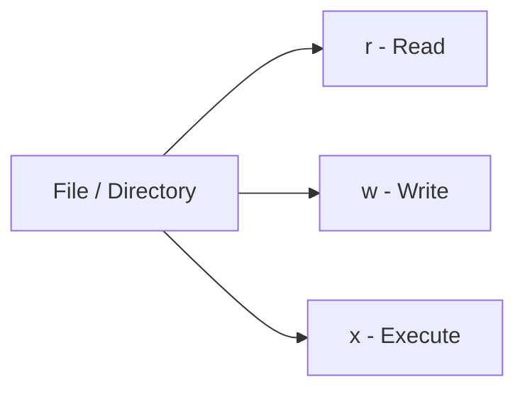
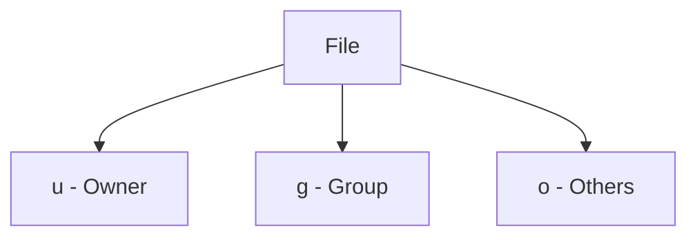
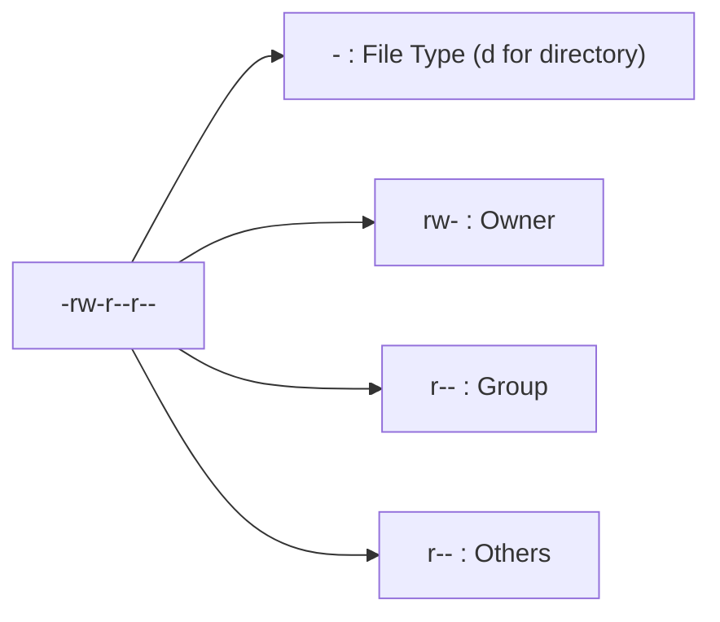
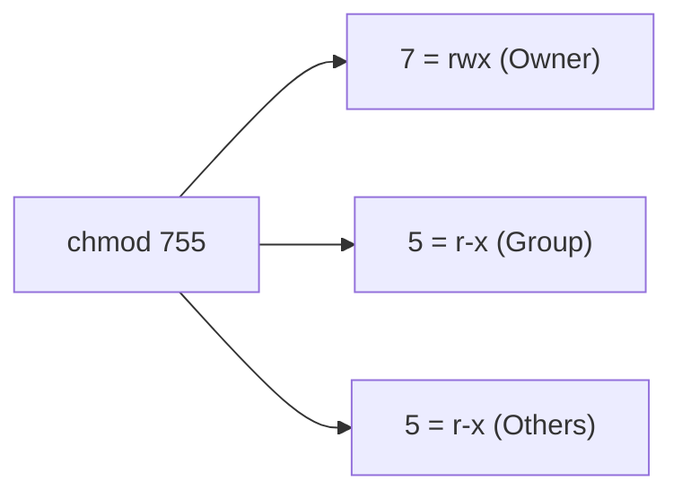
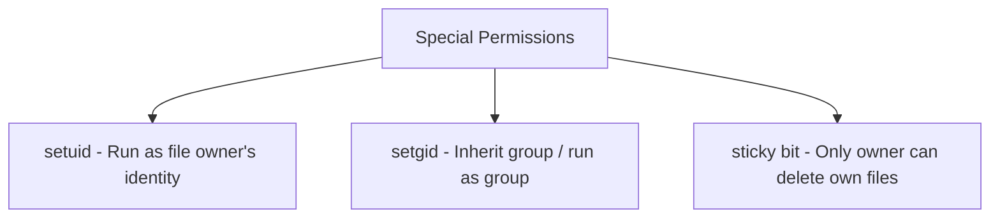

> **الهدف من الـ Section ده:**  
>  هتفهم نظام الصلاحيات في Linux بالكامل - Read/Write/Execute، Ownership، وإزاي تستخدم `chmod` بالـ Symbolic والـ Octal Notation، وهتتعرف على أخطر جزء فيها من ناحية الأمن: الـ Special Permissions زي `setuid` اللي ممكن تتحول لباب خلفي لو اتضبطت غلط.

## Table of Contents

- [Overview](#overview)
- [1. Basic Permissions](#1-basic-permissions)
- [2. Ownership & Permission Groups](#2-ownership--permission-groups)
- [3. Permission Operators](#3-permission-operators)
- [4. Checking File Permissions](#4-checking-file-permissions)
- [5. Changing Permissions with chmod](#5-changing-permissions-with-chmod)
- [6. Special Permissions](#6-special-permissions)
- [7. Changing Ownership](#7-changing-ownership)
- [8. Quick Summary](#8-quick-summary)
- [SOC Analyst Perspective](#soc-analyst-perspective)
- [Summary](#summary)

---

## Overview

صلاحيات الملفات في Linux (**Linux File Permissions**) هي أساس أمان النظام كله. بتحدد مين يقدر يقرأ، يكتب، أو ينفذ الملفات والمجلدات، وده بيضمن إن بس المستخدمين أو العمليات المصرح لهم هي اللي توصل للبيانات الحساسة. الصلاحيات دي بتتعدل باستخدام أمر `chmod`.



---

## 1. Basic Permissions

كل ملف أو مجلد ليه 3 أنواع من الصلاحيات:

| Permission | Meaning |
|---|---|
| `r` | Read – View file contents or list directory contents |
| `w` | Write – Modify the file or add/delete files in a directory |
| `x` | Execute – Run a file as a program or enter a directory |

> [!NOTE]
> صلاحية `x` على **الملف** معناها تشغيله كبرنامج، لكن نفس الصلاحية على **المجلد** معناها مختلف تمامًا - إنك تقدر تدخل (`cd`) للمجلد ده أصلاً. المجلد من غير `x` تقدر تشوف اسمه بس مش تدخله.

---

## 2. Ownership & Permission Groups

الصلاحيات بتتحدد لـ 3 فئات من المستخدمين:

| Symbol | Category | Description |
|---|---|---|
| `u` | User | The owner of the file |
| `g` | Group | Users who are members of the file's group |
| `o` | Others | All other users on the system |
| `a` | All | User, Group, and Others |



---

## 3. Permission Operators

| Operator | Function |
|---|---|
| `+` | Add permission |
| `-` | Remove permission |
| `=` | Set permission exactly |

> [!TIP]
> الفرق بين `+`/`-` و `=`: العلامتين الأوليين بيضيفوا أو يشيلوا صلاحية **من غير ما يأثروا** على باقي الصلاحيات الموجودة، بينما `=` بيحدد الصلاحيات **بالظبط** ويمسح أي صلاحية تانية كانت موجودة قبل كده.

---

## 4. Checking File Permissions

### 4.1 Using `ls -l`

```bash
ls -l filename
```

**Example output**:

```
-rw-r--r-- 1 user group 46 Apr 14 16:37 NarX.txt
```

| Segment | Meaning |
|---|---|
| `-` | file type (`d` = directory) |
| `rw-` | owner permissions |
| `r--` | group permissions |
| `r--` | others permissions |



### 4.2 Using `stat`

```bash
stat filename
```

بيعرض حجم الملف، وقت التعديل، وقت الوصول، وتفاصيل تانية.

### 4.3 Using `namei`

```bash
namei -l /path/to/file
```

بيوريك صلاحيات كل مجلد على طول مسار الملف.

> [!TIP]
> `namei -l` أداة قيّمة جدًا لما تحاول تفهم "ليه المستخدم مش عارف يوصل للملف ده"، لأنها بتوريك صلاحيات **كل مجلد** في المسار كامل، مش الملف النهائي بس. أحيانًا المشكلة بتكون في مجلد وسطاني مش في الملف نفسه.

---

## 5. Changing Permissions with chmod

### 5.1 Symbolic Notation

**Add execute permission for others**:

```bash
chmod o+x xyz.txt
```

**Remove all permissions for everyone**:

```bash
chmod ugo-rwx xyz.txt
```

**Add read/write to owner and group, remove execute for others**:

```bash
chmod ug+rw,o-x abc.mp4
```

**Add read/execute to owner/group, read for others**:

```bash
chmod ug=rx,o+r abc.c
```

### 5.2 Octal Notation

الصلاحيات ممكن تتمثل رقميًا:

```
r = 4, w = 2, x = 1
```

3 أرقام: Owner, Group, Others.

**Example**:

```bash
chmod 755 file.txt
```

| Digit | Calculation | Result |
|---|---|---|
| 7 | 4+2+1 | rwx (Owner) |
| 5 | 4+0+1 | r-x (Group) |
| 5 | 4+0+1 | r-x (Others) |



> [!IMPORTANT]
> احفظ الجدول ده - هتستخدمه كتير جدًا في تحليل أي صلاحية رقمية:

| Value | Permission |
|---|---|
| 0 | --- (no permissions) |
| 1 | --x |
| 2 | -w- |
| 3 | -wx |
| 4 | r-- |
| 5 | r-x |
| 6 | rw- |
| 7 | rwx |

---

## 6. Special Permissions

### 1. `setuid` → Run file with owner's privileges

```bash
chmod u+s program
```

### 2. `setgid` → Run file or inherit group of directory

```bash
chmod g+s directoryname
```

### 3. `sticky bit` → Only owner can delete/rename files in directory

```bash
chmod +t directoryname
```



> [!WARNING]
> الـ **Special Permissions** دي من أقوى وأخطر مفاهيم الصلاحيات في Linux. `setuid` بالذات بيخلي أي مستخدم عادي ينفذ برنامج **بصلاحيات صاحب الملف الأصلي** (غالبًا root)، وده أساس عدد كبير جدًا من تقنيات الـ **Privilege Escalation** المعروفة في Linux.

---

## 7. Changing Ownership

**Change owner and group using `chown`**:

```bash
chown user:group file.txt
```

**Modify permissions with `chmod`**:

```bash
chmod 755 file.txt
```

> [!NOTE]
> `chmod` بيتحكم في **الصلاحيات** (مين يقدر يعمل إيه)، بينما `chown` بيتحكم في **الملكية** (مين هو الـ Owner والـ Group أصلاً). الاتنين مختلفين تمامًا ومكملين لبعض.

---

## 8. Quick Summary

- `r` → read, `w` → write, `x` → execute
- User groups: `u` = owner, `g` = group, `o` = others, `a` = all
- Permissions can be symbolic or octal
- Special permissions: `setuid`, `setgid`, `sticky bit`
- Change ownership: `chown user:group file.txt`

---

## SOC Analyst Perspective

> [!IMPORTANT]
> إعدادات الصلاحيات الخاطئة (Misconfigured Permissions) هي من أكتر أسباب الاختراقات شيوعًا في بيئات Linux، وفحص صلاحيات الملفات الحساسة جزء أساسي من أي **Security Audit** أو **Incident Response**.

### Common Threats Related to Permissions

| Threat | Description | MITRE ATT&CK Reference |
|---|---|---|
| SUID/SGID Privilege Escalation | استغلال ملفات عندها `setuid` bit مربوطة بـ root عشان تنفذ أوامر بصلاحيات إدارية كاملة من حساب عادي | T1548.001 - Abuse Elevation Control Mechanism: Setuid and Setgid |
| World-Writable Files/Directories | ملفات أو مجلدات صلاحياتها `777` أو فيها `w` للـ Others بتسمح لأي مستخدم يعدلها، وده بيفتح الباب للتلاعب أو زرع كود ضار | T1222.002 - File and Directory Permissions Modification: Linux and Mac |
| Weak Permissions on Sensitive Files | ملفات زي `/etc/shadow` أو مفاتيح SSH لو صلاحياتها متظبطتش صح، ممكن تتقرأ من مستخدمين مش المفروض يوصلوا ليها | T1552.004 - Unsecured Credentials: Private Keys |
| Sticky Bit Missing on Shared Directories | مجلدات مشتركة (زي `/tmp`) من غير Sticky Bit بتسمح لأي مستخدم يمسح أو يعدل ملفات مستخدمين تانيين فيها | T1222 - File and Directory Permissions Modification |

> [!WARNING]
> أشهر تقنية Privilege Escalation في Linux بتعتمد على البحث عن ملفات عندها `setuid` bit مربوطة بـ root. الأمر الكلاسيكي اللي أي مهاجم (أو محلل أمني بيعمل Assessment) بيستخدمه:
> ```bash
> find / -perm -4000 -type f 2>/dev/null
> ```
> الأمر ده بيدور على كل الملفات اللي عندها `setuid` bit مفعّل في النظام كله. لو لقيت ملف غير متوقع في القائمة دي (خصوصًا لو مش من أدوات النظام القياسية)، ده يستاهل تحقيق فوري.

### Detection & Best Practices

- استخدام `find / -perm -4000` و `find / -perm -2000` بشكل دوري لمراجعة أي ملفات عندها `setuid`/`setgid` غير متوقعة
- التأكد من إن **Sticky Bit** مفعّل على أي مجلد مشترك بين مستخدمين متعددين (زي `/tmp`)
- مراجعة صلاحيات الملفات الحساسة بانتظام: `/etc/shadow` المفروض تكون `600` أو أضيق، ومفاتيح SSH الخاصة المفروض تكون `600`
- تجنب استخدام `chmod 777` نهائيًا إلا في حالات استثنائية جدًا وموثقة، لأنها بتفتح الملف/المجلد للجميع من غير أي قيود
- مراقبة أي تغيير في صلاحيات الملفات الحرجة عن طريق أدوات زي `auditd` مع قواعد خاصة لمراقبة `chmod`/`chown`

> [!TIP]
> لو لاحظت ملف تنفيذي (Executable) في مجلد زي `/tmp` أو `/home` عنده `setuid` bit مفعّل ومملوك لـ root، ده مؤشر شديد الخطورة على محاولة **Privilege Escalation** جارية أو ناجحة بالفعل، ولازم يتحقق فيه فورًا ويتشال لحد ما يتفهم مصدره.

---

## Summary

- صلاحيات Linux بتتكون من 3 أنواع أساسية: **r (Read), w (Write), x (Execute)**، ومحددة لـ 3 فئات: **u (Owner), g (Group), o (Others)**
- الصلاحيات ممكن تتعدل بـ `chmod` بطريقتين: **Symbolic** (زي `chmod o+x file`) أو **Octal** (زي `chmod 755 file`)
- الـ **Special Permissions** (`setuid`, `setgid`, `sticky bit`) قوية جدًا ومحتاجة حذر شديد، خصوصًا `setuid` لخطورته في الـ Privilege Escalation
- `chown` بيغيّر **الملكية** (Owner/Group)، بينما `chmod` بيغيّر **الصلاحيات** فوق الملكية دي
- من ناحية الـ SOC: أهم المخاطر هي **SUID/SGID Privilege Escalation (T1548.001)**، **World-Writable Files (T1222.002)**، وضعف صلاحيات الملفات الحساسة (T1552.004)، والأمر `find / -perm -4000` أداة أساسية لأي Audit أمني على Linux
