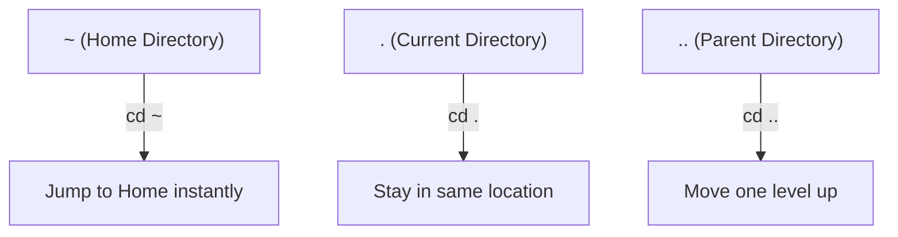

> **الهدف من الـ Section ده:**  
> الهدف من الـ Section ده: هتتقن أهم أوامر التنقل والتعامل مع الملفات في Linux (pwd, ls, cd, mkdir, cp, mv, touch)، وهتفهم إزاي بعض الأوامر البسيطة دي (زي touch) ممكن تتستخدم من المهاجمين لإخفاء آثارهم، وإزاي تكتشف كده كـ SOC Analyst.


## Table of Contents

- [Why File System Navigation Matters](#why-file-system-navigation-matters)
- [Commonly Used File System Navigation Commands](#commonly-used-file-system-navigation-commands)
  - [1. pwd – Print Working Directory](#1-pwd--print-working-directory)
  - [2. ls – List Files and Directories](#2-ls--list-files-and-directories)
  - [3. cd – Change Directory](#3-cd--change-directory)
  - [4. mkdir – Make Directory](#4-mkdir--make-directory)
  - [5. rmdir – Remove Empty Directory](#5-rmdir--remove-empty-directory)
  - [6. cp – Copy Files](#6-cp--copy-files)
  - [7. mv – Move or Rename Files](#7-mv--move-or-rename-files)
  - [8. touch – Create Empty Files & Manage Timestamps](#8-touch--create-empty-files--manage-timestamps)
- [Useful Navigation Shortcuts](#useful-navigation-shortcuts)
- [Summary Table – Linux File System Navigation Commands](#summary-table--linux-file-system-navigation-commands)
- [SOC Analyst Perspective](#soc-analyst-perspective)
- [Summary](#summary)

---

## Why File System Navigation Matters

استخدام أوامر التنقل في Linux بيساعدك على:

- Move between directories quickly and efficiently
- Locate files and understand the folder hierarchy
- Manage files and directories with confidence
- Perform system administration and troubleshooting tasks

بيستخدمها المطورين، System Administrators، ومتخصصي الأمن السيبراني بشكل واسع.

> [!NOTE]
> إتقان الأوامر دي مش بس لإدارة النظام - هي نفس الأدوات اللي هتستخدمها كـ SOC Analyst وقت أي تحقيق حي (Live Investigation) على جهاز Linux مشتبه فيه.

---

## Commonly Used File System Navigation Commands

### 1. pwd – Print Working Directory

الأمر `pwd` بيعرض المسار الكامل للمجلد اللي إنت شغال فيه حاليًا.

```bash
pwd
```

**Example Output**:

```
/home/kali/Templates
```

**Explanation**: إنت حاليًا جوه مجلد `Templates`، الموجود تحت `/home/kali`.

### 2. ls – List Files and Directories

الأمر `ls` بيسرد كل الملفات والمجلدات جوه المجلد الحالي.

```bash
ls
```

**Use Case**: بيديك نظرة سريعة على محتويات المجلد.

**Helpful Variants**:

```bash
ls -l   # Detailed list
ls -a   # Include hidden files
```

> [!IMPORTANT]
> `ls -a` من أهم الأوامر بالنسبة لأي محقق أمني، لأن Linux بيخفي أي ملف اسمه بيبدأ بنقطة (`.`) من العرض العادي. المهاجمين أحيانًا بيستخدموا الملفات المخفية دي عشان يخبوا أدواتهم، وأمر `ls` العادي من غير `-a` مش هيوريهالك.

### 3. cd – Change Directory

الأمر `cd` بيخليك تتنقل بين المجلدات.

**Move to a Nearby Directory**:

```bash
cd Downloads
```

**Move Using an Absolute Path**:

```bash
cd /home/username/Documents
```

### 4. mkdir – Make Directory

الأمر `mkdir` بيستخدم لإنشاء مجلدات جديدة.

```bash
mkdir GeeksForGeeks
```

**Result**: مجلد جديد اسمه `GeeksForGeeks` بيتعمل.

### 5. rmdir – Remove Empty Directory

الأمر `rmdir` بيحذف مجلد فاضي.

```bash
rmdir GeeksForGeeks
```

**Important Notes**:

- المجلد لازم يكون فاضي
- الأمر بيفشل لو فيه ملفات جواه

### 6. cp – Copy Files

الأمر `cp` بينسخ ملفات أو مجلدات من مكان لمكان تاني.

```bash
cp ~/Downloads/image.jpg ~/Pictures
```

**Explanation**: بينسخ الملف مع الاحتفاظ بالأصلي.

### 7. mv – Move or Rename Files

الأمر `mv` بينقل أو بيعيد تسمية الملفات والمجلدات.

**Move a File**:

```bash
mv ~/Downloads/image.jpg ~/Pictures
```

**Rename a File**:

```bash
mv old_name.txt new_name.txt
```

### 8. touch – Create Empty Files & Manage Timestamps

الأمر `touch` بيستخدم لإنشاء ملفات فاضية أو تحديث الـ Timestamps بتاعة الملف من غير ما يعدل محتواه.

**Create an Empty File**:

لو الملف مش موجود، `touch` بينشئه.

```bash
touch file.txt
```

**Result**: ملف فاضي اسمه `file.txt` بيتعمل.

> [!TIP]
> **Quick Note**:
> - لو الملف مش موجود → `touch` بينشئ ملف فاضي جديد
> - لو الملف موجود بالفعل → `touch` بيحدث الـ Timestamps بس (Access Time & Modification Time)

**Create Multiple Files**:

```bash
touch file1.txt file2.txt file3.txt
```

**Use Case**: تجهيز ملفات مشروع أو اختبار بسرعة.

**Verify File Timestamps**:

```bash
stat file.txt
```

**Displays**:

- Access Time
- Modification Time
- Change Time

> [!WARNING]
> نفس القدرة اللي بتخلي `touch` مفيد لإدارة الـ Timestamps، هي بالظبط اللي بتخليه أداة خطيرة في إيد مهاجم متمرس. المهاجم يقدر يستخدم `touch` عشان **يغيّر تاريخ التعديل بتاع ملف ضار** ليتطابق مع ملفات النظام الأصلية، وده بيسمى **Timestomping** - تقنية شائعة جدًا لإخفاء الأدلة أثناء أي تحقيق جنائي رقمي.

---

## Useful Navigation Shortcuts

| Shortcut | Meaning | Command |
|---|---|---|
| `~` | Home Directory | `cd ~` |
| `.` | Current Directory | `cd .` |
| `..` | Parent Directory | `cd ..` |

### tree – Visualize Directory Structure

الأمر `tree` بيعرض المجلدات بشكل شجري (Tree-like Format).

```bash
tree
```

**Use Case**: بيساعد في تصور تسلسل المجلدات (Folder Hierarchy) بوضوح.



---

## Summary Table – Linux File System Navigation Commands

| Command | Purpose | Example |
|---|---|---|
| `pwd` | Show current directory path | `pwd` |
| `ls` | List files and directories | `ls -la` |
| `cd` | Change directory | `cd /home/user/Documents` |
| `mkdir` | Create a new directory | `mkdir NewFolder` |
| `rmdir` | Remove an empty directory | `rmdir NewFolder` |
| `cp` | Copy files or directories | `cp file.txt ~/Backup/` |
| `mv` | Move or rename files/directories | `mv old.txt new.txt` |
| `touch` | Create empty file or update timestamps | `touch file.txt` |
| `stat` | Display detailed file timestamps | `stat file.txt` |
| `tree` | Display directory structure visually | `tree` |

---

## SOC Analyst Perspective

> [!IMPORTANT]
> الأوامر البسيطة دي هي أدواتك الأساسية أثناء أي **Live Response** على جهاز Linux مصاب. سرعتك في التنقل والتحقق من الملفات بتفرق كتير في الوقت اللي بتاخده عملية التحقيق.

### Security-Relevant Notes on These Commands

| Command | Security Relevance |
|---|---|
| `ls -a` | ضروري لكشف الملفات والمجلدات المخفية اللي المهاجمين ممكن يخبوا فيها أدواتهم |
| `touch` | ممكن يتستخدم في **Timestomping** لتغيير تاريخ ملف ضار عشان يتماشى مع ملفات النظام الشرعية |
| `stat` | أداة أساسية للتحقق من الـ Timestamps الحقيقية ومقارنتها بالمتوقع - مفيد لاكتشاف Timestomping |
| `cp` / `mv` | مراقبة استخدامهم على ملفات حساسة (زي `/etc/passwd` أو `/etc/shadow`) ممكن يكشف محاولة نسخ بيانات حساسة |
| `mkdir` في `/tmp` | إنشاء مجلدات جديدة في `/tmp` غالبًا خطوة أولى لتحضير مكان لتشغيل أو تخزين ملفات ضارة |

من ناحية الـ MITRE ATT&CK:

| Technique | Description |
|---|---|
| T1070.006 - Indicator Removal: Timestomp | استخدام أوامر زي `touch` لتغيير الـ Timestamps وإخفاء آثار التعديل على ملف ضار |
| T1083 - File and Directory Discovery | استخدام أوامر زي `ls` و `tree` من المهاجم لاستكشاف بنية النظام بعد الاختراق |
| T1005 - Data from Local System | استخدام `cp` أو `mv` لتجميع ملفات حساسة قبل تهريبها |

> [!TIP]
> لو لقيت ملف في `/tmp` أو أي مجلد مشبوه ليه Timestamp قديم جدًا (زي تاريخ تثبيت النظام) لكن محتواه أو حجمه غريب، ده مؤشر قوي على **Timestomping**. قارن دايمًا بين الـ **Modification Time** والـ **Change Time** باستخدام `stat` - المهاجمين غالبًا بيقدروا يغيروا الأول بسهولة، لكن الـ Change Time (اللي بيسجل آخر تعديل على الـ Metadata نفسها) أصعب في التلاعب بيه.

---

## Summary

- أوامر التنقل الأساسية في Linux: **`pwd`** (المسار الحالي)، **`ls`** (عرض المحتويات)، **`cd`** (التنقل)، **`mkdir`/`rmdir`** (إنشاء/حذف مجلدات)
- أوامر إدارة الملفات: **`cp`** (نسخ)، **`mv`** (نقل/إعادة تسمية)، **`touch`** (إنشاء ملف فاضي أو تحديث Timestamps)
- اختصارات مهمة: **`~`** (Home)، **`.`** (Current)، **`..`** (Parent)، بالإضافة لأمر **`tree`** لتصور بنية المجلدات
- من ناحية الـ SOC: أوامر بسيطة زي `touch` ممكن تتستخدم في هجمات **Timestomping (T1070.006)** لإخفاء آثار الملفات الضارة، وأمر `stat` أداة أساسية لكشف التلاعب ده عن طريق مقارنة الـ Modification Time بالـ Change Time
- إتقان الأوامر دي ضروري لأي عملية **Live Incident Response** سريعة وفعالة على أنظمة Linux
