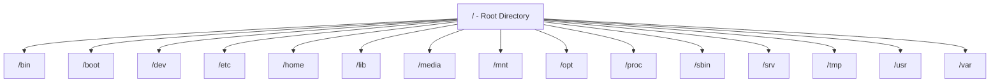

> **الهدف من الـ Section ده:**  
> الهدف من الـ Section ده: هتفهم إزاي Linux بينظم كل ملفاته تحت مجلد واحد أساسي (`/`)، وهتحفظ وظيفة كل مجلد رئيسي، وهتقدر تربط ده بمعرفة أماكن الأدلة الجنائية (Forensic Artifacts) المهمة زي الـ Logs وملفات الإعدادات وقت أي تحقيق على جهاز Linux.

## Table of Contents

- [Overview](#overview)
- [/ — Root Directory](#--root-directory)
- [/bin — Essential User Binaries](#bin--essential-user-binaries)
- [/boot — Boot Loader Files](#boot--boot-loader-files)
- [/dev — Device Files](#dev--device-files)
- [/etc — Configuration Files](#etc--configuration-files)
- [/home — User Home Directories](#home--user-home-directories)
- [/lib — System Libraries](#lib--system-libraries)
- [/media — Removable Media](#media--removable-media)
- [/mnt — Temporary Mount Point](#mnt--temporary-mount-point)
- [/opt — Optional Software](#opt--optional-software)
- [/sbin — System Binaries](#sbin--system-binaries)
- [/srv — Service Data](#srv--service-data)
- [/tmp — Temporary Files](#tmp--temporary-files)
- [/usr — User Utilities and Applications](#usr--user-utilities-and-applications)
- [/var — Variable Data](#var--variable-data)
- [/proc — Process Information](#proc--process-information)
- [Full Directory Tree Overview](#full-directory-tree-overview)
- [SOC Analyst Perspective](#soc-analyst-perspective)
- [Summary](#summary)

---

## Overview

الـ **Linux File Hierarchy Structure (FHS)** بتحدد الشكل القياسي (Standard Directory Layout) اللي Linux وأنظمة شبيهة بـ Unix بتستخدمه. بتوفر طريقة منظمة وثابتة لتخزين ملفات النظام، بيانات المستخدمين، ملفات الإعدادات، والتطبيقات.

في Linux، كل حاجة بتبدأ من مجلد الـ **Root** `/`، وكل الملفات والمجلدات منظمة تحته، سواء كانت موجودة على أجهزة فيزيائية أو Virtual.

> [!NOTE]
> فكر في `/` زي جذر شجرة - كل فرع (مجلد) طالع منه بشكل مباشر أو غير مباشر، ومفيش أي مجلد "فوق" الـ Root ده أبدًا.

---

## / — Root Directory

المجلد الرئيسي (Top-Level Directory) في Linux.

- All files and directories originate from `/`
- No directory exists above it
- Only the **root user** can modify its contents
- `/root` is the home directory of the root user and is different from `/`

> [!WARNING]
> متلخبطش بين `/` (Root Directory - جذر النظام كله) و `/root` (Home Directory بتاع مستخدم الـ root بس). الاتنين مختلفين تمامًا رغم تشابه الاسم.

---

## /bin — Essential User Binaries

بيحتوي على الأوامر الأساسية (Essential Command Binaries) المطلوبة لكل المستخدمين.

- Available in single-user and recovery modes
- Includes commonly used commands

**Examples**: `ls`, `cp`, `ping`, `grep`, `ps`

---

## /boot — Boot Loader Files

بيخزن الملفات المطلوبة لتشغيل النظام (Boot the System).

- Kernel files
- Bootloader configuration (**GRUB**)

**Examples**: `vmlinuz`, `initrd.img`

---

## /dev — Device Files

بيمثل الأجهزة الفيزيائية على هيئة ملفات (Hardware Devices as Files).

- Block devices (disks)
- Character devices (keyboard, mouse, terminals)

**Examples**: `/dev/sda1`, `/dev/tty1`

> [!NOTE]
> فلسفة Linux الشهيرة "**Everything is a file**" بتظهر بوضوح هنا - حتى الأجهزة الفيزيائية زي الهارد ديسك أو الكيبورد بيتم التعامل معاها كملفات عادية جوه `/dev`.

---

## /etc — Configuration Files

بيحتوي على ملفات الإعدادات على مستوى النظام كله (System-wide Configuration).

- Application and service configurations
- Startup and shutdown scripts

**Examples**: `/etc/passwd`, `/etc/resolv.conf`

---

## /home — User Home Directories

بيخزن المجلدات الشخصية للمستخدمين غير الـ root.

- Each user has a private workspace
- Users can manage files only in their own directory

**Examples**: `/home/ahmed`, `/home/ali`

---

## /lib — System Libraries

بيحتوي على المكتبات المشتركة (Shared Libraries) المطلوبة للـ Binaries الأساسية.

- Needed by programs in `/bin` and `/sbin`

**Examples**: `lib*.so`, `ld*.so`

---

## /media — Removable Media

نقطة تثبيت (Mount Point) للأجهزة القابلة للفصل.

- USB drives
- CDs and DVDs

**Examples**: `/media/usb`, `/media/cdrom`

---

## /mnt — Temporary Mount Point

بيستخدم لتثبيت أنظمة ملفات مؤقتة يدويًا.

- Commonly used by system administrators

---

## /opt — Optional Software

بيخزن تطبيقات طرف ثالث أو إضافية.

- Software not included in the default system installation

**Examples**: `/opt/google`, `/opt/oracle`

---

## /sbin — System Binaries

بيحتوي على أوامر إدارية (Administrative Commands).

- Primarily used by the root user
- Used for system maintenance and repair

**Examples**: `iptables`, `fdisk`, `reboot`, `ifconfig`

---

## /srv — Service Data

بيخزن البيانات اللي بتقدمها خدمات النظام (Data Served by System Services).

- Web servers
- FTP servers
- Version control systems

**Examples**: `/srv/www`, `/srv/ftp`

---

## /tmp — Temporary Files

بيحمل الملفات المؤقتة اللي بتنشئها التطبيقات.

- Files are deleted automatically on reboot

> [!WARNING]
> `/tmp` من أكتر الأماكن استخدامًا من الـ Malware لتخزين ملفاته مؤقتًا أثناء التنفيذ، لأنه عادةً قابل للكتابة من كل المستخدمين ومحتواه بيتمسح تلقائي، وده بيصعب أحيانًا تتبع الأدلة لو الجهاز اتعمله Reboot قبل التحقيق.

---

## /usr — User Utilities and Applications

بيحتوي على غالبية التطبيقات والأدوات على مستوى المستخدم.

### Important subdirectories

- `/usr/bin` — User commands
- `/usr/sbin` — Administrative commands
- `/usr/lib` — Libraries
- `/usr/local` — Locally installed software
- `/usr/src` — Linux kernel source files

---

## /var — Variable Data

> [!NOTE]
> المجلد ده من أهم مجلدات النظام لكنه ملحقش في المصدر الأصلي اللي بعتهولي، فكملته بمعلومات مرجعية قياسية عشان الصورة تكون متكاملة.

بيخزن البيانات المتغيرة باستمرار أثناء تشغيل النظام (Variable Data).

- System logs
- Mail spools
- Print queues
- Cache files

**Examples**: `/var/log`, `/var/mail`, `/var/spool`

> [!IMPORTANT]
> `/var/log` هو **أهم مجلد بالنسبة لأي SOC Analyst** في نظام Linux بالكامل، لأنه المكان اللي بتتخزن فيه أغلب الـ System Logs (زي `/var/log/auth.log` أو `/var/log/syslog`) اللي هتعتمد عليها في أي تحقيق.

---

## /proc — Process Information

نظام ملفات افتراضي (Virtual Filesystem) بيوفر معلومات النظام Real-Time.

- Process details
- Memory usage
- System uptime

**Examples**: `/proc/meminfo`, `/proc/uptime`, `/proc/[pid]`

> [!TIP]
> `/proc` مش موجود فعليًا على الهارد ديسك - هو بيتولد ديناميكيًا (Dynamically Generated) بواسطة الـ Kernel في الـ RAM، وبيدي "لقطة حية" (Live Snapshot) لحالة النظام في أي لحظة، وده اللي بيخليه أداة قوية جدًا في التحقيقات الحية (Live Forensics).

---

## Full Directory Tree Overview

| Directory | Purpose |
|---|---|
| `/` | Root of the entire filesystem |
| `/bin` | Essential user command binaries |
| `/boot` | Kernel and bootloader files |
| `/dev` | Device files |
| `/etc` | System-wide configuration files |
| `/home` | User home directories |
| `/lib` | Shared libraries |
| `/media` | Removable media mount points |
| `/mnt` | Temporary manual mount points |
| `/opt` | Optional/third-party software |
| `/proc` | Virtual filesystem - live process/system info |
| `/sbin` | Administrative/system binaries |
| `/srv` | Service-related data |
| `/tmp` | Temporary files (cleared on reboot) |
| `/usr` | User-level applications and utilities |
| `/var` | Variable data (logs, mail, cache) |

---

## SOC Analyst Perspective

> [!IMPORTANT]
> فهم الـ FHS مش مجرد معلومة نظرية - ده **خريطة أساسية** لأي تحقيق على جهاز Linux، لأن كل نوع دليل (Evidence) ليه مكان متوقع تقدر تلاقيه فيه بسرعة.

### Key Directories for Forensics & Incident Response

| Directory | Investigative Value |
|---|---|
| `/var/log` | المصدر الأساسي لكل الـ System Logs (Authentication, Kernel, Application Logs) |
| `/etc/passwd` & `/etc/shadow` | معلومات المستخدمين وكلمات السر المشفرة - هدف شائع لمحاولات سرقة بيانات الدخول |
| `/tmp` | مكان شائع لتخزين ملفات الـ Malware المؤقتة أثناء التنفيذ |
| `/proc/[pid]` | فحص العمليات الشغالة حاليًا Live، مفيد جدًا لاكتشاف عمليات ضارة مخفية |
| `/home/[user]` | ملفات المستخدم الشخصية، تاريخ الأوامر (`.bash_history`)، ومفاتيح SSH |
| `/etc/cron*` و `/etc/init.d` | أماكن شائعة لتحقيق **Persistence** بواسطة المهاجمين |

> [!WARNING]
> ملف `.bash_history` جوه مجلد المستخدم في `/home` بيسجل كل الأوامر اللي اتنفذت، وده مصدر دليل قوي جدًا في أي تحقيق - لكن انتبه إن المهاجمين المتمرسين غالبًا بيمسحوا أو يعدلوا الملف ده لإخفاء آثارهم (**Anti-Forensics Technique**).

من ناحية الـ MITRE ATT&CK:

| Technique | Relevant Directory |
|---|---|
| T1074.001 - Local Data Staging | `/tmp` أو أي مجلد قابل للكتابة يستخدم لتجميع بيانات مسروقة قبل الـ Exfiltration |
| T1053.003 - Scheduled Task/Job: Cron | `/etc/cron.d`, `/etc/crontab` لتحقيق Persistence |
| T1552.001 - Unsecured Credentials: Credentials In Files | `/etc/passwd`, `/home/*/.bash_history`, ملفات إعدادات فيها بيانات دخول مكشوفة |
| T1070.003 - Indicator Removal: Clear Command History | تعديل أو مسح `.bash_history` لإخفاء آثار النشاط |

> [!TIP]
> لما تحقق في جهاز Linux مشتبه فيه، ابدأ دايمًا بالترتيب ده: `/var/log` للـ Logs، بعدين `/tmp` لأي ملفات مشبوهة متروكة، بعدين `/etc/cron*` للتأكد من عدم وجود Persistence، وأخيرًا `/proc` لو الجهاز لسه شغال عشان تشوف العمليات الحية.

---

## Summary

- الـ **Linux File Hierarchy Structure (FHS)** بتنظم كل ملفات النظام تحت مجلد **Root** `/` واحد
- كل مجلد رئيسي له وظيفة محددة: `/bin` و `/sbin` للأوامر، `/etc` للإعدادات، `/home` لبيانات المستخدمين، `/var` للبيانات المتغيرة زي الـ Logs، و `/proc` لمعلومات النظام الحية
- `/tmp` مكان مؤقت بيتمسح عند الـ Reboot، وشائع الاستخدام من الـ Malware
- من ناحية الـ SOC: أهم المجلدات في أي تحقيق هي **`/var/log`** (للـ Logs)، **`/etc/passwd`** (لبيانات المستخدمين)، **`/tmp`** (لآثار Malware)، و **`/proc`** (للفحص الحي للعمليات)
- فهم الخريطة دي بيسرّع أي عملية Incident Response على جهاز Linux بشكل كبير، لأنك بتعرف بالظبط فين تدور على كل نوع دليل

