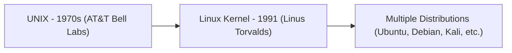
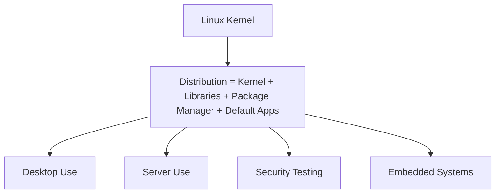
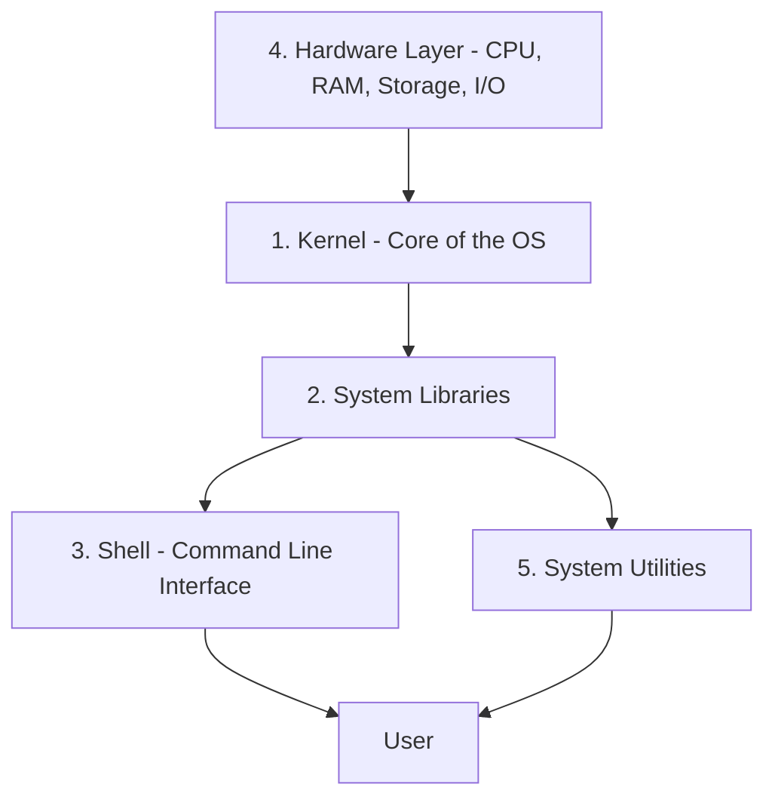
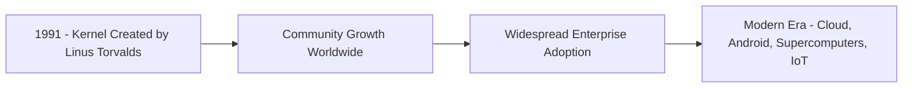

> **الهدف من الـ Section ده:**  
> هتاخد نظرة شاملة عن نظام تشغيل Linux، إزاي بنيته (Architecture) شغالة، أشهر التوزيعات (Distributions) ومنها Kali Linux المخصصة للأمن السيبراني، وهتفهم ليه إتقان Linux مش اختياري بالنسبة لأي SOC Analyst لأن معظم السيرفرات في العالم شغالة بيه.


## Table of Contents

- [Overview](#overview)
- [Linux Distributions](#linux-distributions)
- [Popular Linux Distributions](#popular-linux-distributions)
- [Importance of Linux](#importance-of-linux)
- [Architecture of Linux](#architecture-of-linux)
- [Applications of Linux](#applications-of-linux)
- [Installing Software on Linux](#installing-software-on-linux)
- [Basic Linux Commands](#basic-linux-commands)
- [History of Linux](#history-of-linux)
- [SOC Analyst Perspective](#soc-analyst-perspective)
- [Summary](#summary)

---

## Overview

**Linux** هو نظام تشغيل مجاني ومفتوح المصدر (Free and Open-Source)، معروف بالأمان، الاستقرار، ومجال استخدام واسع بيشمل السيرفرات، أجهزة الديسكتوب، التطوير، والأمن السيبراني.

Linux مبني على **UNIX**، اللي اتطور في السبعينات في **AT&T Bell Labs**، وده اللي قدم مفاهيم زي الأنظمة **Multi-User** و**Multitasking**، ووضع الأساس لأنظمة تشغيل حديثة كتير من ضمنها Linux نفسه.

Linux مجاني للاستخدام، التعديل، والتوزيع. طبيعته مفتوحة المصدر بتشجع على التعاون العالمي، الابتكار المستمر، الأمان القوي، والأداء الفعال عبر مجموعة واسعة من الأجهزة والصناعات.



---

## Linux Distributions

الـ **Linux Distribution (Distro)** هي نظام تشغيل كامل مبني حول الـ **Linux Kernel**، مدموج معاه مكتبات النظام، الأدوات، مديري الحزم (Package Managers)، والتطبيقات.

الـ Distribution عادةً بتشمل:

- The Linux kernel
- System libraries and utilities
- A package management system
- Default applications and a desktop environment

توزيعات مختلفة مصممة لاستخدامات محددة زي أجهزة الديسكتوب، السيرفرات، اختبار الأمان، والأنظمة المدمجة (Embedded Systems).



---

## Popular Linux Distributions

| Distribution | Use Case |
|---|---|
| Ubuntu | User-friendly and widely used for desktops, servers, and cloud environments |
| Debian | Highly stable and reliable, commonly used for servers |
| Kali Linux | Security-focused distribution for penetration testing and digital forensics |
| MX Linux | Lightweight distribution optimized for older hardware |
| Manjaro | Arch-based distribution with rolling updates and easy setup |
| Linux Mint | Beginner-friendly with a familiar desktop experience |
| Fedora | Cutting-edge distribution for developers and new technologies |
| openSUSE | Enterprise-ready distribution for system administration and development |

> [!IMPORTANT]
> **Kali Linux** هي التوزيعة الأهم بالنسبة لأي حد شغال في مجال الأمن السيبراني، لأنها بتيجي مثبت عليها مسبقًا مئات الأدوات المخصصة للـ Penetration Testing، Digital Forensics، وTools زي Wireshark، Nmap، وMetasploit.

---

## Importance of Linux

Linux منتشر جدًا بسبب مرونته، استقراره، وأمانه.

- High reliability and uptime, especially for servers
- Fully open-source and free
- Highly customizable for different environments
- Supported by a large global community and software ecosystem

---

## Architecture of Linux

Linux بيتبع بنية طبقية (Layered Architecture) بتحدد إزاي مكونات النظام بتتفاعل مع بعضها.



### 1. Kernel

الـ Kernel هو قلب نظام التشغيل.

- Manages CPU, memory, and device resources
- Handles process scheduling and hardware communication
- Prevents conflicts between running programs

**Types of kernels**: Monolithic, Microkernel, Hybrid, Exokernel

### 2. System Libraries

مكتبات النظام بتوفر دوال (Functions) قياسية بتستخدمها التطبيقات عشان تتفاعل مع الـ Kernel من غير ما تحتاج توصل ليه مباشرة.

### 3. Shell

الـ Shell هي واجهة سطر الأوامر (Command-Line Interface) المستخدمة للتواصل مع نظام التشغيل.

- Interprets user commands
- Acts as a bridge between users and the kernel

### 4. Hardware Layer

بتشمل المكونات الفيزيائية زي CPU، RAM، أجهزة التخزين، وأجهزة الإدخال/الإخراج.

### 5. System Utilities

أدوات بتستخدم لإعداد النظام، المراقبة، تثبيت البرمجيات، وإدارة المستخدمين.

> [!NOTE]
> فكر في الـ Shell زي "المترجم" بينك وبين الـ Kernel - إنت بتكتب أمر بلغة بشرية مفهومة (زي `ls`)، والـ Shell بيترجمه لطلب يقدر الـ Kernel يفهمه وينفذه فعليًا على الـ Hardware.

---

## Applications of Linux

Linux مستخدم عبر مجالات متعددة:

- **Servers and Hosting** – Web servers, cloud platforms, and data centers
- **Software Development** – Programming, testing, and deployment
- **Desktop Computing** – Daily personal and professional use
- **Cybersecurity** – Ethical hacking and penetration testing
- **Embedded Systems** – IoT devices, routers, and controllers
- **Supercomputers** – High-performance scientific computing
- **Education** – Teaching operating systems, networking, and programming

> [!TIP]
> الغالبية العظمى من السيرفرات، الـ Cloud Platforms (زي AWS وAzure)، وحتى نظام Android نفسه مبنيين على Linux Kernel. ده معناه إن أي SOC Analyst هيقابل أنظمة Linux باستمرار في شغله اليومي، مش بس في بيئات الـ Penetration Testing.

---

## Installing Software on Linux

طريقة تثبيت البرمجيات بتعتمد على الـ Distribution.

### Debian-based systems (Ubuntu, Mint)

```bash
sudo apt install package_name
```

### Fedora-based systems

```bash
sudo dnf install package_name
```

واجهات رسومية لمراكز البرمجيات (Software Centers) متاحة كمان لإدارة أسهل للتطبيقات.

---

## Basic Linux Commands

أوامر مستخدمة بشكل شائع:

| Command | Purpose |
|---|---|
| `ls` | List directory contents |
| `cd` | Change directory |
| `pwd` | Show current directory path |
| `cp`, `mv`, `rm` | Copy, move, and delete files |
| `top` | Monitor running processes |
| `df`, `free` | Check disk and memory usage |
| `ping`, `ifconfig`, `netstat` | Network troubleshooting |

---

## History of Linux

- **1991**: Linux kernel created by **Linus Torvalds**
- **Community Growth**: Developers worldwide contributed to kernel and tools
- **Adoption**: Widely used in servers, desktops, and enterprises
- **Modern Era**: Powers cloud platforms, Android devices, supercomputers, and embedded systems



Linux لسه بيتطور كنظام تشغيل آمن، مستقر، وقابل للتوسع بيستخدم عالميًا.

---

## SOC Analyst Perspective

> [!IMPORTANT]
> إتقان Linux مش رفاهية بالنسبة لأي SOC Analyst - هو **أساس** لأن الغالبية العظمى من الـ Servers، Web Applications، وأنظمة الـ Logging (زي ELK Stack وSplunk على Linux) شغالة على أنظمة Linux، وهتحتاج تتعامل مع سطر الأوامر بثقة أثناء أي تحقيق.

### Why Linux Matters for a SOC Analyst

| Area | Relevance |
|---|---|
| Log Investigation | معظم الـ System Logs على Linux موجودة في مسارات زي `/var/log/`، ولازم تعرف تقرأها وتفلترها بسطر الأوامر |
| Incident Response on Linux Servers | معرفة أوامر زي `top`, `netstat`, `ps` ضرورية لفحص جهاز مصاب (Compromised) واكتشاف عمليات أو اتصالات غريبة |
| Penetration Testing / Red Team Awareness | **Kali Linux** هي البيئة الأساسية اللي المهاجمين (وفرق الـ Red Team) بيستخدموها، فمعرفتها بتساعدك تفهم أدوات الهجوم من الجهة التانية |
| Server Hardening | فهم بنية Linux (Kernel, Shell, Utilities) ضروري عشان تقدر تقيّم إعدادات الأمان وتحدد الثغرات المحتملة |
| Malware Analysis | عينات الـ Malware المستهدفة لـ Linux (زي Botnets على IoT Devices) بتحتاج فهم للـ Shell والـ Processes عشان تحللها |

> [!WARNING]
> غياب المعرفة بـ Linux Command Line بيبقى نقطة ضعف حقيقية لأي محلل SOC، لأن كتير من الـ Investigation الأساسية (زي فحص الـ Processes النشطة، أو مراجعة الـ Logs، أو فحص الـ Network Connections) بتتطلب التعامل المباشر مع الـ Terminal، خصوصًا في بيئات Cloud وServers اللي مفيهاش واجهة رسومية أصلاً.

### Practical Starting Point

- تعلم أوامر التنقل الأساسية (`ls`, `cd`, `pwd`) والتعامل مع الملفات (`cp`, `mv`, `rm`)
- تعلم أوامر مراقبة النظام (`top`, `ps`, `df`, `free`) لفحص أي جهاز أثناء التحقيق
- تعلم أوامر الشبكة الأساسية (`ping`, `ifconfig`/`ip`, `netstat`/`ss`) لفهم حالة الاتصالات
- التعرف على مسارات الـ Logs المهمة زي `/var/log/auth.log` و `/var/log/syslog`

---

## Summary

- **Linux** نظام تشغيل مجاني ومفتوح المصدر مبني على أساس **UNIX**، معروف بالأمان والاستقرار
- الـ **Distribution** هي حزمة كاملة (Kernel + Libraries + Package Manager + Apps)، وأشهرها **Ubuntu, Debian, Kali Linux, Fedora**
- **Kali Linux** هي التوزيعة الأساسية في مجال الأمن السيبراني لأنها مجهزة بأدوات Penetration Testing وForensics
- بنية Linux طبقية: **Kernel → System Libraries → Shell → System Utilities**، فوق **Hardware Layer**
- مستخدم في: Servers, Development, Desktop, Cybersecurity, Embedded Systems, Supercomputers, Education
- من ناحية الـ SOC: إتقان Linux **أساسي مش اختياري**، لأن الـ Servers والـ Logging Systems ومعظم بيئات الـ Investigation شغالة عليه، وأوامر زي `top`, `netstat`, `ps` جزء أساسي من أي Incident Response على أنظمة Linux
