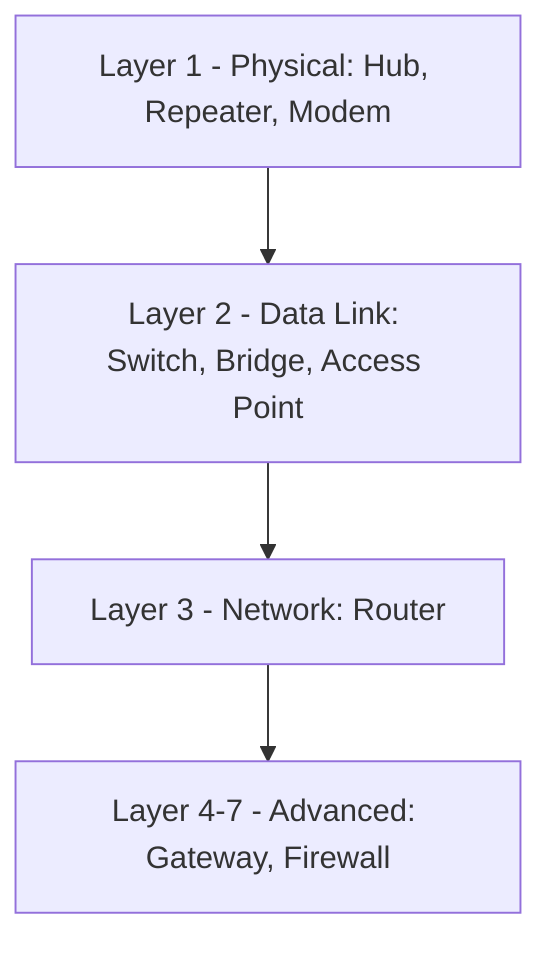
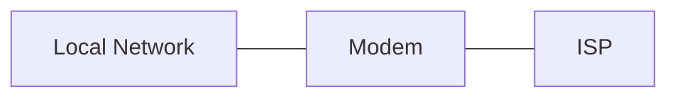
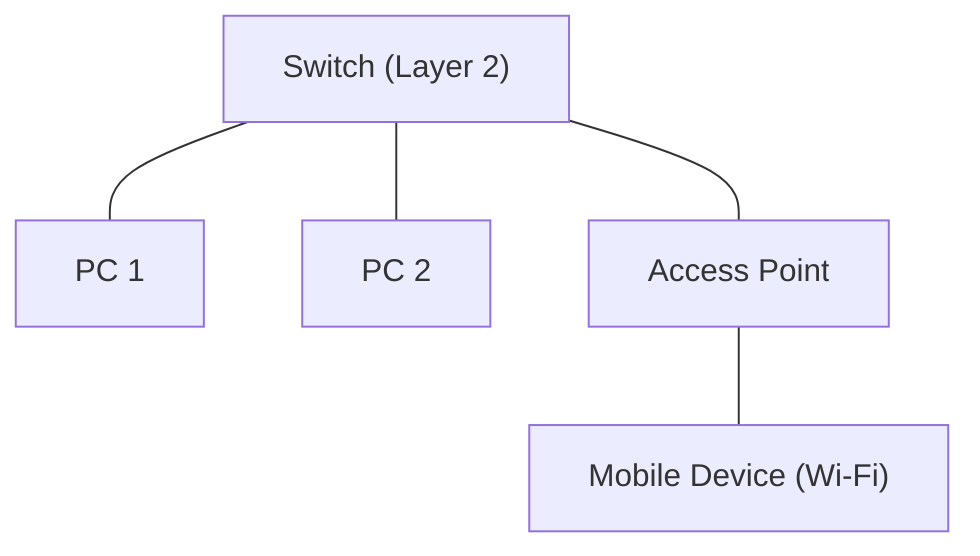
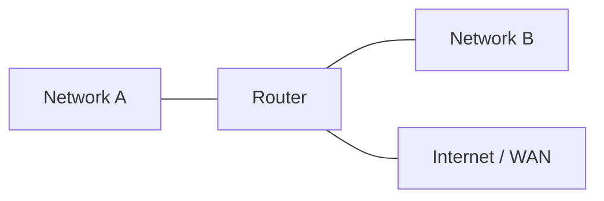
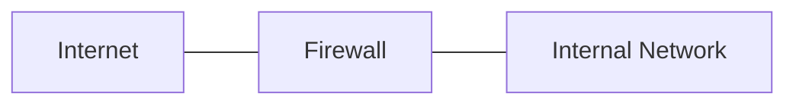
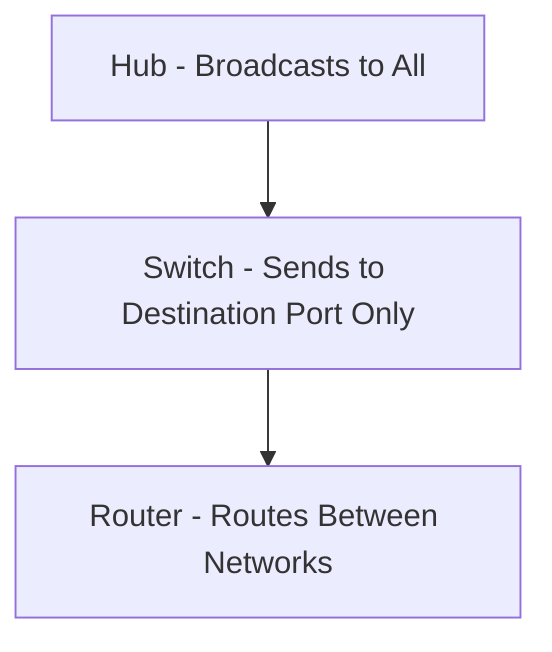
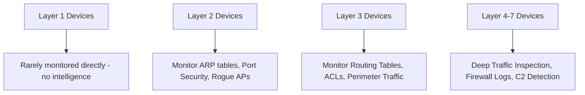

> **الهدف من الـ Section ده:**  
>  هتتعرف على أهم الـ Network Devices اللي بتبني الشبكة، وهتفهم إزاي كل جهاز شغال على أي Layer من الـ OSI Model، وليه فهم ده مهم جدًا وأنت بتحلل أي Incident أو تحدد فين ممكن الـ Attacker يستغل ضعف في الـ Hardware نفسه.

## Table of Contents

- [Introduction](#introduction)
- [Functions of Network Devices](#functions-of-network-devices)
- [Layer 1 Devices – Physical Layer](#layer-1-devices--physical-layer)
- [Layer 2 Devices – Data Link Layer](#layer-2-devices--data-link-layer)
- [Layer 3 Devices – Network Layer](#layer-3-devices--network-layer)
- [Layer 4–7 Devices – Advanced Processing](#layer-47-devices--advanced-processing)
- [Hub vs Switch vs Router](#hub-vs-switch-vs-router)
- [SOC Analyst Perspective](#soc-analyst-perspective)
- [Summary](#summary)

---

## Introduction

الـ Network Devices هي المكونات الفيزيائية (Physical Hardware) اللي بتخلي الأجهزة في الشبكة تقدر تتواصل مع بعضها وتتبادل البيانات. تعتبر هي الـ Backbone بتاع أي شبكة، لأنها المسؤولة عن توجيه الـ Traffic (Directing Traffic)، وتقوية الإشارة (Amplifying Signals)، وتأمين الاتصالات (Securing Connections).

الطريقة الأساسية اللي بنصنف بيها الأجهزة دي هي حسب **الـ Layer** اللي بتشتغل عليه في الـ **OSI Model**.

> [!NOTE]
> كل ما اتحركنا لفوق في الـ OSI Layers، الجهاز بيبقى "أذكى" وبيقدر ياخد قرارات بناءً على معلومات أكتر (زي MAC Address أو IP Address أو حتى محتوى الـ Packet نفسه)، وده بيخليه أقدر على توفير الـ Security.

---

## Functions of Network Devices

- Enable communication between networked devices
- Provide secure and efficient connectivity
- Improve network performance and traffic management
- Control access and enhance network security
- Extend network coverage and overcome signal attenuation

> [!TIP]
> "Signal Attenuation" هي ضعف الإشارة كل ما المسافة تزيد، وده اللي بيخلي أجهزة زي الـ Repeater ضرورية في الشبكات الكبيرة.

---

## Layer 1 Devices – Physical Layer

أجهزة الـ Layer 1 بتتعامل مع الإشارات الخام (Raw Signals / Bits) من غير أي فهم لـ MAC Address أو IP Address. يعني هي مجرد "ناقل" للإشارة من غير أي ذكاء.

### Hub

جهاز مركزي بيستقبل البيانات ويعمل Broadcast ليها لكل الـ Ports المتصلة بيه من غير أي تمييز.

> [!WARNING]
> الـ Hub بقى **Obsolete** (متروك من الاستخدام) بسبب كثرة الـ Collisions وارتفاع المخاطر الأمنية، لأنه بيبعت البيانات لكل الأجهزة حتى لو مش المفروض توصلها، وده بيسهل عمل **Sniffing** على أي جهاز متوصل بيه.

### Repeater

بيعيد توليد وتقوية الإشارات الضعيفة (Regenerates and Amplifies) عشان يمد مدى الشبكة لمسافة أبعد.

### Modem

بيوصل الشبكة المحلية بمزود الخدمة (ISP) عن طريق تحويل الإشارة من Digital لـ Analog والعكس.

> [!NOTE]
> من ناحية الـ Security، أجهزة الـ Layer 1 نفسها مفيهاش أي منطق يقدر يفهم أو يفلتر الـ Traffic، فمينفعش تعتمد عليها كطبقة حماية، وأي Monitoring أو Filtering لازم يحصل في طبقة أعلى.

---

## Layer 2 Devices – Data Link Layer

أجهزة الـ Layer 2 بتشتغل باستخدام **MAC Addresses**.

### Switch

بيوصل الأجهزة جوه نفس الـ LAN، وبيبعت البيانات بس للـ Port الخاص بالجهاز المقصود (Destination Port)، وده بيحسن السرعة والأمان مقارنة بالـ Hub.

فيه نوعين رئيسيين:
- **Unmanaged Switch**: بسيط، من غير أي إعدادات أو تحكم
- **Managed Switch**: بيدعم إعدادات متقدمة زي VLANs، Port Security، وSNMP Monitoring

### Bridge

بيوصل بين قطعتين من الـ LAN (LAN Segments) وبيفلتر الـ Traffic باستخدام MAC Addresses. النوع ده تقريبًا اتستبدل بالكامل بالـ Switches.

### Access Point (AP)

بيوفر اتصال لاسلكي (Wireless Connectivity) عن طريق عمل Bridge بين شبكة Ethernet السلكية وأجهزة الـ Wi-Fi.

> [!IMPORTANT]
> الـ **Managed Switches** مهمين جدًا من ناحية الـ Security لأنهم بيدعموا **Port Security** (تحديد أي MAC Address مسموح له يتصل بأي Port) وده بيمنع هجمات زي **MAC Flooding** و**Rogue Device Connection**.

من ناحية الـ Detection:
- **ARP Spoofing / MITM Attacks** بتحصل عادةً على مستوى الـ Layer 2، فمراقبة جداول الـ ARP على الـ Switches مهمة جدًا
- **Rogue Access Points**: لو ظهر AP مش مسجل رسميًا جوه الشبكة، ده بيبقى Indicator خطير على وجود جهاز غير مصرح بيه حاول يعمل اتصال لاسلكي غير آمن

---

## Layer 3 Devices – Network Layer

أجهزة الـ Layer 3 بتشتغل باستخدام **IP Addresses** عشان توصل بين شبكات مختلفة (مش بس أجهزة جوه نفس الشبكة).

### Router

بيوجه البيانات بين الشبكات المختلفة باستخدام **Routing Tables**، وبيعزل الـ Broadcast Traffic بين الشبكات (يعني بيمنع الـ Broadcast بتاع شبكة إنه يوصل لشبكة تانية).

> [!IMPORTANT]
> الـ Router غالبًا بيبقى أول نقطة اتصال بين الشبكة الداخلية والعالم الخارجي، فبيبقى نقطة مراقبة أساسية (Perimeter Point) لأي Traffic داخل أو خارج، وممكن يتظبط عليه Access Control Lists (ACLs) عشان يمنع Traffic غير مرغوب فيه من الأساس.

---

## Layer 4–7 Devices – Advanced Processing

الأجهزة دي بتشتغل على طبقات أعلى وبتقدر تفهم وتتعامل مع محتوى الـ Traffic نفسه مش بس العناوين.

### Gateway

بيشتغل كـ "مترجم" بين شبكات أو بروتوكولات أو Architectures مختلفة تمامًا عن بعض.

### Firewall

بيتحكم في الـ Traffic الداخل والخارج بناءً على قواعد أمنية (Security Rules) محددة مسبقًا. ممكن يكون Hardware-based أو Software-based.

> [!IMPORTANT]
> الـ Firewall هو خط الدفاع الأول (First Line of Defense) في أغلب الـ SOC Environments، وبيتم تحليل الـ Firewall Logs بشكل مستمر لاكتشاف أي محاولات اتصال مشبوهة، سواء Inbound (زي محاولات Scanning) أو Outbound (زي اتصال بـ C2 Server).

من ناحية الـ MITRE ATT&CK:
- **T1071 - Application Layer Protocol**: الـ Firewall والـ Gateway بيقدروا يكتشفوا استخدام غير طبيعي لبروتوكولات زي HTTP/HTTPS/DNS للتواصل مع C2
- **T1090 - Proxy**: بعض الـ Gateways بتشتغل كـ Proxy، وممكن تتستخدم من الـ Attacker لإخفاء مصدر الـ Traffic لو مش متابعة صح

---

## Hub vs Switch vs Router

| Aspect | Hub | Switch | Router |
|---|---|---|---|
| OSI Layer | Layer 1 (Physical) | Layer 2 (Data Link) | Layer 3 (Network) |
| Addressing Used | None | MAC Address | IP Address |
| Traffic Handling | Broadcasts to all ports | Sends only to destination port | Routes between different networks |
| Security Level | Very Low | Medium (with Managed types) | High (supports ACLs, Routing Rules) |
| Collision Domain | Single (shared) | Separate per port | Separate per network |
| Use Case | Legacy / Obsolete | Connecting devices in a LAN | Connecting different networks |

> [!WARNING]
> غلطة شائعة عند المبتدئين إنهم يستخدموا كلمة "Switch" و"Router" وكأنهم نفس الحاجة. الـ Switch بيوصل أجهزة جوه نفس الشبكة، أما الـ Router فبيوصل شبكات مختلفة مع بعض. الفرق ده أساسي في فهم أي Network Diagram.

---

## SOC Analyst Perspective

> [!NOTE]
> كل ما اتحركنا لفوق في الـ Layers، بتزيد قدرتنا على عمل **Deep Inspection** للـ Traffic، وده بيخلي أجهزة زي الـ Firewall والـ Gateway أهم مصادر الـ Logs بالنسبة لـ SIEM والـ SOC Team.

> [!TIP]
> لما تحلل أي Incident، أول سؤال تسأله لنفسك هو: "الجهاز ده شغال على أنهي Layer؟" لأن ده هيحدد نوع الـ Logs المتاحة، ونوع الهجوم المحتمل، وأنهي أداة تقدر تستخدمها للتحقيق (زي Wireshark للـ Layer 2/3، أو Firewall/Proxy Logs للـ Layer 4-7).

---

## Summary

- الـ Network Devices بتتصنف حسب الـ Layer اللي بتشتغل عليه في الـ OSI Model
- **Layer 1 (Hub, Repeater, Modem)**: بتتعامل مع الإشارات الخام من غير أي ذكاء، والـ Hub بقى Obsolete لأسباب أمنية
- **Layer 2 (Switch, Bridge, Access Point)**: بتشتغل بـ MAC Address، والـ Managed Switches بيدعموا Port Security ضد MAC Flooding وRogue Devices
- **Layer 3 (Router)**: بيشتغل بـ IP Address ويوصل شبكات مختلفة، وبيعتبر نقطة مراقبة أساسية (Perimeter Point)
- **Layer 4-7 (Gateway, Firewall)**: بتقدر تفهم محتوى الـ Traffic، والـ Firewall هو خط الدفاع الأول ومصدر أساسي للـ Logs في أي SOC
- الفرق الأساسي بين **Hub vs Switch vs Router**: Hub بيعمل Broadcast للكل، Switch بيبعت للـ Destination Port بس، Router بيوصل شبكات مختلفة مع بعض
- كل ما زادت ذكاء الجهاز (كل ما اتحركنا لأعلى في الـ Layers)، زادت قدرته على توفير الـ Security والـ Visibility للـ SOC Team
