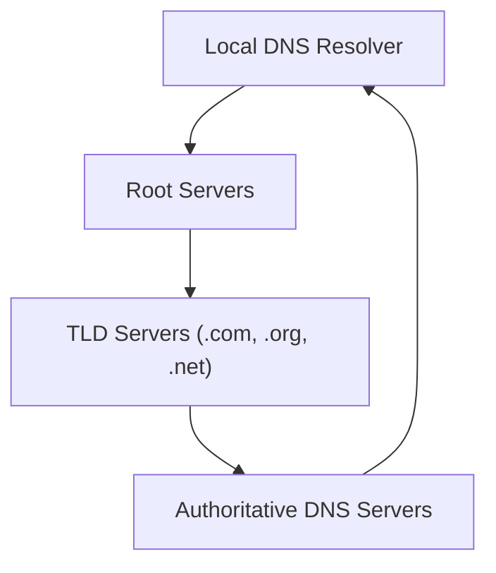
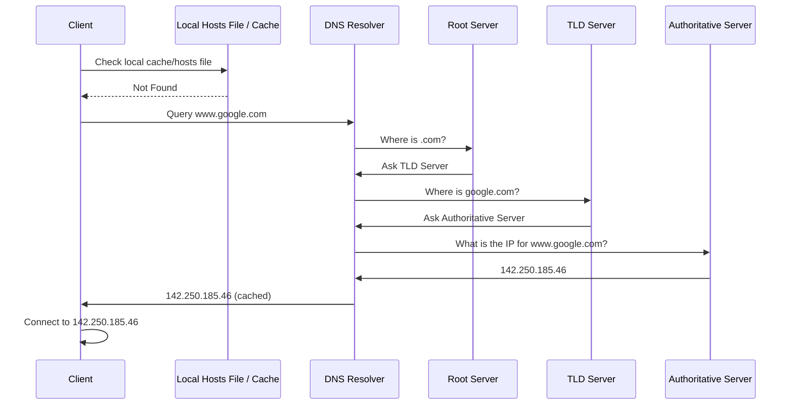
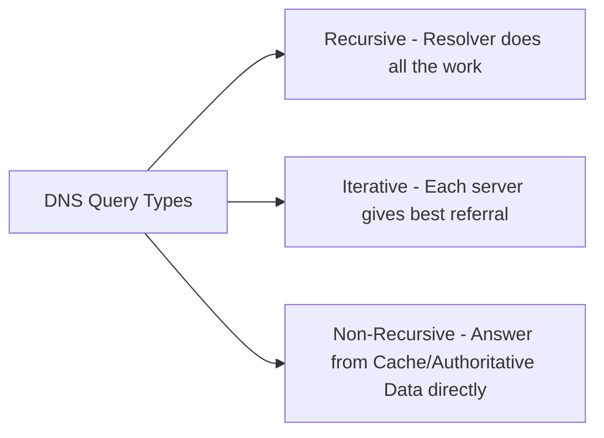
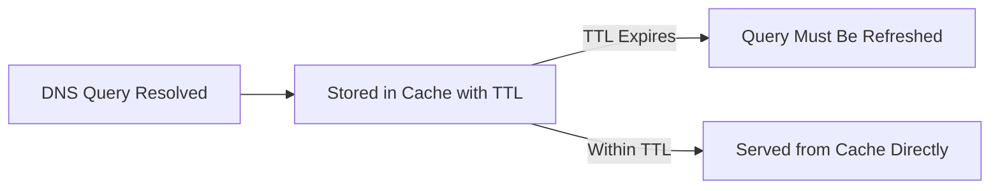
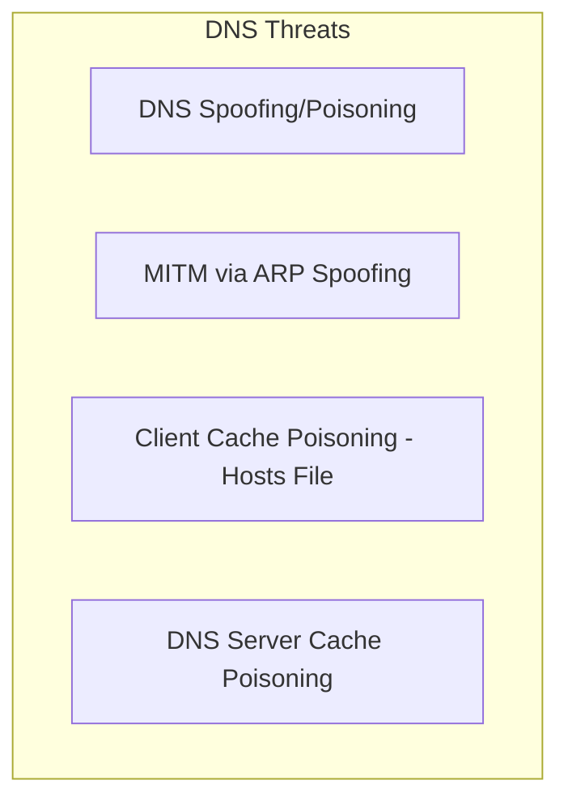
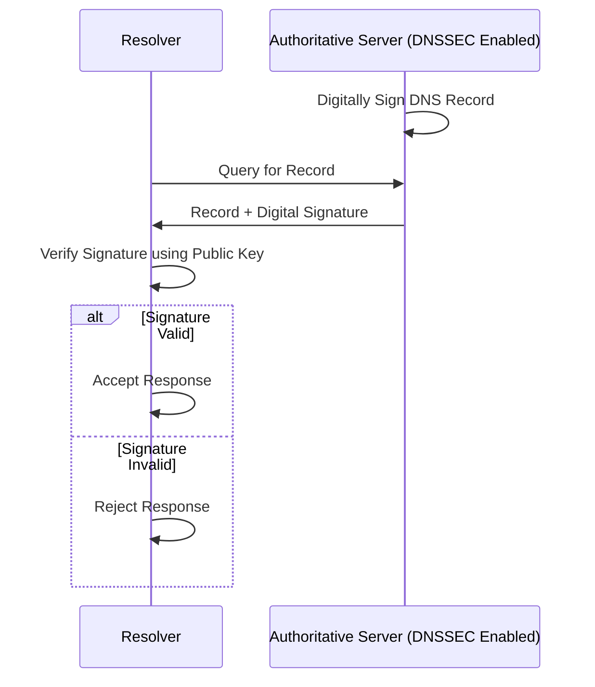

> **الهدف من الـ Section ده:**  
> هتفهم إزاي DNS بيترجم أسماء المواقع لـ IP Addresses، هتتعرف على التسلسل الهرمي بتاعه من الـ Root Servers لحد الـ Authoritative Server، وهتقدر تربط ده بأخطر الهجمات اللي بتستهدف DNS زي Spoofing وCache Poisoning، وإزاي DNSSEC بيحميه.


## Table of Contents

- [Overview](#overview)
- [DNS Hierarchy](#dns-hierarchy)
- [DNS Resolution Process](#dns-resolution-process)
- [Types of DNS Queries](#types-of-dns-queries)
- [Common DNS Record Types](#common-dns-record-types)
- [DNS Caching and TTL](#dns-caching-and-ttl)
- [Reverse DNS](#reverse-dns)
- [DNS Security Threats](#dns-security-threats)
- [DNS Security – DNSSEC](#dns-security--dnssec)
- [SOC Analyst Perspective](#soc-analyst-perspective)
- [Summary](#summary)

---

## Overview

الـ **Domain Name System (DNS)** مسؤول عن ترجمة أسماء النطاقات اللي بيفهمها الإنسان (Human-Readable Domain Names) لـ IP Addresses اللي الكمبيوتر بيفهمها.

مثال:

```
www.google.com → 142.250.185.46
```

DNS بيسمح للمستخدمين إنهم يوصلوا للمواقع باستخدام أسماء بدل ما يحفظوا أرقام IP. DNS عادةً بيشتغل على **Port 53** باستخدام **UDP** (وأحيانًا TCP لو الرد كبير أو في حالة الـ Zone Transfers).

> [!NOTE]
> فكر في DNS زي "دليل التليفونات" بتاع الإنترنت - إنت عارف اسم الشخص (Domain Name)، لكن محتاج الدليل عشان يديك الرقم الفعلي (IP Address) اللي هتتصل بيه.

---

## DNS Hierarchy

DNS هو نظام موزع وهرمي (Distributed Hierarchical System) بيتكون من عدة مستويات:

1. **Root Servers**: Direct queries to the appropriate Top-Level Domain (TLD) servers
2. **TLD Servers**: Manage domain extensions such as `.com`, `.org`, and `.net`
3. **Authoritative DNS Servers**: Store the actual DNS records for a domain and provide the final IP address
4. **Local DNS Resolver**: Usually provided by an ISP or organization, responsible for performing the lookup process on behalf of the client



> [!IMPORTANT]
> كل مستوى في التسلسل بيوجهك للمستوى اللي بعده، مش بيديك الإجابة النهائية مباشرة (إلا الـ Authoritative Server). ده اسمه **Delegation**، وهو اللي بيخلي نظام الـ DNS موزع وقابل للتوسع بدل ما يكون Server واحد مركزي بيعرف كل حاجة.

---

## DNS Resolution Process

لما المستخدم يكتب اسم Domain:

1. العميل بيفحص الـ **Local Cache** بتاعه أولاً:
   - **Windows**: `C:\Windows\System32\drivers\etc\hosts`
   - **Linux/Unix**: `/etc/hosts`
2. لو مش موجود، الطلب بيتبعت لـ **DNS Resolver**
3. الـ Resolver بيسأل بالترتيب:
   - Root Server
   - TLD Server
   - Authoritative Server
4. الـ Authoritative Server بيرجع الـ IP Address
5. الـ Resolver بيبعت الرد للعميل ويعمله Cache
6. العميل بيتصل بالـ IP النهائي



> [!WARNING]
> الخطوة الأولى (فحص الـ **Hosts File** المحلي) هي بالظبط نقطة الضعف اللي بتستغلها هجمات **Client Cache Poisoning**، لأن لو المهاجم عدّل الملف ده، جهازك مش هيسأل DNS من الأساس - هيثق في القيمة المزيفة المكتوبة محليًا.

---

## Types of DNS Queries

| Type | Description |
|---|---|
| Recursive | الـ Resolver بياخد على عاتقه إنه يجيب الإجابة النهائية كاملة بالنيابة عن العميل |
| Iterative | كل Server بيرجع أفضل إحالة (Referral) متاحة، والـ Resolver هو اللي بيكمل السؤال بنفسه للمرحلة الجاية |
| Non-Recursive | الرد بيرجع مباشرة من الـ Cache أو من بيانات Authoritative موجودة بالفعل من غير الحاجة لأي استعلامات إضافية |



---

## Common DNS Record Types

| Record | Purpose |
|---|---|
| A | Maps a domain to an IPv4 address |
| AAAA | Maps a domain to an IPv6 address |
| CNAME | Alias for another domain name |
| MX | Mail server for the domain |
| PTR | Reverse lookup (IP to domain) |

> [!TIP]
> النوع **MX Record** مهم جدًا من ناحية الأمن - لو مهاجم قدر يعدل الـ MX Record بتاع دومين معين، يقدر يوجه كل الإيميلات المرسلة لهذا الدومين لسيرفر تحت سيطرته.

---

## DNS Caching and TTL

- DNS responses are cached to improve performance and reduce query load
- **TTL (Time To Live)** defines how long a DNS record is stored in cache before it must be refreshed



> [!NOTE]
> الـ TTL بيمثل موازنة بين الأداء والدقة: TTL طويل معناه سرعة أعلى لكن تحديثات أبطأ لو الـ IP اتغير، وTTL قصير معناه دقة أعلى لكن حمل استعلامات أكتر على السيرفرات.

---

## Reverse DNS

الـ Reverse DNS بيعمل العملية العكسية:

```
IP Address → Domain Name
```

بيستخدم بشكل شائع في:

- Email server validation
- Network troubleshooting
- Security analysis

> [!TIP]
> **Reverse DNS Lookup** أداة أساسية في التحقيقات الأمنية - لما تلاقي IP غريب في الـ Logs، عمل Reverse Lookup ليه أول خطوة سريعة تساعدك تعرف هو مرتبط بأي Domain أو Service.

---

## DNS Security Threats

### 1. DNS Spoofing / Poisoning

المهاجم بيقدم IP Address مزيف لدومين شرعي، وده بيوجه المستخدمين لموقع ضار.

### 2. Man-in-the-Middle (MITM)

المهاجم بيعترض طلبات DNS ويرد بمعلومات مزورة، غالبًا باستخدام ARP Spoofing.

### 3. Client Cache Poisoning (Hosts File Manipulation)

المهاجمين بيعدلوا ملف الـ Hosts المحلي:

- **Windows**: `C:\Windows\System32\drivers\etc\hosts`
- **Linux/Unix**: `/etc/hosts`

ده بيجبر النظام إنه يحل الدومينات لـ IPs ضارة من غير ما يسأل DNS من الأساس.

### 4. DNS Server Cache Poisoning

المهاجمين بيحقنوا ردود DNS مزيفة في الـ Cache بتاع الـ Resolver، وده بيأثر على كل المستخدمين اللي بيعتمدوا على السيرفر ده.



---

## DNS Security – DNSSEC

**DNS Security Extensions (DNSSEC)** بتضيف توقيعات تشفيرية (Cryptographic Signatures) لسجلات DNS.

### How it works

- DNS records are digitally signed by the authoritative server
- The resolver verifies the signature using public keys
- If validation fails, the response is rejected



### DNSSEC ensures

- Data integrity
- Authentication
- Protection against DNS spoofing and cache poisoning

> [!IMPORTANT]
> DNSSEC بيحل مشكلة **Integrity** و**Authentication**، لكنه **مش بيوفر تشفير (Encryption)** للاستعلامات نفسها - يعني لسه ممكن حد يشوف إنك بتسأل عن دومين معين، بس مش هيقدر يزور الرد. الحل للتشفير الكامل هو بروتوكولات زي **DNS over HTTPS (DoH)** أو **DNS over TLS (DoT)**.

---

## SOC Analyst Perspective

| Threat | MITRE ATT&CK Reference |
|---|---|
| DNS Spoofing / Poisoning | T1557 - Adversary-in-the-Middle |
| Client Cache Poisoning (Hosts File) | T1565.001 - Data Manipulation: Stored Data Manipulation |
| DNS Server Cache Poisoning | T1557 - Adversary-in-the-Middle |
| DNS Tunneling (Data Exfiltration) | T1071.004 - Application Layer Protocol: DNS |
| Domain Generation Algorithms (DGA) for C2 | T1568.002 - Dynamic Resolution: Domain Generation Algorithms |

> [!WARNING]
> بعض أنواع الـ Malware المتقدمة بتستخدم **Domain Generation Algorithms (DGA)** عشان تولد أسماء دومين عشوائية بشكل يومي للتواصل مع C2 Server، وده بيصعب حظر الدومين بشكل تقليدي لأنه بيتغير باستمرار.

### Detection & Best Practices

- مراقبة **DNS Query Logs** لاكتشاف أنماط غير طبيعية (زي عدد كبير من الاستعلامات الفاشلة NXDOMAIN، أو دومينات عشوائية الشكل قد تكون مؤشر DGA)
- تفعيل **DNSSEC** على الدومينات الحساسة لضمان سلامة السجلات
- مراقبة أي تغيير غير مصرح به في ملف الـ **Hosts File** على الأجهزة (EDR Rules)
- استخدام **DNS Sinkholing** لإعادة توجيه الاستعلامات لدومينات ضارة معروفة لسيرفر مراقبة بدل السيرفر الحقيقي
- تحليل طول وتكرار الـ Subdomains في الاستعلامات، لأن **DNS Tunneling** غالبًا بيظهر كـ Subdomains طويلة وغريبة الشكل (زي Base64-encoded Strings)

> [!TIP]
> لو لاحظت جهاز واحد بيعمل عدد ضخم من استعلامات DNS لدومين معين بشكل متكرر جدًا، أو الاستعلامات نفسها فيها Subdomains طويلة وغريبة (مش أسماء طبيعية)، ده مؤشر قوي جدًا على **DNS Tunneling** ويستاهل تحقيق فوري باستخدام أدوات زي Wireshark أو DNS Logs Analysis.

---

## Summary

- **DNS** بيترجم أسماء الدومينات لـ IP Addresses، وبيشتغل على **Port 53 (UDP/TCP)**
- بنية هرمية موزعة: **Root Servers → TLD Servers → Authoritative Servers**، وكل ده بيتم عن طريق **Local DNS Resolver**
- 3 أنواع استعلامات: **Recursive, Iterative, Non-Recursive**
- أهم أنواع السجلات: **A, AAAA, CNAME, MX, PTR**
- **TTL** بيحدد مدة بقاء السجل في الـ Cache قبل ما يحتاج تحديث
- **Reverse DNS** بيحول IP لدومين، ومفيد في التحقيقات الأمنية
- أهم التهديدات: **DNS Spoofing/Poisoning, MITM, Client/Server Cache Poisoning**، بالإضافة لـ **DNS Tunneling** و**DGA-based C2**
- **DNSSEC** بيحمي الـ Integrity والـ Authentication (لكن مش التشفير)، وأدوات زي DNS Sinkholing وتحليل استعلامات الـ DNS أساسية لأي SOC
