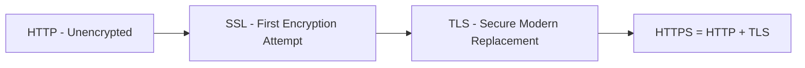
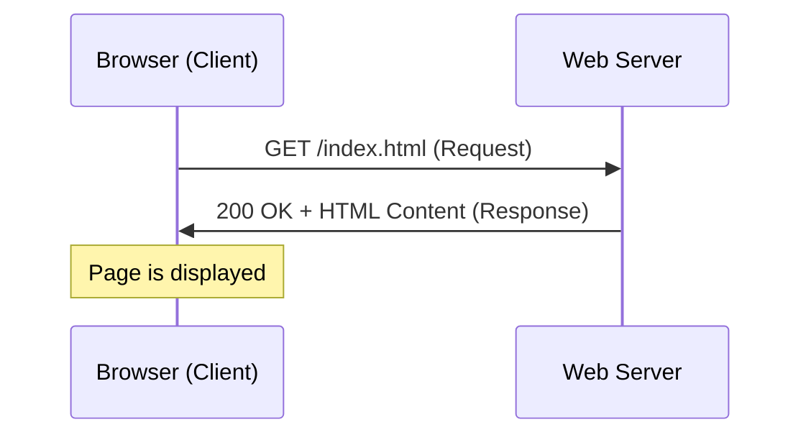
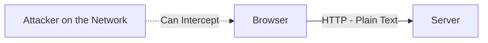
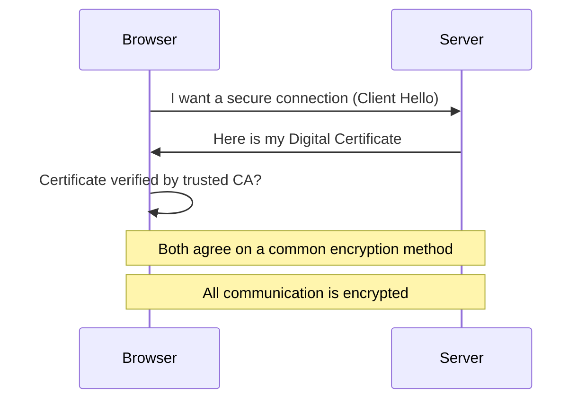
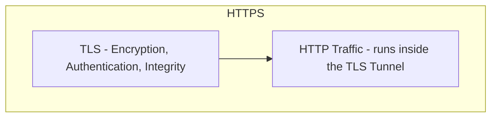
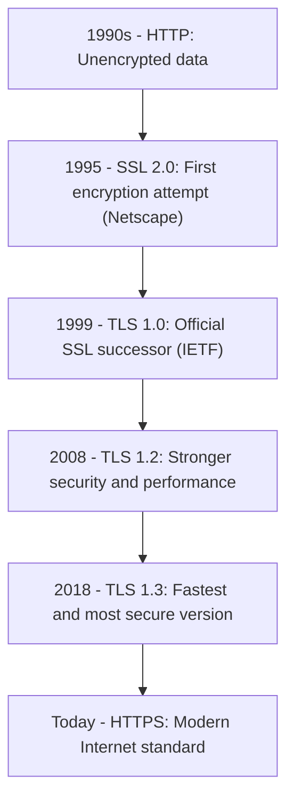

> **الهدف من الـ Section ده:**  
> هتفهم إزاي HTTP بيشتغل من غير أي حماية، وإزاي SSL وبعده TLS جم يحلوا المشكلة دي عن طريق التشفير، ووصلنا لـ HTTPS اللي بنستخدمه دلوقتي، وهتقدر تشرح لأي حد ليه شبكة الـ HTTP خطر حقيقي على أي بيانات حساسة.


## Table of Contents

- [Overview](#overview)
- [1. HTTP – HyperText Transfer Protocol](#1-http--hypertext-transfer-protocol)
- [2. SSL – Secure Sockets Layer](#2-ssl--secure-sockets-layer)
- [3. TLS – Transport Layer Security](#3-tls--transport-layer-security)
- [4. HTTPS – HTTP Secure](#4-https--http-secure)
- [Protocol Evolution Timeline](#protocol-evolution-timeline)
- [HTTP vs HTTPS](#http-vs-https)
- [Key Takeaways](#key-takeaways)
- [SOC Analyst Perspective](#soc-analyst-perspective)
- [Summary](#summary)

---

## Overview

كل مرة بتفتح فيها موقع، فيه بروتوكول شغال في الخلفية عشان ينقل الصفحة من الـ Server لمتصفحك. الجزء ده هيشرح التطور من HTTP العادي للـ HTTPS الآمن باستخدام SSL/TLS.



---

## 1. HTTP – HyperText Transfer Protocol

| Property | Value |
|---|---|
| Layer | Application Layer (Layer 7) |
| Port | 80 |
| Function | Transfers web pages between client and server |

### How it works



### Key Characteristics

- **Client-Server Model**: The client initiates the request; the server responds
- **Stateless**: HTTP does not remember previous requests. Each request is independent
  - Websites use **Cookies and Sessions** to maintain user sessions
- **Plain Text**: All data is sent unencrypted - usernames, passwords, credit card data. Anyone on the network can see it

### Major Problem



أي مهاجم على الشبكة يقدر يعترض البيانات الحساسة.

**Example**:

```
Browser ─── username=admin ───► Server
        ─── password=12345
```

المهاجم يقدر يشوف كل حاجة.

> [!WARNING]
> "Stateless" معناه إن كل Request منفصل تمامًا عن اللي قبله - الـ Server مش فاكر إنك عملت Login قبل كده أصلاً، وده سبب وجود الـ Cookies من الأساس. لو الـ Cookie دي اتسرقت على شبكة HTTP غير مشفرة، المهاجم يقدر ينتحل شخصيتك بالكامل من غير ما يعرف الباسورد خالص.

---

## 2. SSL – Secure Sockets Layer

اتقدم في التسعينات بواسطة **Netscape**.

**Purpose**: Solve the problem of unencrypted HTTP data.

### What SSL does

- Encrypts data between client and server
- Makes intercepted data unreadable
- Supports secure communication between client-server and server-server

### Limitation

- Vulnerabilities were discovered over time
- Replaced by TLS for better security

> [!NOTE]
> SSL بكل إصداراته (1.0, 2.0, 3.0) بقى **Deprecated بالكامل** حاليًا بسبب ثغرات معروفة (زي POODLE Attack)، ومفيش أي متصفح حديث بيدعمه دلوقتي.

---

## 3. TLS – Transport Layer Security

- TLS is the improved successor of SSL
- Same idea but more secure and modern
- Provides three main functions: **Authentication, Encryption, Integrity**

### How TLS works



### Digital Certificate

- Confirms the server's identity
- Contains the **Public Key** used for encryption

> [!IMPORTANT]
> خطوة "Certificate verified by trusted CA?" هي أهم خطوة في العملية كلها. لو المتصفح قبل شهادة مش موقعة من جهة موثوقة (Certificate Authority) من غير تحقق، فده بيفتح الباب بالكامل لهجمات MITM باستخدام شهادات مزيفة.

---

## 4. HTTPS – HTTP Secure

- HTTPS = HTTP + TLS
- HTTP runs inside a secure encrypted tunnel



---

## Protocol Evolution Timeline



| Year | Milestone | Description |
|---|---|---|
| 1990s | HTTP | Unencrypted data |
| 1995 | SSL 2.0 | First encryption attempt (Netscape) |
| 1999 | TLS 1.0 | Official SSL successor (IETF) |
| 2008 | TLS 1.2 | Stronger security and performance |
| 2018 | TLS 1.3 | Fastest and most secure version |
| Today | HTTPS | Modern Internet standard |

---

## HTTP vs HTTPS

| Aspect | HTTP | HTTPS |
|---|---|---|
| Port | 80 | 443 |
| Encryption | None (Plain Text) | Encrypted via TLS |
| Data Integrity | Not guaranteed | Guaranteed |
| Server Authentication | None | Verified via Digital Certificate |
| Vulnerability | Easily intercepted (Sniffing) | Protected against interception |
| Browser Indicator | No lock icon / "Not Secure" warning | Lock icon shown |

---

## Key Takeaways

- **HTTP**: Transfers web pages, Port 80, unencrypted
- **SSL**: First encryption layer, outdated
- **TLS**: Secure and modern replacement for SSL
- **HTTPS**: HTTP + TLS, Port 443, encrypted

> [!IMPORTANT]
> **Golden Rule**: أي موقع بيطلب بيانات حساسة من غير HTTPS يعتبر غير آمن. اتأكد دايمًا من وجود `https://` في المتصفح قبل ما تدخل أي بيانات شخصية.

---

## SOC Analyst Perspective

> [!IMPORTANT]
> الانتقال من HTTP لـ HTTPS مش بس تحسين تقني، ده تحول أمني جوهري غيّر إزاي المهاجمين بيهاجموا وإزاي الـ SOC بيراقب الـ Traffic.

### Threats Related to HTTP/HTTPS

| Threat | Description | MITRE ATT&CK Reference |
|---|---|---|
| Network Sniffing on HTTP | التقاط بيانات حساسة (Usernames, Passwords) بشكل مباشر من Traffic غير مشفر | T1040 - Network Sniffing |
| SSL/TLS Downgrade Attack | إجبار الاتصال على استخدام SSL أو إصدار TLS قديم وضعيف بدل TLS 1.3 | T1600 - Weaken Encryption |
| Certificate Spoofing / Fake CA | استخدام شهادة مزيفة أو موقعة من جهة غير موثوقة لانتحال هوية Server وعمل MITM | T1553.002 - Subvert Trust Controls: Code Signing |
| HTTPS-based C2 Communication | استخدام HTTPS العادي لإخفاء اتصال Command and Control وسط Traffic مشفر شرعي | T1071.001 - Application Layer Protocol: Web Protocols |

> [!WARNING]
> التشفير في HTTPS **بيحمي محتوى البيانات**، لكنه **مش بيمنع** استخدام HTTPS نفسه كقناة لهجمات زي C2 Communication. المهاجم يقدر يستخدم HTTPS الطبيعي عشان يخبي نشاطه، وده بيخلي تحليل الـ Metadata (زي حجم الـ Traffic، تكراره، والـ Domain المتصل بيه) أهم من محاولة "فك تشفير" الـ Traffic نفسه.

### Detection & Best Practices

- تفعيل **HSTS (HTTP Strict Transport Security)** على الـ Web Servers عشان تمنع المتصفح من قبول أي اتصال HTTP غير مشفر بالخطأ
- مراقبة أي محاولة اتصال على **Port 80** لخدمات المفروض تشتغل بس على HTTPS، لأن ده ممكن يكون مؤشر Misconfiguration أو محاولة Downgrade
- استخدام أدوات **SSL/TLS Inspection** (لو السياسة الأمنية تسمح) لفحص محتوى الـ HTTPS Traffic في نقاط معينة من الشبكة
- تحليل **JA3/JA3S Fingerprints** والـ **SNI (Server Name Indication)** في الـ TLS Handshake للتعرف على أدوات Malware اللي بتحاول تتخفى وسط HTTPS الطبيعي
- التأكد من صحة الشهادات الرقمية ورصد أي **Self-Signed Certificates** غريبة داخل الشبكة

> [!TIP]
> لو موظف بيتصل بموقع داخلي أو خارجي وظهر تحذير "Certificate Not Trusted" أو "Connection Not Private"، ده مش مجرد إزعاج تقني - ده ممكن يكون أول مؤشر على محاولة **MITM Attack** جارية فعلاً على الشبكة، ولازم يتاخد بجدية فورية.

---

## Summary

- **HTTP** بروتوكول بسيط لنقل صفحات الويب على **Port 80**، لكنه **غير مشفر بالكامل** وأي بيانات حساسة فيه ممكن تتسرق بسهولة
- **SSL** كان أول محاولة لحل المشكلة دي، لكنه بقى **قديم وضعيف** وتم استبداله بالكامل
- **TLS** هو البديل الآمن والحديث، بيوفر **Authentication, Encryption, Integrity** عن طريق عملية Handshake بتتضمن التحقق من Digital Certificate
- **HTTPS = HTTP + TLS**، بيشتغل على **Port 443**، وهو المعيار الحالي لأي موقع آمن
- من ناحية الـ SOC: أهم التهديدات المرتبطة هي **Network Sniffing على HTTP (T1040)**، **SSL/TLS Downgrade (T1600)**، **Certificate Spoofing (T1553.002)**، و**استخدام HTTPS لإخفاء C2 Communication (T1071.001)**
- أدوات الحماية الأساسية: **HSTS، SSL/TLS Inspection، تحليل JA3/SNI Fingerprints،** ومراقبة صحة الشهادات الرقمية باستمرار
