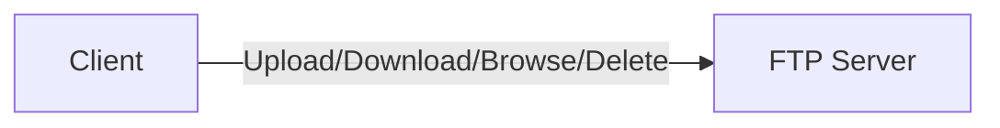
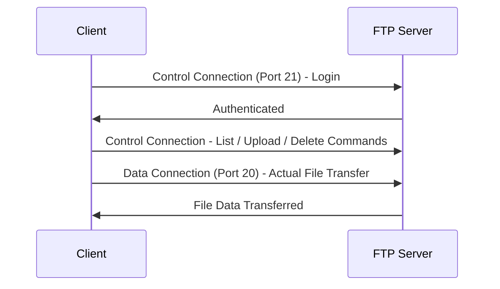
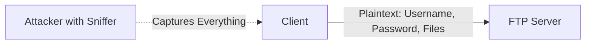
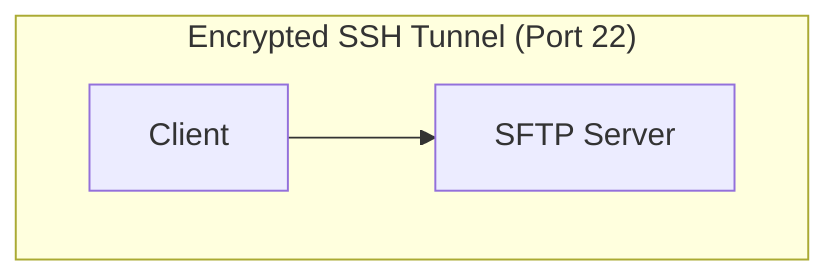

> **الهدف من الـ Section ده:**  
> هتفهم إزاي FTP بينقل الملفات باستخدام اتصالين منفصلين (Control وData)، وليه استخدامه أصبح خطر أمني حقيقي بسبب غياب التشفير بالكامل، وإزاي SFTP بيحل المشكلة دي عن طريق نفق SSH مشفر بالكامل.

## Table of Contents

- [Overview](#overview)
- [Basic Information](#basic-information)
- [How FTP Works](#how-ftp-works)
- [Security Risk](#security-risk)
- [Secure Alternative – SFTP](#secure-alternative--sftp)
- [How SFTP Works](#how-sftp-works)
- [FTP vs SFTP](#ftp-vs-sftp)
- [Security Note (SOC / Blue Team)](#security-note-soc--blue-team)
- [Best Practices](#best-practices)
- [SOC Analyst Perspective](#soc-analyst-perspective)
- [Summary](#summary)

---

## Overview

**FTP (File Transfer Protocol)** هو بروتوكول شبكة بيستخدم لنقل الملفات بين نظامين:

- **Client** (جهاز المستخدم)
- **FTP Server**

باستخدام FTP، تقدر:

- Upload files
- Download files
- Browse server directories
- Delete or modify files

ببساطة: **FTP هي طريقة لنقل الملفات بين جهازك وسيرفر بعيد**.

---

## Basic Information

| Property | Value |
|---|---|
| Layer | Application Layer (Layer 7) |
| Protocol | TCP |
| Ports | Port 21 – Control connection (commands) / Port 20 – Data connection (file transfer) |

---

## How FTP Works

FTP بيستخدم **اتصالين منفصلين**:

### Control Connection (Port 21)

بيستخدم للأوامر زي:

- Login
- List files
- Upload/Delete

### Data Connection (Port 20)

بيستخدم لنقل الملفات الفعلي.

> [!NOTE]
> فكرة فصل الأوامر عن نقل البيانات في اتصالين منفصلين قديمة نسبيًا في تصميمها، وده جزء من السبب في تعقيد إعداد FTP خلف Firewalls (خصوصًا في وضع Active Mode) مقارنة بالبروتوكولات الحديثة.

---

## Security Risk

المشكلة الأساسية في FTP:

- **No encryption**
- All data is sent as **plaintext**, including:
  - Username
  - Password
  - File contents

أي حد على نفس الشبكة باستخدام أدوات Packet Sniffing (زي Network Analyzers) يقدر:

- Capture login credentials
- Read transferred files

> [!WARNING]
> **FTP over the internet = High security risk**. أي استخدام لـ FTP عبر شبكة عامة أو الإنترنت مباشرة بيعرض بيانات الدخول ومحتوى الملفات بالكامل للخطر.

---

## Secure Alternative – SFTP

**SFTP (SSH File Transfer Protocol)** هو البديل الآمن لـ FTP.

| Property | Value |
|---|---|
| Port | 22 |
| Protocol | SSH |
| Encryption | Yes |

---

## How SFTP Works

بيتعمل **Encrypted SSH Tunnel** بين الـ Client والـ Server.

جوه النفق ده:

- Commands are protected
- Files are encrypted
- Credentials are secure

حتى لو الـ Traffic اتقفل (Intercepted)، البيانات مش هتتقدر تتقرا.

> [!IMPORTANT]
> على عكس FTP اللي بيستخدم اتصالين منفصلين (Control وData)، SFTP بيستخدم **اتصال واحد فقط مشفر بالكامل** على Port 22، وده بيخليه أبسط وأأمن في نفس الوقت.

---

## FTP vs SFTP

| Aspect | FTP | SFTP |
|---|---|---|
| Encryption | None (Plaintext) | Full Encryption (via SSH) |
| Port(s) | 21 (Control) + 20 (Data) | 22 (Single Connection) |
| Underlying Protocol | TCP (direct) | SSH |
| Credential Security | Exposed | Protected |
| File Content Security | Readable if intercepted | Unreadable if intercepted |
| Firewall Configuration | Complex (multiple ports/modes) | Simple (single port) |
| Recommended for Internet Use | ❌ No | ✅ Yes |

---

## Security Note (SOC / Blue Team)

وجود FTP على أي نظام ممكن يشير لـ:

- Exposed credentials
- Risk of data leakage
- Weak security configuration

---

## Best Practices

- Disable FTP if not required
- Use SFTP or FTPS instead
- Monitor for plaintext credential transmission

---

## SOC Analyst Perspective

> [!IMPORTANT]
> اكتشاف **Port 21 مفتوح** على أي جهاز أثناء الـ Asset Discovery أو Vulnerability Scanning لازم يترفع كـ **Finding** أساسي، لأنه بيمثل نقطة ضعف واضحة ومباشرة حتى لو الـ Server نفسه محدث.

| Threat | Description | MITRE ATT&CK Reference |
|---|---|---|
| Credential Sniffing over FTP | التقاط بيانات الدخول مباشرة من الـ Traffic غير المشفر | T1040 - Network Sniffing |
| Anonymous FTP Access | بعض سيرفرات FTP بتكون معدة بإعدادات Anonymous Login، وده بيسمح لأي حد بالوصول من غير Authentication | T1078 - Valid Accounts |
| FTP Brute Force | محاولات تخمين بيانات الدخول بشكل متكرر لأن FTP مش دايمًا بيدعم Rate Limiting قوي | T1110 - Brute Force |
| Data Exfiltration via FTP | استخدام FTP كقناة لتهريب بيانات مسروقة، خصوصًا لأنه بروتوكول شائع ومش دايمًا بيتراقب بعمق | T1048.003 - Exfiltration Over Unencrypted/Obfuscated Non-C2 Protocol |

### Detection & Best Practices

- عمل **Port Scanning** دوري على الشبكة لاكتشاف أي سيرفرات FTP نشطة غير موثقة
- مراقبة أي **Traffic على Port 21** والتأكد من عدم وجود بيانات دخول أو ملفات حساسة بتتنقل من غيرها تشفير
- تعطيل **Anonymous FTP Login** بالكامل لو FTP لازم يفضل شغال لسبب معين
- استبدال أي استخدام FTP فعلي بـ **SFTP** أو **FTPS (FTP over SSL/TLS)** فورًا
- مراقبة أي حجم كبير من البيانات بيتنقل عبر FTP لجهة خارجية، لأنه ممكن يكون مؤشر **Data Exfiltration**

> [!TIP]
> لو لاحظت في الـ Logs اتصال FTP (Port 21) من جهاز داخلي لسيرفر خارجي مجهول، وده مصحوب بحجم بيانات كبير غير معتاد، ده يستاهل تحقيق فوري - ممكن يكون محاولة تهريب بيانات (**Data Exfiltration**) باستخدام بروتوكول قديم ومهمل عن قصد عشان يتفادى أدوات المراقبة الحديثة.

---

## Summary

- **FTP** بروتوكول قديم لنقل الملفات، بيستخدم اتصالين منفصلين: **Control (Port 21)** و **Data (Port 20)**
- المشكلة الأساسية: **من غير أي تشفير** - كل حاجة (Username, Password, File Contents) بتتبعت Plaintext
- **SFTP** هو البديل الآمن، بيستخدم **SSH على Port 22** واتصال واحد مشفر بالكامل
- **الفرق الجوهري**: FTP بيعرض بيانات الدخول والملفات للخطر، SFTP بيحميهم بالكامل حتى لو الـ Traffic اتقفل
- من ناحية الـ SOC: وجود FTP على أي نظام مؤشر خطر أمني، ومرتبط بـ **Credential Sniffing (T1040)**, **Anonymous Access (T1078)**, **Brute Force (T1110)**, و **Data Exfiltration (T1048.003)**
- **القاعدة الذهبية**: متستخدمش FTP أبدًا عبر الإنترنت - استخدم SFTP دايمًا
