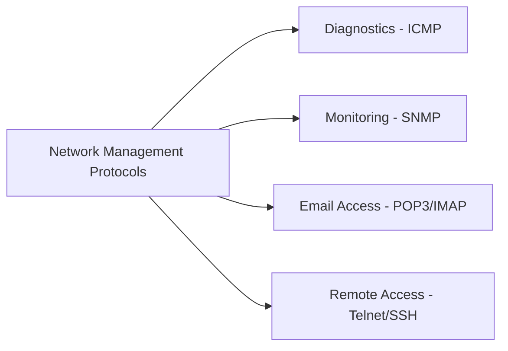
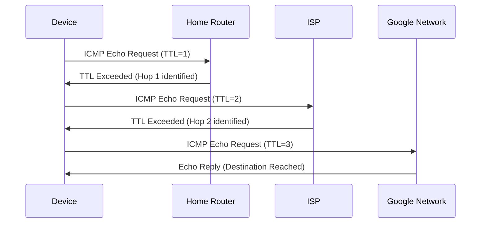
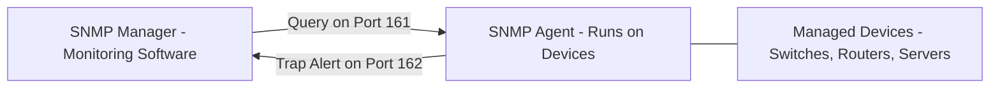
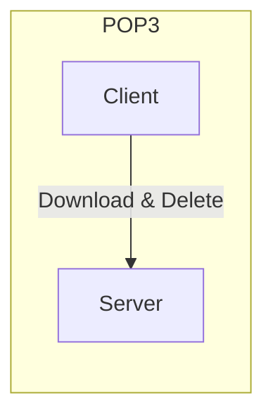
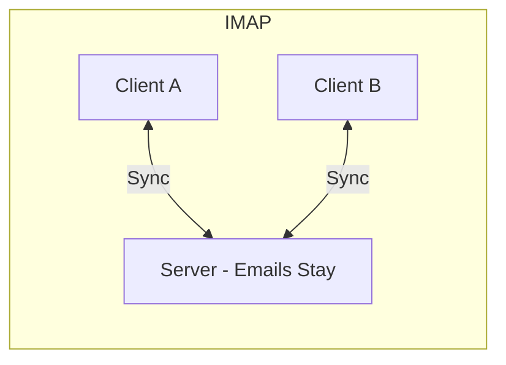

> **الهدف من الـ Section ده:**  
> هتتعرف على أهم بروتوكولات إدارة ومراقبة الشبكة (ICMP, SNMP, POP3, IMAP, Telnet, SSH) اللي مش بتنقل بيانات المستخدم لكنها أساسية لتشغيل ومراقبة الشبكة، وهتفهم ليه بعضها (زي Telnet) بقى خطر أمني حقيقي لازم يتستبدل فورًا.

## Table of Contents

- [Overview](#overview)
- [1. ICMP – Internet Control Message Protocol](#1-icmp--internet-control-message-protocol)
- [2. SNMP – Simple Network Management Protocol](#2-snmp--simple-network-management-protocol)
- [3. POP3 – Post Office Protocol v3](#3-pop3--post-office-protocol-v3)
- [4. IMAP – Internet Message Access Protocol](#4-imap--internet-message-access-protocol)
- [POP3 vs IMAP](#pop3-vs-imap)
- [5. Telnet](#5-telnet)
- [6. SSH – Secure Shell](#6-ssh--secure-shell)
- [Comparison Table](#comparison-table)
- [Key Takeaways](#key-takeaways)
- [SOC Analyst Perspective](#soc-analyst-perspective)
- [Summary](#summary)

---

## Overview

بروتوكولات إدارة الشبكة (Network Management Protocols) **مش بتستخدم لنقل بيانات المستخدم**. وظيفتها الأساسية إنها تراقب (Monitor)، تدير (Manage)، وتحافظ (Maintain) على الشبكة عشان تضمن إن كل حاجة شغالة صح.

بتساعد فرق الشبكات والأمن على اكتشاف المشاكل، وتحسين الأداء، وتأمين البنية التحتية.



---

## 1. ICMP – Internet Control Message Protocol

| Property | Value |
|---|---|
| Layer | Network Layer (Layer 3) |
| Port | N/A (not TCP/UDP) |
| Purpose | Network diagnostics |

### How it works

ICMP مش بينقل بيانات، هو بيبلغ عن الأخطاء (Reports Errors) وبيساعد في تشخيص الشبكة (Diagnose the Network).

### Common uses

**Ping**: بيتأكد إن الجهاز شغال أونلاين

```
ping google.com
```

- `Reply from 142.250.185.46` → الجهاز يمكن الوصول ليه (Reachable)
- `Request timed out` → الجهاز مش بيرد

**Traceroute**: بيتتبع مسار الحزم من جهازك للوجهة النهائية

```
1. 192.168.1.1 (Home Router)
2. 10.0.0.1 (ISP)
3. 72.14.204.1 (Google Network)
4. 142.250.185.46 (google.com)
```



> [!NOTE]
> الـ Traceroute بيشتغل عن طريق التلاعب بحقل الـ **TTL (Time To Live)** في كل حزمة - بيبدأ بـ TTL=1 وكل ما يزيد بواحد، بيقدر يحدد الـ Router التالي في المسار.

---

## 2. SNMP – Simple Network Management Protocol

| Property | Value |
|---|---|
| Layer | Application Layer (Layer 7) |
| Ports | 161 (queries) / 162 (traps) |
| Purpose | Monitor and manage network devices |

### Components



- **SNMP Manager**: Monitoring software
- **SNMP Agent**: Runs on devices, collects and sends data
- **Managed Devices**: Switches, routers, servers

### Monitored metrics

- CPU and RAM usage
- Device temperature
- Port status
- Network errors

> [!IMPORTANT]
> **SNMP** هو الأساس اللي أدوات المراقبة الشهيرة زي **Zabbix, PRTG, وSolarWinds** مبنية عليه.

---

## 3. POP3 – Post Office Protocol v3

| Property | Value |
|---|---|
| Layer | Application Layer (Layer 7) |
| Ports | 110 (normal) / 995 (SSL) |
| Purpose | Receive email on a single device |

### Behavior

- Downloads emails from the server
- Deletes emails from the server after download

### Use case

مناسب للوصول للإيميل من جهاز واحد بس، مش مثالي للأجهزة المتعددة.

---

## 4. IMAP – Internet Message Access Protocol

| Property | Value |
|---|---|
| Layer | Application Layer (Layer 7) |
| Ports | 143 (normal) / 993 (SSL) |
| Purpose | Receive and synchronize email across multiple devices |

### Behavior

- Emails remain on the server
- Changes are synchronized across all devices

### Use case

مثالي للوصول للإيميل من أجهزة متعددة (Desktop, Mobile, Tablet).

---

## POP3 vs IMAP

| Aspect | POP3 | IMAP |
|---|---|---|
| Email after download | Deleted from server | Remains on server |
| Multi-device access | ❌ No | ✅ Yes |
| Synchronization | ❌ No | ✅ Yes |
| Suitable for | Single device | Multiple devices |





---

## 5. Telnet

| Property | Value |
|---|---|
| Layer | Application Layer (Layer 7) |
| Port | 23 |
| Purpose | Remote device control via command line |

### Problem

كل الاتصال بيكون **Plaintext** بالكامل:

- Username
- Password
- Commands

### Risk

أي Network Sniffer يقدر يلتقط المعلومات الحساسة دي.

### Recommendation

Telnet بروتوكول قديم؛ استخدم **SSH** بدل منه.

> [!WARNING]
> استخدام Telnet في أي بيئة عمل حديثة يعتبر **Red Flag أمني فوري**. لو لقيت أي جهاز لسه شغال عليه Telnet (Port 23 مفتوح)، ده أول حاجة لازم تتصلح في أي Assessment أمني.

---

## 6. SSH – Secure Shell

| Property | Value |
|---|---|
| Layer | Application Layer (Layer 7) |
| Port | 22 |
| Purpose | Secure remote device management |

### Advantages over Telnet

- Fully encrypted connection
- Supports **SFTP** for secure file transfer
- Supports tunneling of other protocols securely
- Key-based authentication supported

> [!IMPORTANT]
> SSH هو المعيار القياسي (Standard) للوصول الآمن عن بُعد. الـ **Key-Based Authentication** أقوى بكتير من الـ Password Authentication العادي لأنه بيعتمد على زوج مفاتيح (Public/Private Key) بدل كلمة سر ممكن تتخمن أو تتسرق.

---

## Comparison Table

| Protocol | Purpose | Layer | Port | Security |
|---|---|---|---|---|
| ICMP | Network diagnostics | 3 | N/A | Limited |
| SNMP | Device monitoring | 7 | 161/162 | Medium |
| POP3 | Receive email | 7 | 110/995 | Weak (without SSL) |
| IMAP | Email sync | 7 | 143/993 | Good (with SSL) |
| Telnet | Remote control | 7 | 23 | Very weak |
| SSH | Secure remote control | 7 | 22 | Excellent |

---

## Key Takeaways

- **Monitoring & Diagnostics**: ICMP (ping, traceroute), SNMP (device metrics)
- **Email Protocols**: POP3 (single-device) vs IMAP (multi-device, preferred)
- **Remote Access**: SSH is secure; Telnet is insecure

> [!IMPORTANT]
> **Security Rule**: أي بروتوكول بينقل بيانات من غير تشفير (زي Telnet, FTP, POP3 بدون SSL) لازم يتستبدل بنسخة آمنة أو يتقفل خالص.

---

## SOC Analyst Perspective

| Protocol | Common Threat | MITRE ATT&CK Reference |
|---|---|---|
| ICMP | Ping Flood / ICMP Flood (DoS)، وكمان استخدامه في Network/Host Discovery أثناء الـ Reconnaissance | T1499 - Network Denial of Service / T1018 - Remote System Discovery |
| SNMP | استغلال **Default Community Strings** (زي "public"/"private") لسحب معلومات حساسة عن أجهزة الشبكة | T1552 - Unsecured Credentials |
| Telnet | التقاط بيانات الدخول والأوامر بالكامل عن طريق Network Sniffing لأنه Plaintext | T1040 - Network Sniffing |
| SSH | محاولات **Brute Force** على كلمات السر، خصوصًا لو الـ Key-Based Authentication مش مفعّل | T1110 - Brute Force / T1021.004 - Remote Services: SSH |

> [!WARNING]
> **SNMP** لو اتسيب على الإعدادات الافتراضية (Default Community Strings زي "public" للقراءة و"private" للكتابة)، بيبقى نقطة ضعف خطيرة جدًا، لأن أي حد يعرف الـ Community String الافتراضية يقدر يسحب معلومات تفصيلية عن أجهزة الشبكة، وفي بعض الحالات حتى يعدل إعداداتها.

### Detection & Best Practices

- تغيير الـ **SNMP Community Strings** الافتراضية فورًا، والانتقال لـ **SNMPv3** اللي بيدعم Authentication وEncryption
- تعطيل **Telnet بالكامل** واستبداله بـ **SSH** في كل الأجهزة
- تفعيل **Fail2Ban** أو آليات مشابهة على SSH لمنع محاولات الـ Brute Force المتكررة
- مراقبة حجم غير طبيعي من الـ **ICMP Traffic** لأنه ممكن يكون مؤشر Ping Flood أو حتى استخدامه كقناة تهريب بيانات (**ICMP Tunneling**)
- استخدام **IMAP/POP3 over SSL** فقط (Ports 993/995)، ومنع الاتصالات غير المشفرة تمامًا

> [!TIP]
> لو لاحظت عدد كبير من محاولات SSH الفاشلة (Failed Login Attempts) من نفس الـ IP في وقت قصير، ده مؤشر كلاسيكي على **SSH Brute Force**، ولازم يتفعل Rate Limiting أو IP Blocking فورًا.

---

## Summary

- بروتوكولات إدارة الشبكة مش بتنقل بيانات المستخدم، لكنها أساسية للمراقبة والصيانة والتشخيص
- **ICMP**: تشخيص الشبكة عن طريق Ping وTraceroute، بيشتغل على Layer 3 من غير Port محدد
- **SNMP**: مراقبة أجهزة الشبكة (CPU, RAM, Temperature)، أساس أدوات زي Zabbix وPRTG وSolarWinds
- **POP3 vs IMAP**: POP3 بينزل ويمسح الإيميل من السيرفر (جهاز واحد)، IMAP بيخلي الإيميل على السيرفر ويزامنه (أجهزة متعددة - مفضل)
- **Telnet vs SSH**: Telnet قديم وغير مشفر بالكامل (خطر أمني)، SSH هو البديل الآمن والمعياري
- من ناحية الـ SOC: أهم المخاطر هي **SNMP Default Credentials (T1552)**، **Telnet Sniffing (T1040)**، **SSH Brute Force (T1110)**، و**ICMP Flood/Discovery (T1499/T1018)**
- **القاعدة الذهبية**: أي بروتوكول غير مشفر لازم يتستبدل بنسخة آمنة أو يتقفل تمامًا

