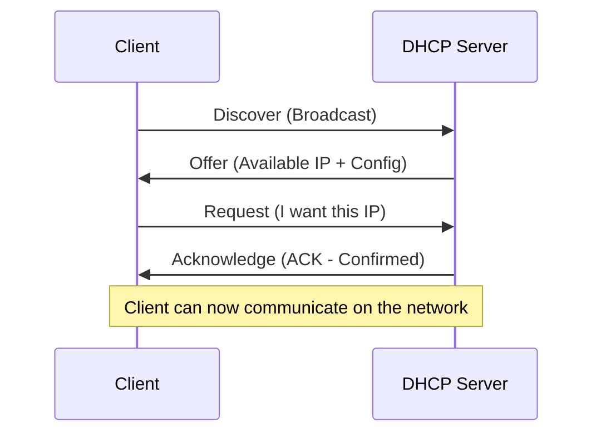
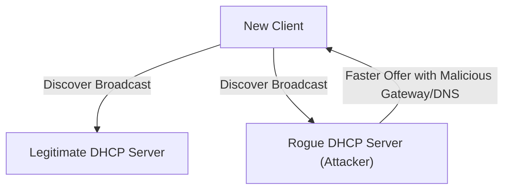
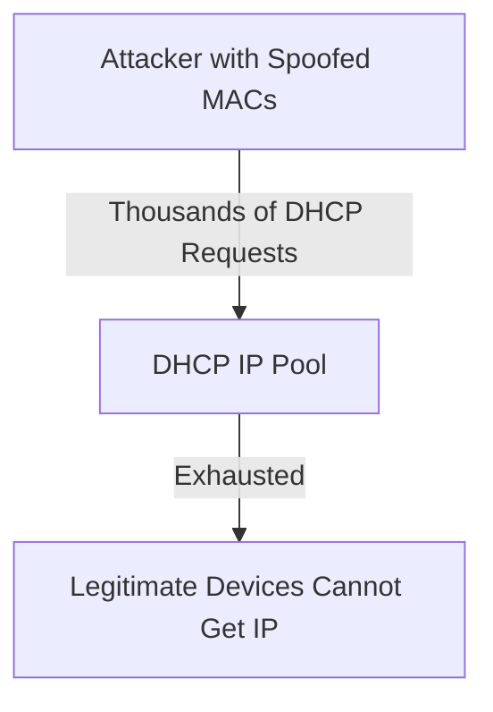
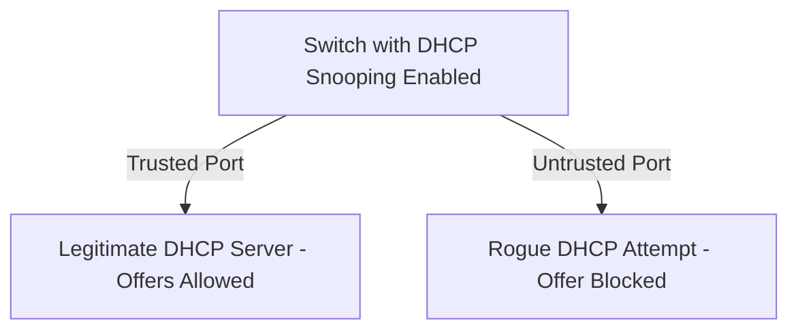

> **الهدف من الـ Section ده:**  
> هتفهم إزاي DHCP بيوزع إعدادات الشبكة أوتوماتيك عن طريق عملية DORA، وهتتعرف بالتفصيل على أشهر هجومين بيستهدفوا DHCP وهما Rogue DHCP Server وDHCP Starvation، وإزاي DHCP Snooping بيحميك منهم.

## Table of Contents

- [Overview](#overview)
- [How DHCP Works (DORA Process)](#how-dhcp-works-dora-process)
- [DHCP Message Types](#dhcp-message-types)
- [Static vs Dynamic Addressing](#static-vs-dynamic-addressing)
- [DHCP Security Risks](#dhcp-security-risks)
- [DHCP Protection](#dhcp-protection)
- [SOC Analyst Perspective](#soc-analyst-perspective)
- [Summary](#summary)

---

## Overview

**Dynamic Host Configuration Protocol (DHCP)** هي خدمة شبكية بتوزع إعدادات الـ IP أوتوماتيك للأجهزة لما تتصل بالشبكة.

كل جهاز محتاج المعلومات دي عشان يقدر يتواصل:

- IP Address
- Subnet Mask
- Default Gateway
- DNS Server

بدل ما تظبط الإعدادات دي يدويًا على كل جهاز، DHCP بيوزعها أوتوماتيك.

> [!NOTE]
> فكر في DHCP زي موظف استقبال في فندق - بمجرد ما توصل (يعني جهازك يتصل بالشبكة)، بيديك رقم أوضة (IP Address) ويقولك فين المصعد (Gateway) وفين خدمة الأدلة (DNS)، من غير ما تحتاج تعرف تفاصيل الفندق بنفسك.

---

## How DHCP Works (DORA Process)

عملية DHCP بتتم على 4 خطوات معروفة باسم **DORA**:

### Discover

العميل بيبعت رسالة Broadcast عشان يلاقي DHCP Server.

### Offer

الـ DHCP Server بيرد بـ IP Address متاح وإعدادات الشبكة.

### Request

العميل بيطلب الـ IP اللي اتعرض عليه.

### Acknowledge (ACK)

السيرفر بيأكد التخصيص ويسجله في جدول الـ Lease.

بعد العملية دي، العميل يقدر يتواصل على الشبكة.

> [!TIP]
> Mnemonic سهل لحفظ الترتيب: **"Do Only Real Acknowledgments"** = Discover, Offer, Request, Acknowledge.

---

## DHCP Message Types

| Message | Sent By | Purpose |
|---|---|---|
| DHCPDISCOVER | Client | Broadcast للبحث عن أي DHCP Server متاح |
| DHCPOFFER | Server | عرض IP Address وإعدادات متاحة للعميل |
| DHCPREQUEST | Client | طلب رسمي لتأكيد استخدام الـ IP المعروض (وكمان بيستخدم لتجديد Lease قائم) |
| DHCPACK | Server | تأكيد نهائي وتسجيل التخصيص في جدول الـ Lease |
| DHCPNAK | Server | رفض الطلب (لو الـ IP لم يعد متاح أو غير صالح) |
| DHCPDECLINE | Client | العميل بيبلغ إن الـ IP المعروض عليه مستخدم بالفعل (تعارض) |
| DHCPRELEASE | Client | العميل بيرجع الـ IP بشكل مبكر قبل انتهاء مدة الـ Lease |

---

## Static vs Dynamic Addressing

| Aspect | Static Addressing | Dynamic Addressing (DHCP) |
|---|---|---|
| Configuration | يدوي على كل جهاز | أوتوماتيك عن طريق DHCP Server |
| Management Effort | مرتفع (خصوصًا في شبكات كبيرة) | منخفض، إدارة مركزية |
| IP Consistency | ثابت دايمًا لنفس الجهاز | ممكن يتغير مع كل Lease جديد (إلا لو فيه Reservation) |
| Best Use Case | Servers, Printers, Network Devices اللي محتاجة IP ثابت | أجهزة المستخدمين العادية (Laptops, Phones) |
| Risk of Human Error | أعلى (تعارض IPs محتمل لو غلطة يدوية) | أقل، DHCP بيدير التخصيص أوتوماتيك |

> [!NOTE]
> في أغلب بيئات العمل، الـ Servers والأجهزة الحرجة (زي Domain Controllers أو Network Devices) بتاخد **Static IP** أو **DHCP Reservation** (يعني IP ثابت لكن متوزع عن طريق DHCP)، بينما أجهزة المستخدمين العادية بتاخد **Dynamic IP** عادي.

---

## DHCP Security Risks

### Rogue DHCP Server

مهاجم بيقدم DHCP Server مزيف على الشبكة.

**Possible impacts**:

- Sends a malicious **Default Gateway** (traffic interception – Man-in-the-Middle)
- Sends a malicious **DNS server** (traffic redirection or phishing)

> [!WARNING]
> بما إن الـ DHCP Discover بيتبعت كـ **Broadcast**، فأي جهاز على نفس الـ LAN Segment (شرعي أو خبيث) يقدر يرد عليه. لو رد الـ Rogue Server أسرع من الشرعي، العميل ممكن يقبل إعداداته المزيفة، وده بيفتح الباب مباشرة لـ **Man-in-the-Middle Attack** كامل عن طريق التحكم في الـ Gateway أو الـ DNS.

### DHCP Starvation Attack

المهاجم بيبعت عدد ضخم من الـ DHCP Requests باستخدام MAC Addresses مزيفة.

**Result**:

- The IP pool becomes exhausted
- Legitimate devices cannot obtain an IP address
- Causes a **Denial of Service (DoS)**

> [!IMPORTANT]
> **DHCP Starvation** غالبًا بتستخدم كخطوة تمهيدية قبل تنفيذ **Rogue DHCP Server Attack** - المهاجم بيستنزف كل الـ IPs الشرعية الأول، وبعدين بينصب الـ Rogue Server بتاعه ليكون هو المصدر الوحيد المتاح للـ IPs، فكل الأجهزة الجديدة تضطر تاخد الإعدادات المزيفة منه.

---

## DHCP Protection

### DHCP Snooping

ميزة أمنية على الـ Switches بتعمل:

- Allows DHCP responses only from **trusted ports** (connected to the legitimate server)
- Blocks DHCP offers from **untrusted ports**

### Additional best practices

- Ensure only one authorized DHCP server exists
- Monitor DHCP activity regularly
- Restrict administrative access to DHCP configuration

> [!TIP]
> **DHCP Snooping** بيبني كمان جدول اسمه **Binding Table** بيربط بين الـ MAC Address والـ IP Address والـ Port اللي اتخصص منه، والجدول ده بيتستخدم كمان مع تقنيات تانية زي **Dynamic ARP Inspection (DAI)** عشان يمنع هجمات ARP Spoofing كمان.

---

## SOC Analyst Perspective

| Threat | MITRE ATT&CK Reference |
|---|---|
| Rogue DHCP Server (leading to MITM) | T1557 - Adversary-in-the-Middle |
| DHCP Starvation Attack (DoS) | T1498 - Network Denial of Service |

> [!IMPORTANT]
> من ناحية الـ Detection، أهم مؤشر على وجود **Rogue DHCP Server** هو ظهور أجهزة على الشبكة بإعدادات **Default Gateway** أو **DNS Server** مش متطابقة مع القيم المعتمدة رسميًا في بيئة العمل.

### Detection & Best Practices

- مراقبة الـ **DHCP Server Logs** لأي عدد غير طبيعي من الـ Lease Requests في وقت قصير (مؤشر DHCP Starvation)
- تفعيل **DHCP Snooping** على كل الـ Switches، مع تحديد بس الـ Port المتصل بالـ DHCP Server الشرعي كـ Trusted
- استخدام أدوات زي **Arpwatch** أو مراقبة الـ Binding Table للتنبيه الفوري لو ظهر DHCP Server تاني غير المصرح بيه
- مراجعة إعدادات الـ Gateway/DNS اللي بتوصل للأجهزة الجديدة دوريًا للتأكد إنها مطابقة للقيم الرسمية

> [!TIP]
> لو جهاز في الشبكة فجأة بدأ ياخد DNS Server مختلف عن باقي الأجهزة، أو الـ Default Gateway بتاعه مش نفس الـ Gateway المعتمد، ده مؤشر قوي جدًا على **Rogue DHCP Server** ويستاهل عزل الجهاز ده والتحقيق فورًا.

---

## Summary

- **DHCP** بيوزع إعدادات الشبكة (IP, Subnet Mask, Gateway, DNS) أوتوماتيك بدل الإعداد اليدوي
- بيشتغل عن طريق عملية **DORA**: Discover, Offer, Request, Acknowledge
- فيه رسائل إضافية زي **DHCPNAK, DHCPDECLINE, DHCPRELEASE** لإدارة الحالات الاستثنائية
- **Static Addressing** أفضل للأجهزة الحرجة (Servers)، بينما **Dynamic (DHCP)** أفضل لأجهزة المستخدمين العاديين
- أهم التهديدات: **Rogue DHCP Server** (بيؤدي لـ MITM - T1557) و**DHCP Starvation Attack** (بيؤدي لـ DoS - T1498)
- الحماية الأساسية: **DHCP Snooping** على الـ Switches + مراقبة مستمرة + تقييد الوصول الإداري لإعدادات DHCP
