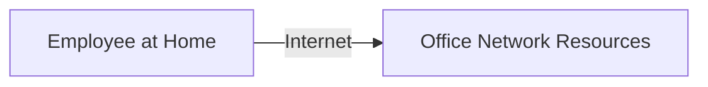
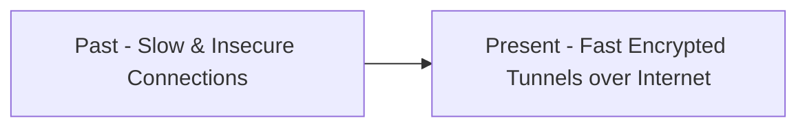
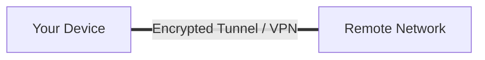
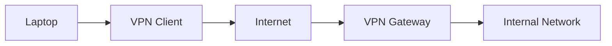
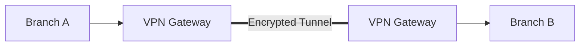
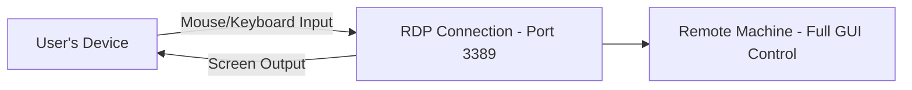
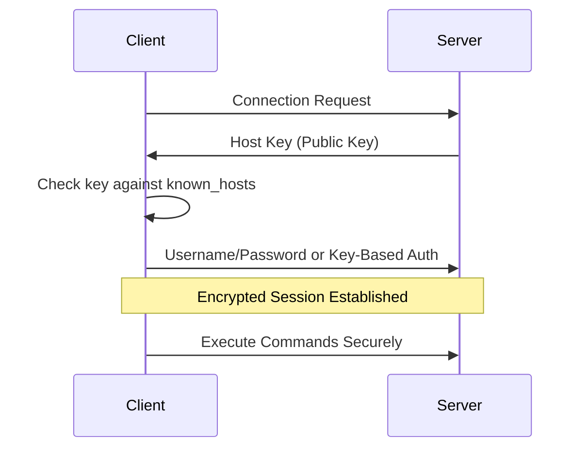

> **الهدف من الـ Section ده:**  
> هتفهم إزاي الـ Remote Access بيشتغل من خلال VPN وRDP وSSH، الفرق بين كل واحد فيهم واستخدامه العملي، وهتقدر تربط ده بأخطر التهديدات اللي بتستهدف الوصول عن بُعد زي RDP Brute Force وVPN Exploitation.

## Table of Contents

- [What is Remote Access?](#what-is-remote-access)
- [Remote Access: Past vs Present](#remote-access-past-vs-present)
- [1. VPN – Virtual Private Network](#1-vpn--virtual-private-network)
- [2. Remote Desktop Protocol (RDP)](#2-remote-desktop-protocol-rdp)
- [3. SSH – Secure Shell](#3-ssh--secure-shell)
- [Remote Access Methods Comparison](#remote-access-methods-comparison)
- [Remote Access Security Challenges](#remote-access-security-challenges)
- [SOC Analyst Perspective](#soc-analyst-perspective)
- [Final Summary](#final-summary)

---

## What is Remote Access?

**Remote Access** بيسمحلك تتصل بشبكة أو جهاز عن بُعد من غير ما تكون متصل فيزيائيًا بيه. الاتصال عادةً بيتم عبر الإنترنت، وده بيخلي المستخدم يحس وكأنه موجود مباشرة جوه الشبكة.

**مثال**: موظف بيشتغل من البيت يقدر يوصل للملفات والطابعات وموارد الشبكة وكأنه موجود في المكتب.

---

## Remote Access: Past vs Present

التطور الأساسي: من اتصالات بطيئة وغير آمنة، لأنفاق (Tunnels) سريعة ومشفرة عبر الإنترنت.

---

## 1. VPN – Virtual Private Network

الـ VPN هو الحل الأساسي للـ Remote Access الحديث. بيعمل نفق مشفر (Encrypted Tunnel) بين جهازك والشبكة البعيدة، وده بيضمن الأمان حتى عبر الإنترنت العام.

### VPN Types

#### a) Remote Access VPN

- بيستخدمه الموظفين من البيت
- محتاج **VPN Client** على الجهاز
- محتاج **User Authentication**
- بمجرد ما يتصل، المستخدم بيحس وكأنه موجود مباشرة جوه الشبكة

**Connection Flow**:

#### b) Site-to-Site VPN

- بيربط شبكتين بشكل دائم
- أوتوماتيكي بالكامل، مش محتاج تدخل بشري
- الأجهزة على الشبكتين مش لازم تعرف إن فيه VPN أصلاً
- مثالي لربط فروع الشركة (Branch Offices)

**Connection Flow**:

> [!NOTE]
> الفرق الجوهري بين النوعين: **Remote Access VPN** بيربط **مستخدم واحد** بشبكة، بينما **Site-to-Site VPN** بيربط **شبكتين كاملتين** ببعض بشكل دائم وشفاف تمامًا بالنسبة للمستخدمين.

---

## 2. Remote Desktop Protocol (RDP)

الـ Remote Desktop بيسمح بتحكم رسومي كامل (Full Graphical Control) في جهاز بعيد.

- الشاشة البعيدة بتتعرض على جهازك
- حركة الماوس والكيبورد على جهازك بتتنفذ فعليًا على الجهاز البعيد

| Property | Value |
|---|---|
| Protocol | Microsoft RDP |
| Port | 3389 |

### Use Cases

- IT support for remote employees
- System administrators managing servers
- Access work computers from home

---

## 3. SSH – Secure Shell

SSH هو البروتوكول الأساسي للـ Remote Access عن طريق سطر الأوامر (Command-Line).

- بيشتغل على **Port 22** بتشفير كامل
- بيستخدم لإدارة السيرفرات
- بيدعم نقل ملفات آمن عن طريق **SFTP**
- بيسمح بـ **Key-Based Authentication** لأمان إضافي

### Connection Flow

1. Client sends a connection request
2. Server sends **Host Key** (Public Key) for identity verification
3. Client checks the key (exists in `known_hosts`?)
4. Client sends username/password or uses key-based auth
5. Encrypted session is established ✅, commands can be executed securely

### Host Key

- Confirms the server's identity
- Any unexpected key change indicates a potential **MITM attack**

> [!WARNING]
> لو اتصلت بسيرفر عن طريق SSH وظهرتلك رسالة تحذير إن الـ **Host Key اتغير** فجأة عن اللي كان محفوظ في `known_hosts`، **متتجاهلهاش أبدًا**. ده مؤشر قوي جدًا على محاولة **Man-in-the-Middle Attack**، ومش مجرد رسالة تقنية عادية.

---

## Remote Access Methods Comparison

| Method | Purpose | Port | Interface | Encryption | Best For |
|---|---|---|---|---|---|
| Remote Access VPN | ربط مستخدم فردي بالشبكة الداخلية | Varies (e.g., 443, 1194, 500) | Network-level access | Yes | موظفين شغالين من البيت |
| Site-to-Site VPN | ربط شبكتين ببعض بشكل دائم | Varies (e.g., 500, 4500) | Network-level access | Yes | ربط فروع الشركات |
| RDP | تحكم رسومي كامل في جهاز بعيد | 3389 | Full GUI | Yes (with proper configuration) | دعم فني، إدارة سيرفرات Windows |
| SSH | إدارة سطر أوامر عن بُعد | 22 | Command-Line | Yes (always) | إدارة سيرفرات Linux/Network Devices |

---

## Remote Access Security Challenges

- Remote devices are not fully controlled — may contain malware
- Internet-based connections increase interception risks
- User identity verification is harder → **MFA (Multi-Factor Authentication)** is recommended

### Best Practices

**VPN + MFA + Endpoint Security + Monitoring = Secure Remote Access ✅**

---

## SOC Analyst Perspective

| Threat | Description | MITRE ATT&CK Reference |
|---|---|---|
| RDP Brute Force | محاولات تخمين كلمات السر بشكل متكرر على Port 3389 المفتوح للإنترنت | T1110 - Brute Force |
| RDP Exploitation (e.g., BlueKeep) | استغلال ثغرات معروفة في تطبيق RDP نفسه للوصول من غير Authentication | T1210 - Exploitation of Remote Services |
| External Remote Services Abuse | استخدام بيانات دخول مسروقة أو مسربة للوصول عبر VPN/RDP/SSH كنقطة دخول أولى | T1133 - External Remote Services |
| SSH Brute Force | محاولات تخمين بيانات الدخول على Port 22، خصوصًا لو Key-Based Authentication مش مفعّل | T1110 - Brute Force / T1021.004 - Remote Services: SSH |
| VPN Credential Theft / Session Hijacking | سرقة بيانات دخول VPN عن طريق Phishing أو Malware، للوصول المباشر للشبكة الداخلية | T1078 - Valid Accounts |

> [!IMPORTANT]
> **RDP** من أكتر البروتوكولات استهدافًا في الهجمات على مستوى العالم، لأنه غالبًا بيتسيب مفتوح للإنترنت مباشرة من غير حماية كافية. ثغرات زي **BlueKeep (CVE-2019-0708)** أثبتت إن مجرد وجود RDP مكشوف على الإنترنت من غير حتى محاولة Login ممكن يكون كافي لاختراق الجهاز بالكامل.

### Detection & Best Practices

- **متسيبش RDP مكشوف مباشرة على الإنترنت** - استخدم VPN أو Jump Server كطبقة وسيطة إجبارية
- تفعيل **MFA** على كل قنوات الـ Remote Access (VPN, RDP, SSH) من غير استثناء
- مراقبة عدد كبير من محاولات الدخول الفاشلة (Failed Logins) على Port 3389 أو 22 من نفس المصدر (مؤشر Brute Force)
- استخدام **Network Level Authentication (NLA)** في RDP لتقليل سطح الهجوم قبل حتى بدء أي جلسة
- مراجعة **VPN Access Logs** بانتظام للتأكد من عدم وجود اتصالات من مواقع جغرافية أو أوقات غير معتادة (**Impossible Travel** كمؤشر Compromise)

> [!TIP]
> لو شفت في الـ Logs اتصال VPN ناجح لنفس المستخدم من بلدين مختلفين جغرافيًا في وقت قريب جدًا من بعض (مستحيل يكون سافر بينهم في الوقت ده)، ده مؤشر قوي على **بيانات دخول مسروقة (Compromised Credentials)**، ولازم يتاخد إجراء فوري زي تعطيل الحساب والتحقيق.

---

## Final Summary

- **Remote Access**: الوصول لشبكة بعيدة عبر الإنترنت
- **الحلول**:
  - **Remote Access VPN** → وصول الموظف من البيت
  - **Site-to-Site VPN** → ربط شبكات الفروع
  - **RDP** → تحكم كامل في الجهاز (GUI)
  - **SSH** → إدارة السيرفرات (Command Line) ✅
- من ناحية الـ SOC: أهم المخاطر هي **RDP Brute Force/Exploitation (T1110/T1210)**, **External Remote Services Abuse (T1133)**, و**SSH Brute Force (T1021.004)**
- الحماية المثالية: **VPN + MFA + Endpoint Security + Monitoring**

> [!IMPORTANT]
> **Golden Rule**: أي Remote Access من غير تشفير يعتبر خطر أمني كبير ❌
