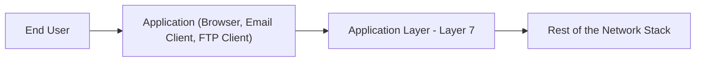
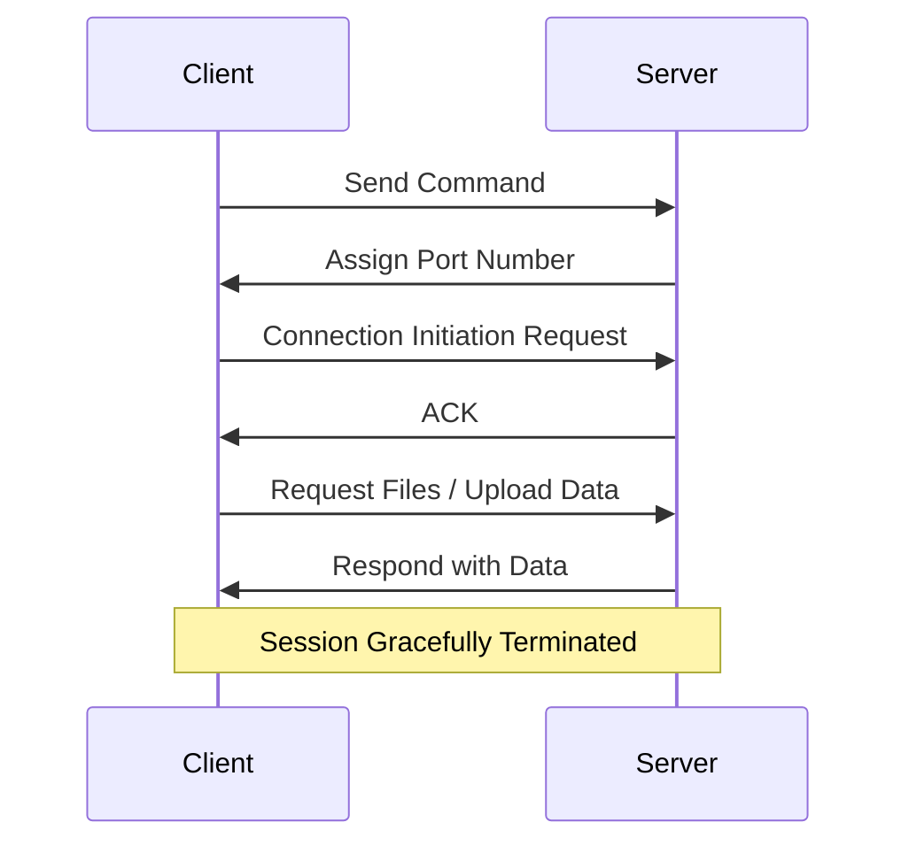

> **الهدف من الـ Section ده:**  
> هتفهم إزاي الـ Application Layer هي أقرب طبقة للمستخدم النهائي، إزاي بروتوكولات زي HTTP وDNS وSMTP بتشتغل عليها، وهتقدر تربط ده بإزاي أغلب الهجمات اللي بتقابلها كـ SOC Analyst (زي Phishing وWeb Attacks) فعليًا بتحصل عند الطبقة دي.

## Table of Contents

- [Overview](#overview)
- [Key Features](#key-features)
- [Functions of Application Layer](#functions-of-application-layer)
- [How the Application Layer Works](#how-the-application-layer-works)
- [Services Provided by Application Layer Protocols](#services-provided-by-application-layer-protocols)
- [Common Application Layer Protocols](#common-application-layer-protocols)
- [SOC Analyst Perspective](#soc-analyst-perspective)
- [Summary](#summary)

---

## Overview

الـ **Application Layer** هي أعلى طبقة (Layer 7) في الـ OSI Model، وبتمكّن التفاعل المباشر بين تطبيقات المستخدم النهائي والشبكة. بتشتغل كواجهة (Interface) بين برامج المستخدم والشبكة.

> [!NOTE]
> دي أقرب طبقة للمستخدم، لكن مهم توضيح إنها مش الـ Application نفسها (زي Chrome أو Outlook) - دي الطبقة اللي بتوفر الخدمات اللي الـ Application بيستخدمها عشان يتواصل مع الشبكة.

---

## Key Features

- Closest layer to the end user
- Provides network services to applications
- Enables file transfer, email, web access, and remote login
- Acts as an interface between user software and the network

---

## Functions of Application Layer

### Data Representation

- Ensures data is in a format both sender and receiver can understand
- Converts user-entered information into network-compatible formats (ASCII, JPEG, HTML)

### Network Service Access

- Provides direct access to network services
- Example: Using email clients or FTP to send/receive files

### Application Protocols

- Defines rules and procedures for communication between applications
- Examples: **HTTP** (web), **FTP** (file transfer), **SMTP** (email), **DNS** (domain resolution)

### Session Management

- Establishes, manages, and terminates communication sessions between applications
- Maintains synchronization during data exchange

> [!NOTE]
> لاحظ إن "Session Management" هنا بتحصل على مستوى الـ Application نفسها (زي Login Session في موقع ويب)، وده مختلف عن الـ Session Layer (Layer 5) اللي بتدير الـ Session على مستوى الاتصال الأساسي بين الجهازين.

---

## How the Application Layer Works

1. The client sends a command to the server
2. The server assigns a port number to the client
3. The client sends a connection initiation request; the server replies with an ACK
4. The client can now request files or upload data to the server
5. Once communication is complete, the session is gracefully terminated

---

## Services Provided by Application Layer Protocols

- Defines processes for both communicating parties
- Specifies the type of messages sent/received
- Sets the basic syntax and formatting of messages
- Manages sending, receiving, and expected responses
- Coordinates interaction with lower layers

---

## Common Application Layer Protocols

| Protocol | Purpose | Default Port |
|---|---|---|
| HTTP | Web browsing (unencrypted) | 80 |
| HTTPS | Secure web browsing (encrypted via TLS) | 443 |
| FTP | File transfer | 20/21 |
| SMTP | Sending email | 25 |
| POP3 | Retrieving email (downloads and removes from server) | 110 |
| IMAP | Retrieving email (syncs with server) | 143 |
| DNS | Domain name resolution | 53 |
| DHCP | Automatic IP address assignment | 67/68 |
| Telnet | Remote login (unencrypted) | 23 |
| SSH | Secure remote login (encrypted) | 22 |

> [!IMPORTANT]
> لاحظ الفرق بين **Telnet** و**SSH**: الاتنين بيوفروا Remote Login، لكن Telnet بيبعت البيانات (بما فيها الـ Credentials) **من غير تشفير**، بينما SSH بيشفر كل حاجة. استخدام Telnet في بيئة العمل الحديثة بيعتبر **Red Flag** أمني كبير.

---

## SOC Analyst Perspective

> [!IMPORTANT]
> الـ Application Layer هي **أكتر طبقة** بيحصل عندها هجمات فعليًا في الواقع العملي، لأنها أقرب طبقة للمستخدم وللبيانات الحساسة، وأغلب الـ Attack Surface بتتركز هنا.

### Common Threats at the Application Layer

| Threat | Description | MITRE ATT&CK Reference |
|---|---|---|
| Phishing | رسائل بريد إلكتروني مزيفة (بتستغل SMTP) بتخدع المستخدم عشان يفتح رابط أو ملف ضار | T1566 - Phishing |
| Web Application Attacks (SQLi, XSS) | استغلال ثغرات في تطبيقات الويب (بتستغل HTTP/HTTPS) لسرقة بيانات أو تنفيذ كود ضار | T1190 - Exploit Public-Facing Application |
| DNS Tunneling / DNS Spoofing | استغلال بروتوكول DNS لتهريب بيانات أو توجيه المستخدم لموقع ضار | T1071.004 - Application Layer Protocol: DNS |
| C2 Communication over HTTP/HTTPS | استخدام بروتوكولات الويب العادية للتواصل مع Command and Control Servers لتفادي الكشف | T1071.001 - Application Layer Protocol: Web Protocols |
| Credential Harvesting via Fake Login Pages | صفحات تسجيل دخول مزيفة بتستخدم HTTP/HTTPS لسرقة بيانات الدخول | T1056.003 - Input Capture: Web Portal Capture |

> [!WARNING]
> استخدام بروتوكولات الويب العادية زي **HTTP/HTTPS** في اتصالات الـ **Command and Control (C2)** بقى شائع جدًا بين المهاجمين، لأن الـ Traffic ده بيندمج بسهولة وسط حركة الويب الطبيعية ويصعب تمييزه من غير أدوات تحليل متقدمة.

### Detection & Best Practices

- استخدام **Web Application Firewall (WAF)** لحماية تطبيقات الويب من هجمات زي SQL Injection وXSS
- مراقبة **DNS Query Logs** لاكتشاف أنماط غير طبيعية (زي Queries طويلة جدًا أو متكررة بشكل غريب) قد تشير لـ DNS Tunneling
- تحليل الـ **Email Gateway Logs** لاكتشاف محاولات Phishing قبل ما توصل لصندوق المستخدم
- مراقبة الـ **User-Agent** والـ **Traffic Patterns** في اتصالات HTTP/HTTPS، لأن أدوات الـ Malware غالبًا بيكون ليها بصمة مختلفة عن المتصفحات الحقيقية

> [!TIP]
> لما تحلل أي Incident، اسأل نفسك: "الهجوم ده استغل أنهي بروتوكول من بروتوكولات الـ Application Layer؟" لأن الإجابة هتوجهك مباشرة لمصدر الـ Logs الصح (Email Gateway لو Phishing، Web Server/WAF Logs لو Web Attack، DNS Logs لو Tunneling).

---

## Summary

- الـ **Application Layer** (Layer 7) هي أقرب طبقة للمستخدم النهائي، وبتوفر الواجهة بين البرامج والشبكة
- أهم وظائفها: **Data Representation, Network Service Access, Application Protocols, Session Management**
- أشهر بروتوكولاتها: **HTTP/HTTPS, FTP, SMTP, POP3/IMAP, DNS, DHCP, Telnet, SSH**
- من ناحية الـ SOC: الطبقة دي هي **الأكثر عرضة للهجمات فعليًا**، وتشمل **Phishing (T1566), Web Application Attacks (T1190), DNS Tunneling (T1071.004), وC2 over HTTP/HTTPS (T1071.001)**
- أدوات الحماية الأساسية: **WAF, Email Gateway Filtering, DNS Monitoring,** وتحليل أنماط الـ Traffic غير الطبيعية
