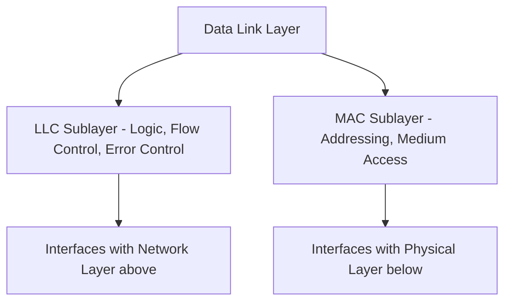
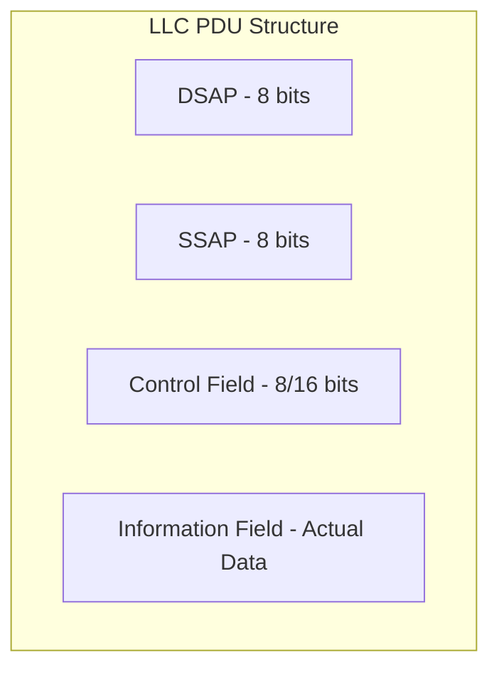
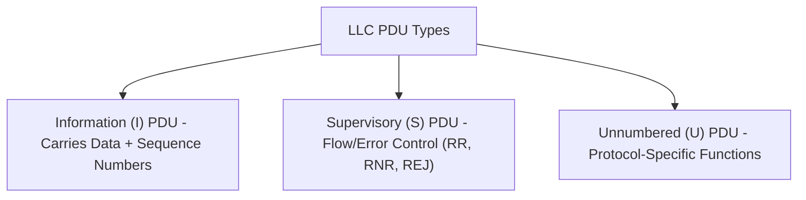

> **الهدف من الـ Section ده:**  
>  هتفهم إزاي الـ Logical Link Control (LLC) هي الجزء "الذكي" من الـ Data Link Layer، إزاي بتنظم البيانات وتتحكم في الأخطاء والـ Flow، وهتتعرف على بنية الـ LLC PDU بالتفصيل عشان تقدر تفهمها لما تشوفها في أي Packet Capture.

# Logical Link Control (LLC) Sublayer

## Table of Contents

- [Overview](#overview)
- [Relationship with MAC Sublayer](#relationship-with-mac-sublayer)
- [LLC Protocols](#llc-protocols)
- [Protocol Data Unit (PDU) Structure](#protocol-data-unit-pdu-structure)
- [Types of LLC PDU](#types-of-llc-pdu)
- [Functions of the LLC Sublayer](#functions-of-the-llc-sublayer)
- [SOC Analyst Perspective](#soc-analyst-perspective)
- [Summary](#summary)

---

## Overview

الـ **Logical Link Control (LLC)** هي الـ Sublayer العلوية من الـ **Data Link Layer (DLL)**. بتوفر المنطق (Logic) وآليات التحكم اللازمة للاتصال الموثوق بين الأجهزة (Reliable Node-to-Node Communication).

الـ LLC بتدير:

- Synchronization
- Multiplexing
- Flow Control
- Error Checking/Correction

بتضمن إن البيانات المنقولة عبر الشبكة منظمة، خالية من الأخطاء، ووصلت بشكل صحيح.

> [!NOTE]
> لو الـ MAC Sublayer هي "الجسم" اللي بيتحكم في الوصول للوسط الفيزيائي، فالـ LLC هي "العقل" اللي بيتحكم في تنظيم البيانات نفسها والتأكد من سلامتها.

---

## Relationship with MAC Sublayer

الـ Data Link Layer بتتقسم لطبقتين فرعيتين:

1. **LLC Sublayer** – logic and control
2. **MAC Sublayer** – access to physical media

الـ LLC بتشتغل مع الـ MAC عشان تضمن الـ Addressing الصحيح وتوصيل الـ Frames جوه الشبكة.

> [!IMPORTANT]
> الـ LLC هي اللي بتوفر واجهة موحدة (Uniform Interface) للـ Network Layer، بغض النظر عن نوع الـ MAC Technology المستخدمة تحتها (سواء Ethernet أو Wi-Fi أو غيرها). ده بيخلي الطبقات العليا مش محتاجة تعرف تفاصيل الـ Hardware اللي شغالة عليه.

---

## LLC Protocols

بروتوكولات الـ LLC متأثرة (Modeled After) بروتوكول **HDLC (High-Level Data Link Control)**، وبتوفر ثلاثة أنواع من الخدمات:

1. **Unacknowledged Connectionless Service** – البيانات بتتبعت من غير أي تأكيد استلام
2. **Connection-Oriented Service** – بيتم إنشاء اتصال (Connection) قبل نقل البيانات
3. **Acknowledged Connectionless Service** – البيانات بتتبعت مع تأكيد استلام

| Service Type | Connection Established? | Acknowledgment? | Use Case |
|---|---|---|---|
| Unacknowledged Connectionless | No | No | سرعة عالية، مناسب لتطبيقات مش حساسة لفقد بيانات بسيط |
| Connection-Oriented | Yes | Yes (implicit via connection) | نقل بيانات موثوق يحتاج ترتيب وتأكيد |
| Acknowledged Connectionless | No | Yes | توازن بين السرعة والموثوقية |

---

## Protocol Data Unit (PDU) Structure

الـ LLC بتستخدم **PDU** لتغليف البيانات. كل PDU بيتكون من أربع حقول أساسية:

### 1. DSAP (Destination Service Access Point)

- 8-bit field
- Identifies the logical address of the receiving device
- Indicates individual or group address

### 2. SSAP (Source Service Access Point)

- 8-bit field
- Identifies the logical address of the sending device
- Specifies command or response PDU

### 3. Information Field

- Contains the actual data being transmitted

### 4. Control Field

- 8 or 16-bit field depending on PDU type
- Specifies flow control and error control functions

> [!NOTE]
> الـ DSAP والـ SSAP بيشتغلوا زي "عناوين منطقية" بتحدد مين بيتكلم مع مين على مستوى البروتوكول، وده مختلف عن الـ MAC Address اللي بيحدد هوية الجهاز الفيزيائية.

---

## Types of LLC PDU

### Information (I) PDU

- Carries data
- Includes 7-bit sequence number **N(S)** and acknowledgment number **N(R)**

### Supervisory (S) PDU

- Used for flow and error control
- Includes acknowledgment number **N(R)** and 2-bit S field for **RR, RNR, and REJ** formats

### Unnumbered (U) PDU

- Includes 5-bit **M field**
- Used for various protocol-specific functions

| PDU Type | Purpose | Key Fields |
|---|---|---|
| Information (I) | نقل البيانات الفعلية | N(S) Sequence Number, N(R) Acknowledgment Number |
| Supervisory (S) | التحكم في الـ Flow والأخطاء | N(R), 2-bit S Field (RR = Receive Ready, RNR = Receive Not Ready, REJ = Reject) |
| Unnumbered (U) | وظائف خاصة بالبروتوكول (زي إنشاء أو إنهاء الاتصال) | 5-bit M Field |

---

## Functions of the LLC Sublayer

- Ensures data integrity and reliability
- Provides logic for the Data Link Layer
- Controls synchronization, multiplexing, flow, and error checking
- Supports multipoint communication across networks

---

## SOC Analyst Perspective

> [!NOTE]
> في شبكات الـ Ethernet الحديثة (زي معظم بيئات العمل الحالية)، غالبًا بيتم استخدام **Ethernet II Framing** مباشرة بدل الاعتماد الكامل على LLC/802.2 Framing، لكن فهم بنية الـ LLC لسه مهم لأنها بتظهر في بروتوكولات وبيئات تانية زي **Token Ring** وبعض بروتوكولات الـ Industrial Networks (زي بعض أنظمة الـ SCADA/ICS القديمة).

من ناحية الـ Threat Hunting والـ Forensics:

- لما تحلل **Packet Capture** باستخدام أداة زي **Wireshark**، وتلاقي Frame فيها **802.2 LLC Header** بدل الـ Ethernet II العادي، ده ممكن يبقى إشارة إن فيه بروتوكول أو جهاز غير معتاد (Legacy Device أو Industrial Equipment) موجود على الشبكة، وده محتاج تحقيق زيادة لمعرفة سبب وجوده
- فهم حقول الـ Control Field (زي RR, RNR, REJ) مفيد لما تحلل مشاكل الأداء أو الـ Errors المتكررة على مستوى الـ Data Link، واللي ممكن تكون مؤشر على مشكلة Hardware أو حتى محاولة تعطيل الاتصال (Denial of Service على مستوى الطبقة)

> [!TIP]
> لو شفت عدد كبير من **Supervisory (S) PDUs** من نوع **REJ (Reject)** بشكل متكرر وغير طبيعي في الـ Traffic، ده ممكن يبقى مؤشر على مشكلة في جودة الاتصال أو محاولة تشويش متعمدة على الشبكة، ويستحق تحقيق إضافي.

---

## Summary

- الـ **LLC Sublayer** هي الجزء العلوي من الـ Data Link Layer، وبتوفر المنطق والتحكم للاتصال الموثوق بين الأجهزة
- بتدير الـ **Synchronization, Multiplexing, Flow Control, Error Checking/Correction**
- بتشتغل مع الـ **MAC Sublayer** عشان تضمن الـ Addressing والتوصيل الصحيح للـ Frames
- بروتوكولاتها متأثرة بـ **HDLC** وبتوفر 3 أنواع خدمات: Unacknowledged Connectionless, Connection-Oriented, Acknowledged Connectionless
- الـ **PDU Structure** بتتكون من: **DSAP, SSAP, Control Field, Information Field**
- فيه 3 أنواع من الـ LLC PDU: **Information (I), Supervisory (S), Unnumbered (U)**
- من ناحية الـ SOC: فهم بنية الـ LLC مفيد في تحليل الـ Packet Captures، خصوصًا لما يظهر 802.2 Framing في بيئات Legacy أو Industrial Networks، وممكن يساعد في اكتشاف مشاكل أو محاولات تشويش على مستوى الـ Data Link
