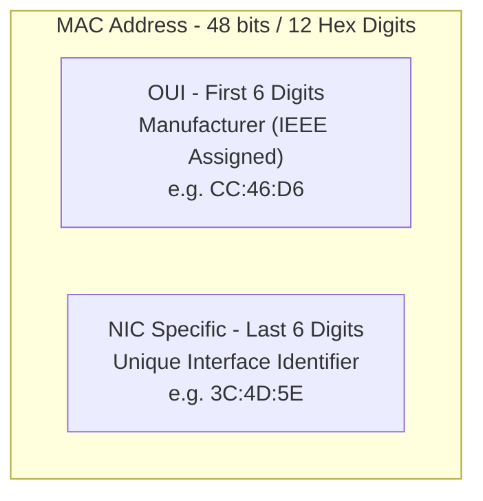
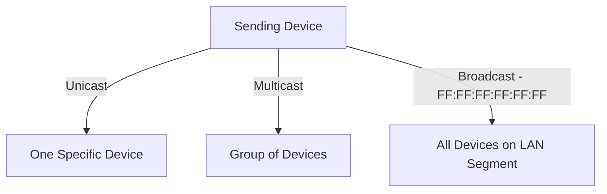
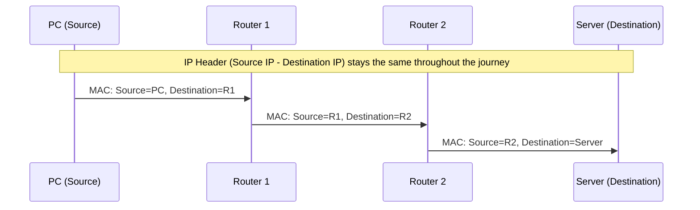

> **الهدف من الـ Section ده:**  
>  هتفهم إيه هو الـ MAC Address وإزاي هو مختلف عن الـ IP Address، وإزاي البيانات بتتنقل من Router لـ Router والـ MAC Header بيتغير في كل Hop، وهتتعرف على إزاي الـ SOC Analyst بيستخدم الـ MAC Address في التحقيقات وكشف الأجهزة الغريبة على الشبكة.


## Table of Contents

- [Overview](#overview)
- [MAC Address Format](#mac-address-format)
- [Examples of OUI](#examples-of-oui)
- [Types of MAC Addresses](#types-of-mac-addresses)
- [MAC vs IP Addresses](#mac-vs-ip-addresses)
- [Importance of Unique MAC Addresses](#importance-of-unique-mac-addresses)
- [Finding Your MAC Address](#finding-your-mac-address)
- [SOC Analyst Perspective](#soc-analyst-perspective)
- [Summary](#summary)

---

## Overview

الـ **MAC Address** هو عنوان فيزيائي فريد (Unique Physical Address) بيتحدد لكارت الشبكة (**Network Interface Card - NIC**) وقت التصنيع. بيشتغل على مستوى **Data Link Layer (Layer 2)** في الـ OSI Model، وبيضمن إن كل جهاز على الشبكة له هوية فريدة (Unique Identification) داخل نفس الشبكة.

الـ MAC Addresses ضرورية لتوصيل البيانات من نقطة لنقطة جوه الشبكة (**Hop-to-Hop Data Delivery**)، وبتشتغل مع الـ IP Addresses اللي مسؤولة عن التوصيل من البداية للنهاية عبر شبكات مختلفة (**End-to-End Delivery**).

> [!NOTE]
> فكر في الـ MAC Address زي "الرقم القومي" بتاع الجهاز - ثابت ومحدد وقت التصنيع (مبدئيًا)، بعكس الـ IP Address اللي بيتغير حسب الشبكة اللي الجهاز متصل بيها، وده زي "عنوان السكن" اللي ممكن يتغير.

---

## MAC Address Format

- **48-bit hardware number** (12 hexadecimal digits)
- Commonly represented in **Colon-Hexadecimal notation**: `00:1A:2B:3C:4D:5E`
- First 6 digits **(OUI)**: Identify the manufacturer (assigned by IEEE)
- Last 6 digits: Identify the specific network interface card (NIC)



> [!NOTE]
> Linux بيستخدم الـ **Colon Notation** (زي `00:1A:2B:3C:4D:5E`)، بينما أجهزة Cisco ممكن تستخدم الـ **Period-Separated Notation** (زي `001A.2B3C.4D5E`).

---

## Examples of OUI

| OUI | Manufacturer |
|---|---|
| CC:46:D6 | Cisco |
| 3C:5A:B4 | Google |
| 3C:D9:2B | Hewlett Packard |
| 00:9A:CD | Huawei Technologies |

> [!TIP]
> معرفة الـ OUI مفيدة جدًا في تحديد نوع الجهاز بسرعة من غير ما تحتاج تدخل عليه فعليًا، وده بيستخدم كتير في عمليات الـ Asset Discovery والـ Network Inventory.

---

## Types of MAC Addresses

### 1. Unicast

- Sent to a single specific device
- Source devices always use unicast

### 2. Multicast

- Sent to a group of devices
- LSB of the first octet = 1

### 3. Broadcast

- Sent to all devices on the LAN segment
- MAC address: `FF:FF:FF:FF:FF:FF`



> [!WARNING]
> الـ Broadcast Traffic لو زاد بشكل غير طبيعي على الشبكة، ده ممكن يبقى مؤشر على مشكلة (زي Broadcast Storm) أو حتى محاولة هجوم بتستغل الـ Broadcast عشان تجمع معلومات عن الأجهزة الموجودة على الشبكة (زي بعض تقنيات الـ Network Discovery/Reconnaissance).

---

## MAC vs IP Addresses

- **MAC Address (Layer 2)**: Hop-to-hop delivery within the network
- **IP Address (Layer 3)**: End-to-end delivery across networks

### Example

1. Data is wrapped in an **IP header** (source and destination IP)
2. Then wrapped in a **MAC header** (source and destination MAC for the next hop)
3. As data moves through routers, **MAC headers are updated for each hop**, **IP header remains until final destination**



> [!IMPORTANT]
> ده من أهم المفاهيم في فهم الشبكات: الـ **IP Header ثابت طول الرحلة** (لحد ما يوصل للـ Destination النهائي)، لكن الـ **MAC Header بيتغير في كل Hop** لأنه بس بيوصف "الجار القادم" (Next Hop) في الرحلة، مش الوجهة النهائية.

---

## Importance of Unique MAC Addresses

- Ensures no confusion between devices in the same LAN
- Guarantees accurate delivery of data to the intended device
- Acts as a unique identifier similar to a personal name in a network

---

## Finding Your MAC Address

### Windows

1. Open Command Prompt
2. Type:

```shell
ipconfig /all
```

3. Look for **Physical Address** under your network adapter

---

## SOC Analyst Perspective

> [!IMPORTANT]
> الـ MAC Address بيستخدم بشكل أساسي في التحقيقات الأمنية لتحديد هوية الأجهزة على الشبكة، لكن لازم تاخد بالك إنه مش دايمًا مصدر موثوق 100% لأنه ممكن يتزوّر.

### MAC Address Spoofing

المهاجم ممكن يغيّر الـ MAC Address بتاع جهازه (Software-level) عشان:

- يتجاوز آليات الـ Access Control اللي بتعتمد على الـ MAC (زي MAC Filtering على الـ Wi-Fi)
- ينتحل شخصية جهاز موثوق على الشبكة (زي انتحال MAC بتاع الـ Gateway في هجوم ARP Spoofing)
- يخفي هويته الحقيقية أثناء أي نشاط غير مصرح بيه

> [!WARNING]
> **MAC Filtering لوحدها مش كافية كطبقة حماية**، لأن أي مهاجم بمعرفة بسيطة يقدر يغيّر الـ MAC Address بتاعه (Spoofing) بسهولة، فلازم تتضاف طبقات حماية تانية زي 802.1X Authentication.

### استخدامات الـ MAC في التحقيقات (Investigations)

| Use Case | Description |
|---|---|
| Asset Identification | استخدام الـ OUI لمعرفة نوع/شركة الجهاز بسرعة أثناء عمل Network Inventory |
| Rogue Device Detection | اكتشاف أجهزة جديدة أو غريبة اتوصلت بالشبكة عن طريق مقارنة الـ MAC Addresses بقائمة معروفة (Known Assets List) |
| DHCP Logs Correlation | ربط الـ MAC Address بالـ IP Address المعطى ليه من DHCP Server وقت معين، مفيد جدًا في تتبع نشاط جهاز بعينه بمرور الوقت |
| Detecting MAC Spoofing | مراقبة أي تغيير مفاجئ في الـ MAC Address المرتبط بنفس الجهاز أو نفس الـ Switch Port |

من ناحية الـ MITRE ATT&CK:
- **T1200 - Hardware Additions**: أجهزة غير مصرح بيها ممكن تتوصل بالشبكة، ومراقبة الـ MAC Addresses الجديدة أول خطوة لاكتشافها
- **T1557 - Adversary-in-the-Middle**: بعض تقنيات الـ MITM (زي ARP Spoofing) بتعتمد على انتحال أو تزييف الـ MAC Address

> [!TIP]
> لما تحقق في Incident، ماتعتمدش على الـ MAC Address لوحده كدليل قاطع على هوية الجهاز - لازم تربطه بمصادر تانية زي DHCP Logs، Switch Port، وIP History عشان تبني صورة كاملة وموثوقة.

---

## Summary

- الـ **MAC Address** هو عنوان فيزيائي فريد بيتحدد للـ NIC وقت التصنيع، وبيشتغل على **Layer 2**
- بيتكون من **48-bit** مقسمة لـ **OUI** (أول 6 خانات - الشركة المصنعة) و **NIC Identifier** (آخر 6 خانات)
- 3 أنواع: **Unicast** (لجهاز واحد)، **Multicast** (لمجموعة)، **Broadcast** (`FF:FF:FF:FF:FF:FF` لكل الأجهزة على نفس الـ LAN)
- الفرق الأساسي بين MAC وIP: MAC بيتغير في كل **Hop** (Hop-to-Hop)، بينما IP بيفضل ثابت طول الرحلة (End-to-End)
- من ناحية الـ SOC: الـ MAC Address أداة أساسية في **Asset Identification** و**Rogue Device Detection**، لكن عرضة للـ **Spoofing**، فلازم يتربط دايمًا بمصادر تحقق تانية زي DHCP Logs وSwitch Port Mapping (مرتبط بـ MITRE T1200 وT1557)
