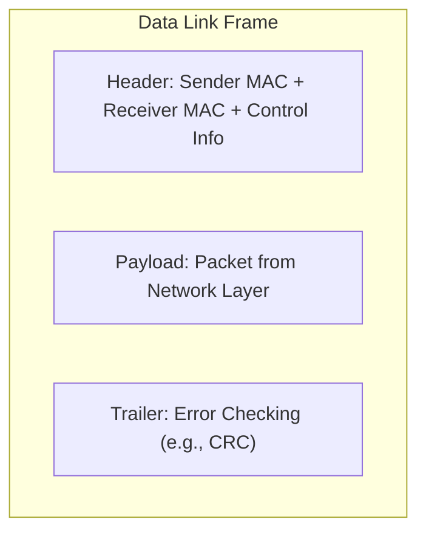
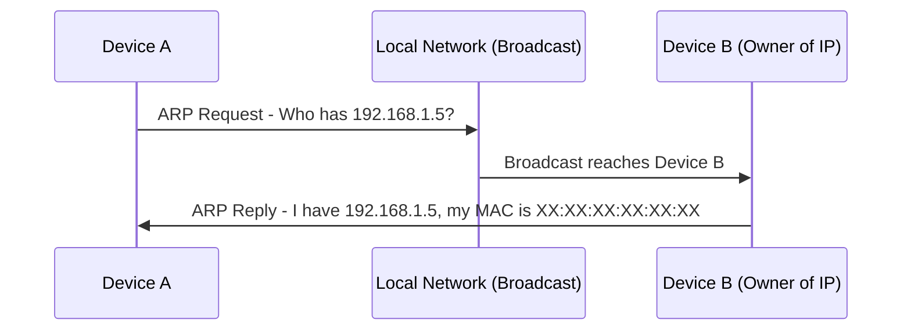
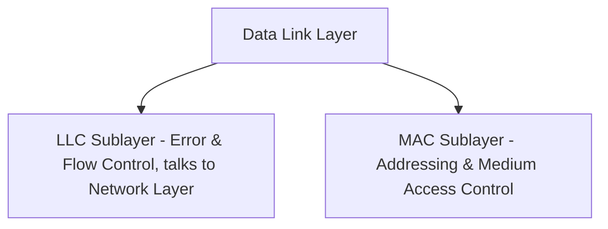
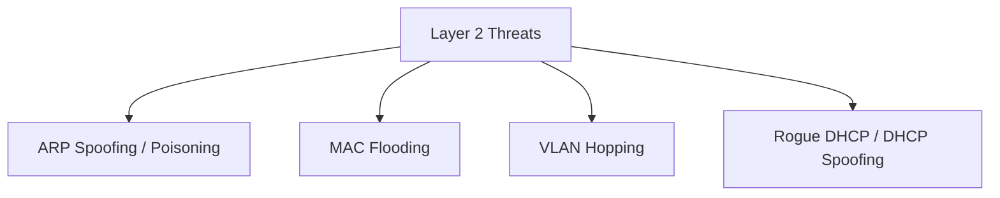

> **الهدف من الـ Section ده:**  
> هتفهم إزاي الـ Data Link Layer بتحول الـ Bits الخام لـ Frames منظمة، إزاي الـ MAC Addresses وبروتوكول ARP بيشتغلوا، وهتقدر تربط الطبقة دي بأشهر هجمات الـ Local Network زي ARP Spoofing وMAC Flooding اللي بتواجهها كتير كـ SOC Analyst.

## Table of Contents

- [Overview](#overview)
- [Frame Structure](#frame-structure)
- [MAC Address and ARP](#mac-address-and-arp)
- [Sublayers](#sublayers)
- [Key Functions](#key-functions)
- [Common Data Link Layer Devices](#common-data-link-layer-devices)
- [SOC Analyst Perspective](#soc-analyst-perspective)
- [Summary](#summary)

---

## Overview

الـ **Data Link Layer** هي الطبقة التانية في الـ OSI Model. مسؤوليتها الأساسية إنها تضمن توصيل البيانات من جهاز لجهاز (Node-to-Node Delivery) من غير أخطاء (Error-Free) فوق الـ Physical Layer. بتاخد الـ Raw Bits من الـ Physical Layer وتنظمها في هيئة **Frames** منظمة، وبتدير الـ Addressing والـ Flow والـ Access Control.

الطبقة دي هي حلقة الوصل بين الـ Physical Layer والـ Network Layer، وبتضمن نقل موثوق (Reliable Transmission) جوه نفس الشبكة.

---

## Frame Structure

البيانات الجاية من الـ Network Layer (اللي بتكون على هيئة **Packet**) بيتم تغليفها (Encapsulated) جوه **Frame**.

كل Frame بيحتوي على:

- Sender MAC Address
- Receiver MAC Address
- Control information

> [!NOTE]
> الـ Frames بتضمن إن البيانات اتحددت واتوصلت صح للجهاز المقصود، عن طريق وجود عنوان المرسل وعنوان المستقبل بشكل واضح جوه كل Frame.

---

## MAC Address and ARP

الـ Data Link Layer بتستخدم **MAC Addresses** عشان تحدد هوية الأجهزة على نفس الشبكة.

لو جهاز عارف الـ IP بتاع جهاز تاني لكن مش عارف الـ MAC بتاعه، بيستخدم بروتوكول **ARP (Address Resolution Protocol)**:

- الجهاز بيبعت سؤال: "Who has this IP?"
- الجهاز صاحب الـ IP ده بيرد بالـ MAC Address بتاعه

> [!WARNING]
> بروتوكول ARP **مفهوش أي آلية توثيق (Authentication)**، يعني أي جهاز على الشبكة ممكن يرد بـ ARP Reply مزيف ويدعي إنه صاحب IP معين. الثغرة دي هي أساس هجوم **ARP Spoofing / ARP Poisoning**.

---

## Sublayers

الـ Data Link Layer بتتقسم لطبقتين فرعيتين (Sublayers):

### 1. Logical Link Control (LLC)

- Provides error control and flow control
- Interfaces with the Network Layer

### 2. Media Access Control (MAC)

- Handles MAC addresses
- Controls access to the shared medium
- Prevents data collisions

---

## Key Functions

### 1. Framing

- Converts packets into frames with defined start and end points
- Ensures the receiver can recognize complete frames

### 2. Physical Addressing

- Adds sender and receiver MAC addresses to each frame header

### 3. Error Control

- Detects damaged or lost frames
- Retransmits frames if errors are detected

### 4. Flow Control

- Maintains consistent data rate between sender and receiver
- Prevents data overflow and corruption

### 5. Access Control

- Coordinates which device can use the shared medium at any time
- Managed by the MAC sublayer

> [!TIP]
> فكر في الـ Access Control زي إشارة المرور في تقاطع شوارع: بتتحكم مين يعدي إمتى عشان تمنع "التصادم" (Collision) بين البيانات اللي بتحاول تستخدم نفس الوسط (Medium) في نفس الوقت.

---

## Common Data Link Layer Devices

- **Switch** – forwards frames only to the destination device
- **Bridge** – connects two LAN segments, filtering traffic based on MAC addresses

> [!NOTE]
> الأجهزة دي اتشرحت بالتفصيل قبل كده في درس الـ Network Devices، وهنا بنستعرضهم تاني كجزء من فهمنا الكامل للـ Data Link Layer.

---

## SOC Analyst Perspective

| Threat | Description | Detection Approach |
|---|---|---|
| ARP Spoofing / Poisoning | مهاجم بيبعت ARP Replies مزيفة عشان يوهم الأجهزة إن الـ MAC بتاعه هو بتاع الـ Gateway أو جهاز تاني (MITM Attack) | مراقبة الـ ARP Tables لأي تغييرات غريبة، استخدام أدوات زي Dynamic ARP Inspection (DAI) |
| MAC Flooding | إغراق الـ Switch بعدد ضخم من الـ MAC Addresses المزيفة عشان يفشل ويرجع يشتغل زي Hub (Fail-Open) فيسمح بالـ Sniffing | مراقبة عدد الـ MAC Addresses على كل Port، تفعيل Port Security على الـ Switches |
| VLAN Hopping | محاولة الوصول لـ VLAN تانية غير المصرح بيها عن طريق استغلال إعدادات الـ Trunking | مراجعة إعدادات الـ Trunk Ports، تعطيل الـ Auto-Trunking Negotiation |
| Rogue DHCP / DHCP Spoofing | جهاز غير مصرح بيه بيوزع إعدادات IP مزيفة على الشبكة (غالبًا مرتبط بهجمات Layer 2/3 المشتركة) | استخدام DHCP Snooping على الـ Switches |

> [!IMPORTANT]
> **ARP Spoofing** هو من أشهر الهجمات اللي بتحصل على الـ Data Link Layer، وبيتم استخدامه غالبًا كخطوة أولى لتنفيذ **Man-in-the-Middle (MITM) Attack**، حيث المهاجم بيقدر يعترض (Intercept) الـ Traffic بين جهازين قبل ما يوصل لوجهته الحقيقية.

من ناحية الـ MITRE ATT&CK:
- **T1557 - Adversary-in-the-Middle**: يغطي تقنيات زي ARP Spoofing وDNS Spoofing اللي بيستخدمها المهاجم عشان يحط نفسه بين طرفين اتصال

> [!TIP]
> كأداة أساسية للـ Detection على مستوى الـ Layer 2، استخدم **Wireshark** أو **Arpwatch** عشان تراقب أي تغيير مفاجئ في الـ MAC-to-IP Mapping، لأن ده أقوى Indicator على وجود ARP Spoofing Attack جارية على الشبكة.

---

## Summary

- الـ **Data Link Layer** مسؤولة عن توصيل البيانات بين الأجهزة على نفس الشبكة من غير أخطاء، عن طريق تنظيم الـ Bits في **Frames**
- كل Frame بيحتوي على Sender MAC، Receiver MAC، وControl Information
- بروتوكول **ARP** بيربط بين الـ IP Address والـ MAC Address، لكنه مفهوش Authentication وده بيخليه عرضة للاستغلال
- الطبقة بتتقسم لـ **LLC** (Error & Flow Control) و **MAC** (Addressing & Medium Access)
- الوظائف الأساسية: **Framing, Physical Addressing, Error Control, Flow Control, Access Control**
- الأجهزة المرتبطة: **Switch** و **Bridge**
- من ناحية الـ SOC: أشهر الهجمات على الطبقة دي هي **ARP Spoofing, MAC Flooding, VLAN Hopping**، ومعظمها بترتبط بـ MITRE **T1557 - Adversary-in-the-Middle**، وأدوات زي Wireshark وDynamic ARP Inspection بتساعد في اكتشافها
