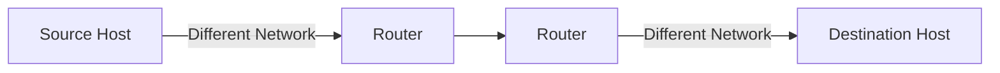
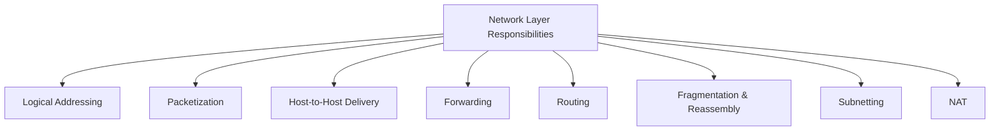
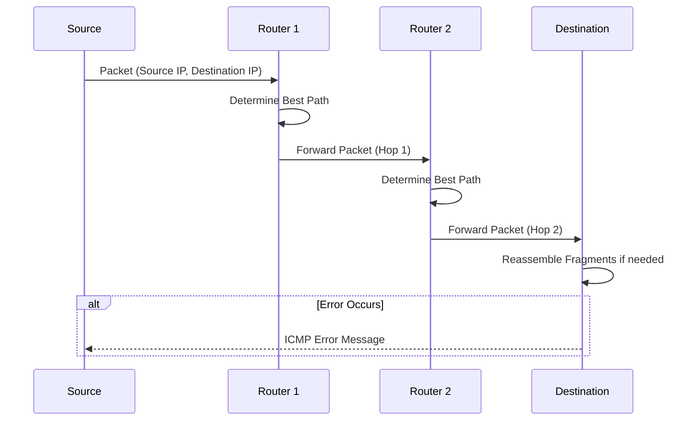
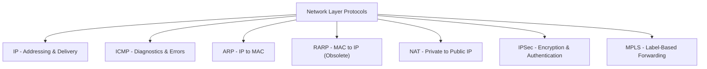
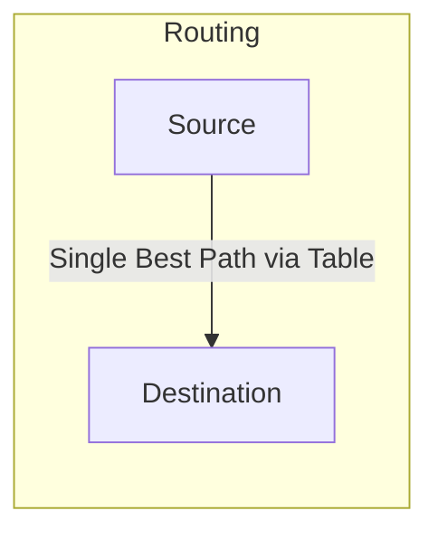
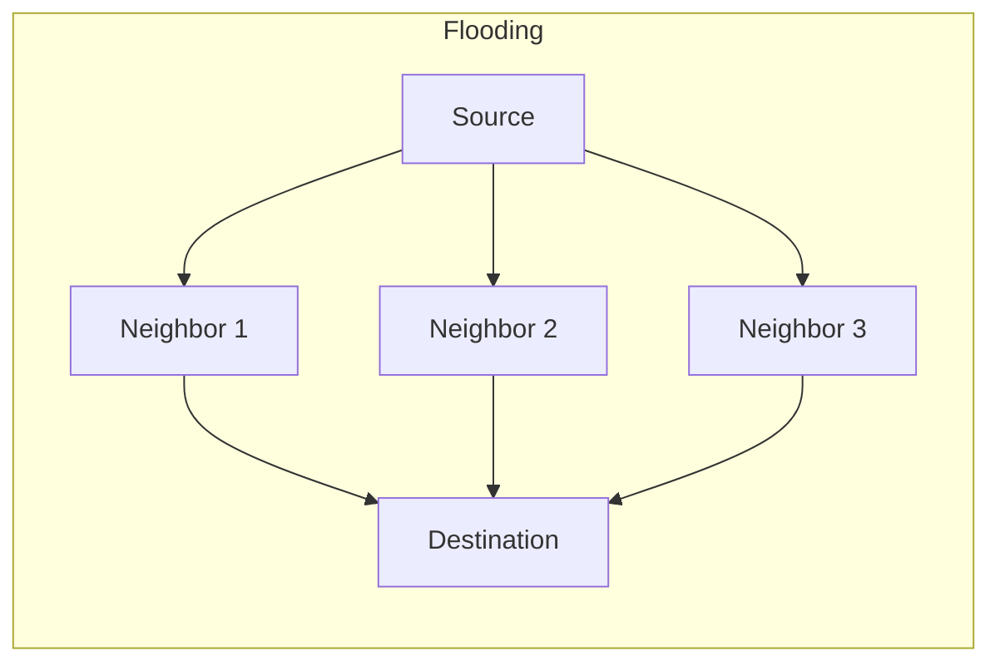

> **الهدف من الـ Section ده:**  
> الهدف من الـ Section ده: هتفهم إزاي الـ Network Layer بتوصل البيانات بين شبكات مختلفة تمامًا عن طريق الـ Logical Addressing والـ Routing، هتتعرف على أهم مسؤولياتها وبروتوكولاتها، وهتقدر تفرق بين الـ Routing والـ Flooding.

## Table of Contents

- [Overview](#overview)
- [Key Responsibilities of the Network Layer](#key-responsibilities-of-the-network-layer)
- [How the Network Layer Works](#how-the-network-layer-works)
- [Protocols Operating at the Network Layer](#protocols-operating-at-the-network-layer)
- [Routing Protocols](#routing-protocols)
- [Advantages of the Network Layer](#advantages-of-the-network-layer)
- [Limitations of the Network Layer](#limitations-of-the-network-layer)
- [Difference Between Routing and Flooding](#difference-between-routing-and-flooding)
- [SOC Analyst Perspective](#soc-analyst-perspective)
- [Summary](#summary)

---

## Overview

الـ **Network Layer** هي الطبقة التالتة في الـ OSI Model، ومسؤولة عن الـ **Logical Addressing**، الـ **Routing**، وتوصيل الحزم من البداية للنهاية (**End-to-End Packet Delivery**) عبر شبكات مترابطة مع بعضها.

- Handles logical (IP) addressing of devices
- Determines optimal routing paths between networks
- Enables host-to-host communication across multiple networks

> [!NOTE]
> على عكس الـ **Data Link Layer** اللي بتركز بس على التوصيل جوه نفس الـ Network Segment (Node-to-Node)، الـ **Network Layer** بتضمن إن البيانات توصل من الـ Host المصدر للـ Host النهائي حتى لو كانوا على شبكات مختلفة تمامًا.

---

## Key Responsibilities of the Network Layer

- **Logical Addressing**: Assigns unique IP addresses to devices, ensuring accurate identification and communication across networks
- **Packetization**: Encapsulates transport layer segments into packets for efficient transmission
- **Host-to-Host Delivery**: Ensures reliable delivery of packets from the sender to the intended receiver across diverse networks
- **Forwarding**: Moves packets from the input interface of a router to the appropriate output interface based on the destination IP
- **Routing**: Determines the optimal path for packets to travel across multiple networks using routing algorithms and protocols
- **Fragmentation and Reassembly**: Splits large packets into smaller fragments to match the Maximum Transmission Unit (MTU) of a network, and reassembles them at the destination
- **Subnetting**: Divides larger networks into smaller subnetworks for efficient addressing and traffic management
- **Network Address Translation (NAT)**: Maps private IPs to public IPs for internet communication, conserving address space and adding security

> [!TIP]
> فكر في الفرق بين **Forwarding** و **Routing** كده: الـ Routing هو "التخطيط" - تحديد أفضل مسار ممكن مقدمًا وتخزينه في جدول (Routing Table). الـ Forwarding هو "التنفيذ" - القرار الفعلي السريع لكل Packet بيوصل لأنهي Interface يتحرك بناءً على الجدول ده.

---

## How the Network Layer Works

1. Each device is assigned a unique logical address (IP address)
2. Data from the transport layer is encapsulated into packets, with source and destination IPs attached
3. Routers analyze the destination address and determine the best available path
4. Packets traverse the network hop-by-hop, moving across routers until reaching the destination
5. If the packet size exceeds the MTU, it is fragmented into smaller units
6. At the destination, the fragments are reassembled into the original data
7. If errors occur (e.g., unreachable destination), protocols like ICMP send error messages back to the source

> [!IMPORTANT]
> خطوة الـ **Fragmentation** بتحصل لو حجم الـ Packet أكبر من الـ **MTU (Maximum Transmission Unit)** بتاع أي شبكة في المسار. المشكلة إن كل جزء (Fragment) بيحتاج يتجمع تاني عند الوجهة النهائية بس، وده بيزود الحمل على المعالجة (Processing Overhead) ومصدر شائع لمشاكل الأداء.

---

## Protocols Operating at the Network Layer

| Protocol | Purpose |
|---|---|
| IP (Internet Protocol - IPv4/IPv6) | Provides logical addressing and delivers packets across networks; IPv6 offers a larger address space and better efficiency |
| ICMP (Internet Control Message Protocol) | Sends error reports and diagnostic messages (e.g., destination unreachable, ping) |
| ARP (Address Resolution Protocol) | Maps IP addresses to MAC addresses within a local network |
| RARP (Reverse Address Resolution Protocol) | Retrieves a device's IP address using its MAC address (largely obsolete) |
| NAT (Network Address Translation) | Converts private IP addresses to public IPs, conserving addresses and improving security |
| IPSec (Internet Protocol Security) | Secures IP communication through encryption and authentication |
| MPLS (Multiprotocol Label Switching) | Uses labels to forward packets efficiently and manage traffic |

---

## Routing Protocols

| Protocol | Type | Description |
|---|---|---|
| RIP (Routing Information Protocol) | Distance-Vector | Distance-vector protocol using hop count to select routes |
| OSPF (Open Shortest Path First) | Link-State | Link-state protocol that computes the shortest path using network topology |
| BGP (Border Gateway Protocol) | Path-Vector | Path-vector protocol that routes data between autonomous systems on the internet |

> [!IMPORTANT]
> **BGP** هو البروتوكول اللي بيربط الإنترنت كله فعليًا مع بعضه (بيوجه الـ Traffic بين الـ Autonomous Systems المختلفة زي شركات الاتصالات وISPs)، وأي مشكلة أو هجوم عليه ممكن يأثر على نطاق واسع جدًا من الإنترنت.

---

## Advantages of the Network Layer

- Enables end-to-end communication across multiple networks
- Supports scalability by allowing subnetting and hierarchical addressing
- Efficiently routes packets using shortest-path and dynamic routing algorithms
- Provides inter-networking by connecting heterogeneous networks

---

## Limitations of the Network Layer

- No flow control mechanism; congestion may occur if too many datagrams are in transit
- Limited error control; mainly relies on upper layers for reliability
- Routers may drop packets under heavy load, leading to possible data loss
- Fragmentation increases processing overhead and may affect performance

> [!WARNING]
> بما إن الـ Network Layer **مفيهاش Flow Control مدمج**، فمسؤولية التحكم في معدل الإرسال ومنع الـ Congestion بتقع بالكامل على طبقات أعلى (زي TCP في الـ Transport Layer). فهم النقطة دي مهم عشان تعرف تحدد صح مصدر أي مشكلة أداء - هل هي في مستوى الـ Routing نفسه ولا في التحكم بمعدل الإرسال فوقه؟

---

## Difference Between Routing and Flooding

| Routing | Flooding |
|---|---|
| A routing table is required | No Routing table is required |
| May give the shortest path | Always gives the shortest path |
| Routing is less reliable | Flooding is more reliable |
| Traffic is less in Routing | Traffic is more in Flooding |
| Duplicate packets are not present | Duplicate packets are present |

> [!NOTE]
> الـ **Flooding** بيبعت نسخة من الـ Packet لكل الـ Interfaces ما عدا اللي جاله منها، وده بيضمن وصول البيانات (حتى لو مسارات كتير اتقطعت)، لكن على حساب حمل هائل من الـ Traffic المكرر مقارنة بالـ Routing العادي اللي بيعتمد على جدول محدد.

---

## SOC Analyst Perspective

> [!IMPORTANT]
> الـ Network Layer هي المستوى اللي بيحصل فيه معظم قرارات الـ Traffic Filtering الأساسية (Firewalls, Router ACLs)، فمهم تفهم مسؤولياتها كويس عشان تعرف تحلل أي Log أو حدث مرتبط بالـ Routing أو الـ IP Addressing بشكل صحيح.

### Common Threats at the Network Layer

| Threat | Description | MITRE ATT&CK Reference |
|---|---|---|
| IP Spoofing | تزوير الـ Source IP Address لانتحال هوية جهاز آخر أو إخفاء مصدر الهجوم | T1090 - Proxy |
| ICMP-based DoS (Ping/Smurf Flood) | إغراق الهدف بحزم ICMP لاستنزاف الموارد | T1498 / T1499 - Network/Endpoint Denial of Service |
| Routing Table Manipulation | التلاعب بجداول الـ Routing (زي BGP Hijacking) لتحويل مسار الـ Traffic | T1584.004 - Compromise Infrastructure: Server |
| Fragmentation-based Evasion | تقسيم الحزم بشكل متعمد لتفادي أدوات IDS/IPS | T1027 - Obfuscated Files or Information |

### Detection & Best Practices

- تفعيل **Ingress/Egress Filtering** على الـ Routers لمنع الحزم اللي بيها Source IP مزور
- مراقبة **Routing Table Changes** غير المتوقعة، خصوصًا في بيئات بتستخدم BGP
- مراجعة **NAT وFirewall Logs** بانتظام لفهم أنماط الاتصال الداخلي والخارجي
- استخدام أدوات تحليل الـ Fragmentation لاكتشاف محاولات تفادي الـ IDS/IPS

> [!TIP]
> لما تحلل أي حادثة أمنية على مستوى الشبكة، اسأل نفسك: "المشكلة دي في الـ Addressing (مين اللي بيتكلم)، ولا في الـ Routing (المسار اللي البيانات ماشية فيه)؟" - التفريق ده بيوجهك بسرعة لمصدر الـ Log الصح (Firewall/ACLs للـ Addressing، Routing Protocol Logs للـ Routing).

---

## Summary

- الـ **Network Layer** (Layer 3) مسؤولة عن **Logical Addressing, Routing, وEnd-to-End Delivery** عبر شبكات مترابطة
- أهم مسؤولياتها: Logical Addressing, Packetization, Forwarding, Routing, Fragmentation/Reassembly, Subnetting, NAT
- أهم بروتوكولاتها: **IP (IPv4/IPv6), ICMP, ARP, RARP**، بالإضافة لـ NAT, IPSec, MPLS
- بروتوكولات الـ **Routing**: RIP (Distance-Vector), OSPF (Link-State), BGP (Path-Vector - العمود الفقري للإنترنت)
- **الفرق بين Routing وFlooding**: Routing أكفأ وأقل Traffic، Flooding أكتر موثوقية لكن أعلى حمل وبيه Duplicate Packets
- من ناحية الـ SOC: أهم التهديدات هي **IP Spoofing, ICMP-based DoS, وRouting Table Manipulation**، وأدوات زي Ingress Filtering ومراقبة جداول الـ Routing أساسية للحماية
