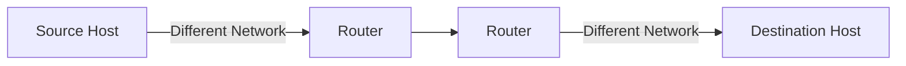
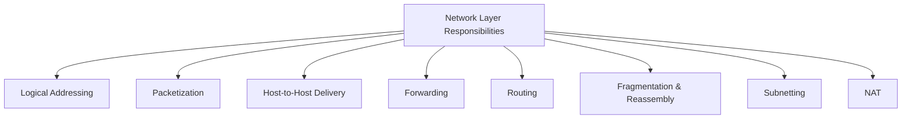
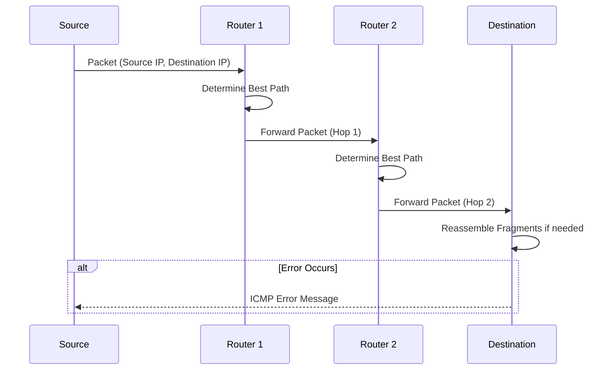
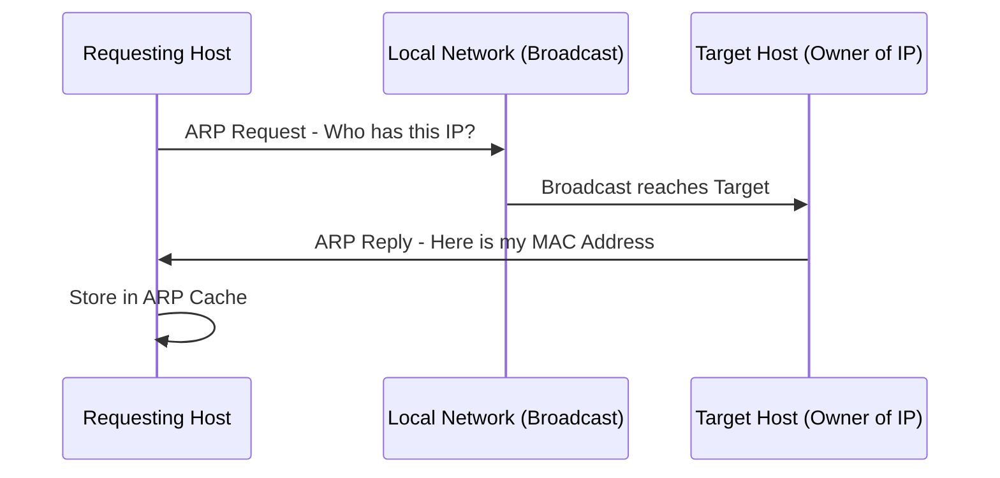
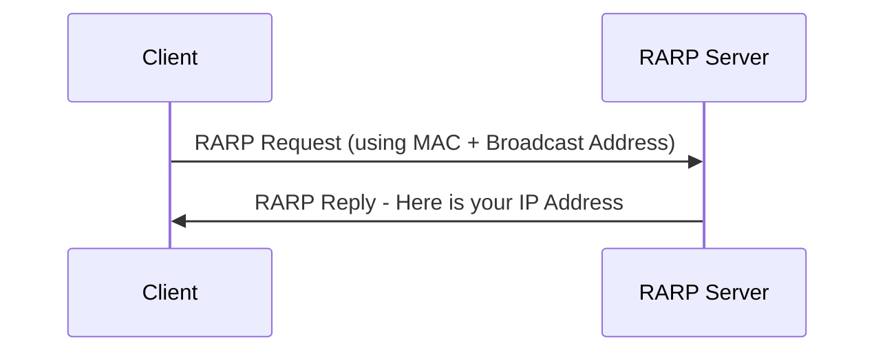
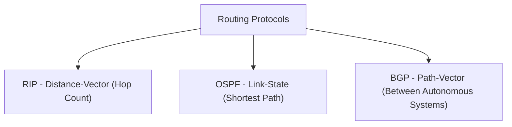

> **الهدف من الـ Section ده:**  
> الهدف من الـ Section ده: هتفهم إزاي الـ Network Layer بتوصل البيانات بين شبكات مختلفة تمامًا (مش بس جوه نفس الشبكة زي Layer 2)، هتتعرف على أهم بروتوكولاتها (IP, ARP, RARP, ICMP, IGMP) وبروتوكولات الـ Routing (RIP, OSPF, BGP)، وهتقدر تربط كل ده بأشهر هجمات الشبكة زي IP Spoofing وBGP Hijacking.

## Table of Contents

- [Overview](#overview)
- [Key Responsibilities of the Network Layer](#key-responsibilities-of-the-network-layer)
- [How the Network Layer Works](#how-the-network-layer-works)
- [Protocols Operating at the Network Layer](#protocols-operating-at-the-network-layer)
  - [1. IP (Internet Protocol)](#1-ip-internet-protocol)
  - [2. ARP (Address Resolution Protocol)](#2-arp-address-resolution-protocol)
  - [3. RARP (Reverse Address Resolution Protocol)](#3-rarp-reverse-address-resolution-protocol)
  - [4. ICMP (Internet Control Message Protocol)](#4-icmp-internet-control-message-protocol)
  - [5. IGMP (Internet Group Message Protocol)](#5-igmp-internet-group-message-protocol)
  - [Other Network Layer Protocols](#other-network-layer-protocols)
- [Routing Protocols](#routing-protocols)
- [Advantages of the Network Layer](#advantages-of-the-network-layer)
- [Limitations of the Network Layer](#limitations-of-the-network-layer)
- [Difference Between Routing and Flooding](#difference-between-routing-and-flooding)
- [SOC Analyst Perspective](#soc-analyst-perspective)
- [Summary](#summary)

---

## Overview

الـ **Network Layer** هي الطبقة التالتة في الـ OSI Model، ومسؤولة عن الـ **Logical Addressing**، الـ **Routing**، وتوصيل الحزم من البداية للنهاية (**End-to-End Packet Delivery**) عبر شبكات مترابطة مع بعضها.

- Handles logical (IP) addressing of devices
- Determines optimal routing paths between networks
- Enables host-to-host communication across multiple networks

> [!NOTE]
> على عكس الـ **Data Link Layer** اللي بتركز بس على التوصيل جوه نفس الـ Network Segment (Node-to-Node)، الـ **Network Layer** بتضمن إن البيانات توصل من الـ Host المصدر للـ Host النهائي حتى لو كانوا على شبكات مختلفة تمامًا.

---

## Key Responsibilities of the Network Layer

- **Logical Addressing**: Assigns unique IP addresses to devices, ensuring accurate identification and communication across networks
- **Packetization**: Encapsulates transport layer segments into packets for efficient transmission
- **Host-to-Host Delivery**: Ensures reliable delivery of packets from the sender to the intended receiver across diverse networks
- **Forwarding**: Moves packets from the input interface of a router to the appropriate output interface based on the destination IP
- **Routing**: Determines the optimal path for packets to travel across multiple networks using routing algorithms and protocols
- **Fragmentation and Reassembly**: Splits large packets into smaller fragments to match the Maximum Transmission Unit (MTU) of a network, and reassembles them at the destination
- **Subnetting**: Divides larger networks into smaller subnetworks for efficient addressing and traffic management
- **Network Address Translation (NAT)**: Maps private IPs to public IPs for internet communication, conserving address space and adding security

---

## How the Network Layer Works

1. Each device is assigned a unique logical address (IP address)
2. Data from the transport layer is encapsulated into packets, with source and destination IPs attached
3. Routers analyze the destination address and determine the best available path
4. Packets traverse the network hop-by-hop, moving across routers until reaching the destination
5. If the packet size exceeds the MTU, it is fragmented into smaller units
6. At the destination, the fragments are reassembled into the original data
7. If errors occur (e.g., unreachable destination), protocols like ICMP send error messages back to the source

---

## Protocols Operating at the Network Layer

### 1. IP (Internet Protocol)

IP بيساعد على تحديد هوية كل جهاز على الشبكة بشكل فريد، ومسؤول عن نقل البيانات من Node لـ Node تانية في الشبكة. IP هو بروتوكول **Connectionless**، يعني **مبيضمنش توصيل البيانات** - عشان كده بروتوكولات أعلى زي TCP بتستخدم للتأكيد على وصول البيانات.

| Version | Details |
|---|---|
| **IPv4** | عنونة 32-bit، 4 حقول رقمية مفصولة بنقط، ممكن تتظبط يدوي أو عن طريق DHCP، مفيهاش أمان مدمج (لا Authentication ولا Encryption)، مقسمة لـ 5 كلاسات (A, B, C, D, E) |
| **IPv6** | عنونة 128-bit، 8 حقول Hexadecimal مفصولة بـ Colon، بتوفر أمان أعلى (Authentication وEncryption)، بتدعم End-to-End Connection Integrity، ونطاق عناوين أوسع بكتير من IPv4 |

> [!IMPORTANT]
> غياب أي Authentication أو Encryption مدمجة في **IPv4** هو السبب الجذري ليه هجمات زي **IP Spoofing** سهلة نسبيًا - أي جهاز يقدر يدعي إن الـ Source IP بتاعه هو أي عنوان تاني من غير أي تحقق مدمج في البروتوكول نفسه.

### 2. ARP (Address Resolution Protocol)

ARP بيحول العنوان المنطقي (IP Address) للعنوان الفيزيائي (MAC Address). لما جهاز يحتاج يعرف الـ MAC Address بتاع جهاز تاني، بيبعت **ARP Query Packet** فيه الـ IP والـ MAC بتاعته، وبس الـ IP بتاع الجهاز المطلوب.

الـ Packet ده بيوصل لكل الأجهزة على الشبكة، لكن بس الجهاز صاحب الـ IP المطلوب هو اللي بيرد بالـ MAC بتاعه.

### How ARP Works

1. الجهاز بيعمل Broadcast لـ ARP Inquiry Packet فيه الـ IP المطلوب
2. كل الأجهزة على الشبكة بتستقبل الـ Packet، لكن بس الجهاز صاحب الـ IP ده بيرد
3. الجهاز صاحب الـ IP بيضيف الـ Physical Address للـ Header ويبعته للمرسل، وبيتسجل في الـ Cache

> [!NOTE]
> عشان يقلل حمل الـ Traffic الناتج عن تكرار الـ ARP Requests، الأنظمة اللي بتستخدم ARP بتحتفظ بـ **Cache** لآخر ربط تم بين IP وMAC.

### Types of ARP Entries

| Type | Description |
|---|---|
| Static Entry | بتتضاف يدويًا باستخدام ARP Command Utility |
| Dynamic Entry | بتتكون أوتوماتيك لما جهاز يعمل Broadcast لرسالته، وبتتحذف دوريًا (مش دائمة) |

### 3. RARP (Reverse Address Resolution Protocol)

RARP بيشتغل عكس ARP - بيحول الـ MAC Address (Physical) للـ IP Address (Logical). بيوفر للأنظمة والتطبيقات طريقة تعرف بيها الـ IP بتاعها من DNS أو Router. البروتوكول ده أصبح **Largely Obsolete** حاليًا واتستبدل ببروتوكولات أحدث زي DHCP.

### How RARP Works

- بيشتغل على مستوى الـ Network Access Layer
- كل مستخدم على الشبكة له عنوانين مختلفين: MAC (فيزيائي) وIP (منطقي)
- أي كمبيوتر عادي على الشبكة يقدر يشتغل كـ RARP Server، بشرط يكون محتفظ بكل الـ MAC Addresses المرتبطة بـ IPs
- العميل بيبعت RARP Request باستخدام الـ Physical Address بتاعه والـ Ethernet Broadcast Address، والسيرفر بيرد بالـ IP Address

### 4. ICMP (Internet Control Message Protocol)

ICMP جزء من مجموعة بروتوكولات IP، وهو بروتوكول لتقارير الأخطاء والتشخيص الشبكي (Error Reporting and Network Diagnostic). أي Feedback في الشبكة بيتبلغ للـ Host المخصص، ولو حصل أي خطأ بيتبلغ لـ ICMP.

### Types of ICMP Messages

| Type | Description |
|---|---|
| Error Message | بتوضح المشاكل اللي واجهها الـ Host أو الـ Routers أثناء معالجة IP Packet |
| Query Message | بيستخدمها الـ Host عشان يحصل على معلومات من Router أو Host تاني |

> [!NOTE]
> ICMP بروتوكول **Connectionless** زي UDP - مش محتاج أي اتصال يتأسس مع الجهاز الهدف قبل ما يبعت الرسالة، على عكس TCP اللي محتاج Handshake قبل أي تبادل بيانات.

### 5. IGMP (Internet Group Message Protocol)

IGMP بروتوكول اتصال Multicasting، بيستخدم الموارد بكفاءة أثناء بث الرسائل والبيانات. بيستخدمه الأجهزة والـ Routers اللي بتدعم شبكات IP للتواصل بنظام Multicast.

### How IGMP Works

- الأجهزة اللي بتدعم Dynamic Multicasting وMulticast Groups تقدر تستخدم IGMP
- الـ Host يقدر ينضم أو يخرج من مجموعة الـ Multicast، وممكن كمان يضيف أو يشيل مستخدمين من المجموعة
- بيستخدم بين الـ Host والـ Local Multicast Router - وقت إنشاء مجموعة Multicast، الـ Destination IP بتاع الـ Packet بيتغير لعنوان مجموعة الـ Multicast

> [!TIP]
> IGMP مستخدم بشكل واسع في تطبيقات زي **Streaming Media, Web Conferencing, وGaming**، لأن الاتصال فيها بيكون من مرسل واحد أو أكتر لمجموعة مستقبلين في نفس الوقت.

### Other Network Layer Protocols

| Protocol | Purpose |
|---|---|
| NAT (Network Address Translation) | Converts private IP addresses to public IPs, conserving addresses and improving security |
| IPSec (Internet Protocol Security) | Secures IP communication through encryption and authentication |
| MPLS (Multiprotocol Label Switching) | Uses labels to forward packets efficiently and manage traffic |

---

## Routing Protocols

| Protocol | Type | Description |
|---|---|---|
| RIP (Routing Information Protocol) | Distance-Vector | Distance-vector protocol using hop count to select routes |
| OSPF (Open Shortest Path First) | Link-State | Link-state protocol that computes the shortest path using network topology |
| BGP (Border Gateway Protocol) | Path-Vector | Path-vector protocol that routes data between autonomous systems on the internet |

> [!IMPORTANT]
> **BGP** هو البروتوكول اللي بيربط الإنترنت كله فعليًا مع بعضه (بيوجه الـ Traffic بين الـ Autonomous Systems المختلفة زي شركات الاتصالات وISPs)، وأي مشكلة أو هجوم عليه (زي BGP Hijacking) ممكن يأثر على نطاق واسع جدًا من الإنترنت.

---

## Advantages of the Network Layer

- Enables end-to-end communication across multiple networks
- Supports scalability by allowing subnetting and hierarchical addressing
- Efficiently routes packets using shortest-path and dynamic routing algorithms
- Provides inter-networking by connecting heterogeneous networks

---

## Limitations of the Network Layer

- No flow control mechanism; congestion may occur if too many datagrams are in transit
- Limited error control; mainly relies on upper layers for reliability
- Routers may drop packets under heavy load, leading to possible data loss
- Fragmentation increases processing overhead and may affect performance

---

## Difference Between Routing and Flooding

| Routing | Flooding |
|---|---|
| A routing table is required | No Routing table is required |
| May give the shortest path | Always gives the shortest path |
| Routing is less reliable | Flooding is more reliable |
| Traffic is less in Routing | Traffic is more in Flooding |
| Duplicate packets are not present | Duplicate packets are present |

> [!NOTE]
> الـ **Flooding** بيبعت نسخة من الـ Packet لكل الـ Interfaces ما عدا اللي جاله منها، وده بيضمن وصول البيانات (حتى لو مسارات كتير اتقطعت)، لكن على حساب حمل هائل من الـ Traffic المكرر مقارنة بالـ Routing العادي اللي بيعتمد على جدول محدد.

---

## SOC Analyst Perspective

| Threat | Description | MITRE ATT&CK Reference |
|---|---|---|
| IP Spoofing | تزوير الـ Source IP Address لانتحال هوية جهاز آخر أو إخفاء مصدر الهجوم | T1584 / T1090 - Proxy |
| ICMP Flood / Ping Flood | إغراق الهدف بعدد ضخم من ICMP Echo Requests لاستنزاف الموارد | T1499 - Network Denial of Service |
| Smurf Attack | استغلال ICMP Broadcast مع IP Spoofing لتضخيم هجوم DoS على الضحية | T1498 - Network Denial of Service |
| ARP Spoofing (at L2/L3 boundary) | تزوير ربط IP-MAC لعمل Man-in-the-Middle | T1557 - Adversary-in-the-Middle |
| BGP Hijacking | إعلان مسارات BGP مزيفة لتحويل مسار Traffic كامل عبر شبكة المهاجم | T1584.004 - Compromise Infrastructure: Server |
| Fragmentation-based Evasion | تقسيم الحزم بشكل متعمد لتفادي أدوات IDS/IPS اللي مش بتعيد تجميع الحزم بنفس طريقة الهدف | T1027 - Obfuscated Files or Information |

> [!WARNING]
> **Smurf Attack** مثال كلاسيكي على استغلال IGMP/ICMP Broadcast: المهاجم بيبعت ICMP Echo Request بـ Source IP مزور (بتاع الضحية) لعنوان Broadcast لشبكة كاملة، فكل الأجهزة على الشبكة دي بترد على الضحية في نفس الوقت، وده بيغرقها بحجم Traffic ضخم من غير ما تكون هي أصلاً اللي طلبت أي حاجة.

### Detection & Best Practices

- تفعيل **Ingress/Egress Filtering** على الـ Routers لمنع الحزم اللي بيها Source IP مزور من الأساس
- مراقبة حجم غير طبيعي من ICMP Traffic كمؤشر على Ping Flood أو Smurf Attack
- استخدام **BGP Monitoring Tools** لاكتشاف أي إعلانات مسارات (Route Announcements) غير متوقعة أو غير مصرح بيها
- تحليل **Packet Fragmentation Patterns** غير الطبيعية اللي ممكن تكون محاولة تفادي لأدوات الـ IDS/IPS
- مراجعة **NAT Logs** بانتظام لفهم أي اتصالات خارجية غير معتادة من الشبكة الداخلية

> [!TIP]
> لو لاحظت زيادة مفاجئة وضخمة في ICMP Traffic متجهة لجهاز واحد معين من مصادر متعددة جدًا في نفس الوقت، ده نمط كلاسيكي لـ **Smurf Attack** أو **DDoS via ICMP**، ويستاهل تحقيق فوري وتفعيل إجراءات الـ Rate Limiting.

---

## Summary

- الـ **Network Layer** (Layer 3) مسؤولة عن **Logical Addressing, Routing, وEnd-to-End Delivery** عبر شبكات مترابطة
- أهم مسؤولياتها: Logical Addressing, Packetization, Forwarding, Routing, Fragmentation/Reassembly, Subnetting, NAT
- أهم بروتوكولاتها: **IP (IPv4/IPv6), ARP, RARP, ICMP, IGMP**، بالإضافة لـ NAT, IPSec, MPLS
- بروتوكولات الـ **Routing**: RIP (Distance-Vector), OSPF (Link-State), BGP (Path-Vector - العمود الفقري للإنترنت)
- **الفرق بين Routing وFlooding**: Routing أكفأ وأقل Traffic، Flooding أكتر موثوقية لكن أعلى حمل وبيه Duplicate Packets
- من ناحية الـ SOC: أهم التهديدات هي **IP Spoofing, ICMP/Smurf Attacks (T1498/T1499), BGP Hijacking (T1584.004)**، وأدوات زي Ingress Filtering وBGP Monitoring أساسية للحماية
