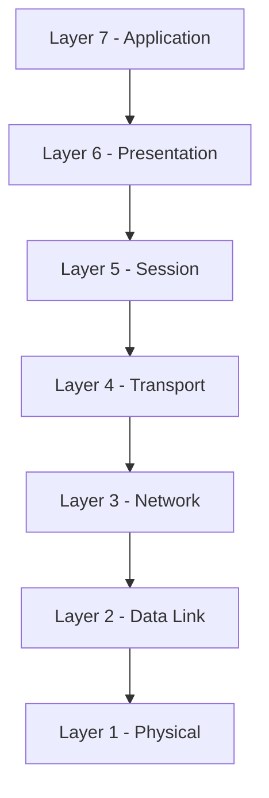
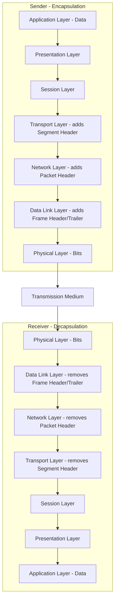
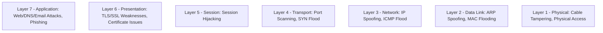

> **الهدف من الـ Section ده:**  
>  هتفهم الـ OSI Model بالتفصيل، السبع طبقات بتاعته وإزاي البيانات بتتحرك من طبقة للتانية، وهتقدر تربط كل طبقة بأدوات الـ Detection والـ Attacks المرتبطة بيها عشان لما تحلل أي Incident تعرف تحدد المشكلة في أنهي Layer بالظبط.

## Table of Contents

- [What is the OSI Model?](#what-is-the-osi-model)
- [Why the OSI Model is Important](#why-the-osi-model-is-important)
- [The Seven Layers of the OSI Model](#the-seven-layers-of-the-osi-model)
  - [7 - Application Layer](#7-application-layer)
  - [6 - Presentation Layer](#6-presentation-layer)
  - [5 - Session Layer](#5-session-layer)
  - [4 - Transport Layer](#4-transport-layer)
  - [3 - Network Layer](#3-network-layer)
  - [2 - Data Link Layer](#2-data-link-layer)
  - [1 - Physical Layer](#1-physical-layer)
- [How Data Flows Through the OSI Model](#how-data-flows-through-the-osi-model)
- [Protocols Used in the OSI Layers](#protocols-used-in-the-osi-layers)
- [Key Takeaways](#key-takeaways)
- [SOC Analyst Perspective](#soc-analyst-perspective)
- [Summary](#summary)

---

## What is the OSI Model?

الـ **OSI (Open Systems Interconnection) Model** هو إطار عمل نظري (Conceptual Framework) بيشرح إزاي أنظمة الكمبيوتر المختلفة بتتواصل مع بعضها عبر الشبكة. اتطور بواسطة الـ **International Organization for Standardization (ISO)** عشان يوحّد طريقة الاتصال في الشبكات ويضمن التوافق (Interoperability) بين أجهزة وتقنيات من شركات مختلفة.

الـ OSI Model بيقسّم عملية الاتصال لسبع طبقات منفصلة (Seven Distinct Layers)، وكل طبقة ليها وظيفة ومسؤولية محددة. الطريقة دي في التقسيم بتسهّل تصميم الشبكة، وتنفيذها، وحتى Troubleshooting أي مشكلة فيها.

> [!NOTE]
> الـ OSI Model هو **Reference Model** مش بروتوكول بيتنفذ فعليًا. يعني الشبكات الحقيقية بتستخدم بروتوكولات (زي TCP/IP) مستوحاة من فكرة الطبقات دي، مش الـ OSI نفسه بالحرف.

---

## Why the OSI Model is Important

- Provides a clear structure for how data moves across a network
- Ensures compatibility and interoperability between different systems
- Simplifies network design and development
- Helps in troubleshooting by isolating problems to a specific layer
- Serves as a standard reference model in networking education and certifications

> [!TIP]
> ميزة تقسيم الشبكة لطبقات إنها بتخليك تعزل المشكلة. مثلاً لو الإنترنت واقع، تقدر تسأل نفسك: "المشكلة في الـ Cable (Layer 1)؟ ولا في الـ IP Configuration (Layer 3)؟ ولا في الـ Application نفسها (Layer 7)؟" وده بيسرع عملية الحل جدًا.

---

## The Seven Layers of the OSI Model

كل طبقة في الـ OSI Model بتقوم بوظيفة محددة، وبتتعامل بس مع الطبقة اللي فوقها والطبقة اللي تحتها مباشرة.

> [!TIP]
> فيه Mnemonic شهير لحفظ الطبقات من فوق لتحت: **"All People Seem To Need Data Processing"** (Application, Presentation, Session, Transport, Network, Data Link, Physical).

---

### 7 - Application Layer

- Provides network services directly to end-user applications
- Enables communication between software applications and the network
- Examples: **HTTP, FTP, SMTP, DNS**

> [!NOTE]
> دي الطبقة الوحيدة اللي بيتفاعل معاها المستخدم بشكل مباشر (زي فتح متصفح أو إرسال إيميل)، لكنها مش الـ Application نفسها (زي Chrome)، دي الطبقة اللي بتوفر الخدمة اللي الـ Application بتستخدمها للتواصل مع الشبكة.

---

### 6 - Presentation Layer

- Translates data into a format that the application layer can understand
- Handles **encryption, decryption, compression, and formatting**

> [!IMPORTANT]
> عمليات الـ **SSL/TLS Encryption** بتحصل تصوريًا في المنطقة دي، وده بيخليها مهمة جدًا من ناحية الـ Security، لأن أي ضعف في التشفير هنا ممكن يعرض البيانات لخطر الـ Interception.

---

### 5 - Session Layer

- Establishes, manages, and terminates communication sessions
- Controls dialog between devices and synchronizes data exchange

> [!NOTE]
> الطبقة دي هي المسؤولة عن فتح الـ Session وقفلها بشكل منظم، زي إدارة جلسة الاتصال بين المتصفح والـ Server طول فترة تصفحك لموقع معين.

---

### 4 - Transport Layer

- Ensures reliable or unreliable data delivery between devices
- Manages **segmentation, flow control, and error control**
- Uses **port numbers** to identify applications
- Examples: **TCP, UDP**

> [!IMPORTANT]
> الفرق بين **TCP** و**UDP** أساسي جدًا: TCP بيضمن وصول البيانات (Reliable - Connection-Oriented) عن طريق الـ Three-Way Handshake، أما UDP فبيبعت البيانات من غير تأكيد وصول (Unreliable - Connectionless) وده بيخليه أسرع بس أقل أمانًا من ناحية التأكد من التسليم.

---

### 3 - Network Layer

- Determines the best path for data transmission
- Handles logical addressing and routing
- Examples: **IP, ICMP**

> [!NOTE]
> هنا بيحصل الـ **Logical Addressing** باستخدام IP Addresses، وهنا كمان بيتحدد أفضل مسار (Best Path) للبيانات عن طريق الـ Routing.

---

### 2 - Data Link Layer

- Provides node-to-node data transfer
- Uses **MAC addresses** for device identification
- Handles error detection and frame synchronization
- Examples: **Ethernet, ARP**

> [!WARNING]
> هجمات زي **ARP Spoofing / MAC Flooding** بتستهدف الطبقة دي تحديدًا، لأنها بتعتمد على الثقة الضمنية بين الأجهزة في تحديد الـ MAC Addresses من غير تحقق قوي.

---

### 1 - Physical Layer

- Transmits raw binary data (bits) over physical media
- Defines cables, connectors, voltages, and signaling

> [!NOTE]
> دي الطبقة الفيزيائية الخام اللي بتتعامل مع الإشارات الكهربائية أو الضوئية اللي بتنقل الـ Bits (0 و 1) عبر الكابلات أو الهواء.

---

## How Data Flows Through the OSI Model

لما البيانات بتتبعت من جهاز لجهاز تاني:

1. البيانات بتتحرك لأسفل (Downward) عبر طبقات الـ OSI في جهاز الإرسال (Sender)
2. بتتنقل عبر الوسط الفيزيائي (Physical Medium)
3. البيانات بتتحرك لأعلى (Upward) عبر طبقات الـ OSI في جهاز الاستقبال (Receiver)

كل طبقة بتضيف أو بتشيل الـ Header الخاص بيها أثناء العملية دي، وده اللي بيتسمى **Encapsulation** (عند الإرسال) و **Decapsulation** (عند الاستقبال).

> [!TIP]
> اسم البيانات بيتغير حسب الطبقة، وده معروف بـ **Protocol Data Unit (PDU)**:

| Layer | PDU Name |
|---|---|
| Application / Presentation / Session | Data |
| Transport | Segment (TCP) / Datagram (UDP) |
| Network | Packet |
| Data Link | Frame |
| Physical | Bits |

---

## Protocols Used in the OSI Layers

| Layer | Layer Name | Protocols / Examples |
|---|---|---|
| 7 | Application | HTTP, FTP, SMTP, DNS |
| 6 | Presentation | SSL/TLS, JPEG, ASCII |
| 5 | Session | NetBIOS, RPC, PPTP |
| 4 | Transport | TCP, UDP |
| 3 | Network | IP, ICMP |
| 2 | Data Link | Ethernet, ARP |
| 1 | Physical | Cables, Hubs, NICs (Physical Signaling) |

---

## Key Takeaways

- The OSI Model consists of 7 layers, each with a specific role
- It is a reference framework, not a protocol
- It simplifies learning, designing, and troubleshooting networks
- Widely used in networking education and documentation

---

## SOC Analyst Perspective

> [!IMPORTANT]
> فهم الـ OSI Model بعمق هو أساس أي **Threat Hunting** أو **Incident Response** ناجح، لأن معظم أدوات الـ SOC بتتخصص في طبقة معينة:

| Layer | Common Detection Tools / Focus |
|---|---|
| Layer 7 | Web Application Firewall (WAF), Proxy Logs, DNS Logs |
| Layer 6 | SSL/TLS Inspection Tools, Certificate Monitoring |
| Layer 5 | Application Logs, Session Monitoring |
| Layer 4 | IDS/IPS, NetFlow (Port/Protocol Analysis) |
| Layer 3 | Firewall, Router ACLs, IP Reputation Lists |
| Layer 2 | Switch Port Security, ARP Monitoring Tools |
| Layer 1 | Physical Security, Cable Management, NAC (Network Access Control) |

> [!TIP]
> لما تستخدم أداة زي **Wireshark**، أنت فعليًا بتقرأ الـ Traffic على مستويات مختلفة من الـ OSI Model في نفس الوقت - من الـ Frame (Layer 2) لحد الـ Application Data (Layer 7) - وده اللي بيخلي فهم الطبقات ضروري عشان تقدر تفسر أي Packet Capture صح.

---

## Summary

- الـ **OSI Model** هو إطار نظري من 7 طبقات بيشرح إزاي الأجهزة بتتواصل عبر الشبكة، وهو Reference Model مش بروتوكول فعلي
- الطبقات من فوق لتحت: **Application → Presentation → Session → Transport → Network → Data Link → Physical**
- كل طبقة ليها PDU خاص بيها (Data, Segment, Packet, Frame, Bits) وبتضيف/تشيل Header أثناء الـ **Encapsulation/Decapsulation**
- من ناحية الـ SOC: كل طبقة مرتبطة بنوع مختلف من الهجمات وأدوات الـ Detection (زي ARP Spoofing على Layer 2، وPort Scanning على Layer 4، وPhishing على Layer 7)
- فهم الـ OSI Model بعمق بيساعدك تعزل أي مشكلة أو هجوم في الطبقة الصحيحة، وده أساس أي عملية Troubleshooting أو Incident Response ناجحة
