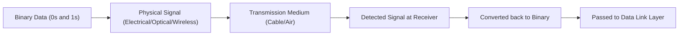
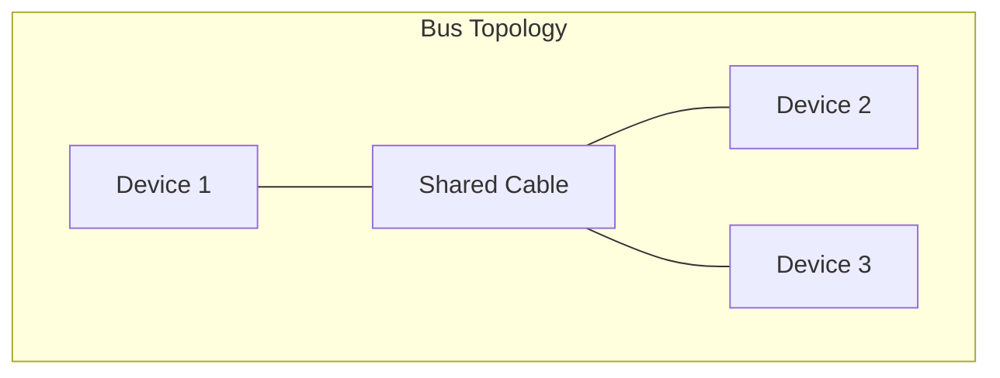
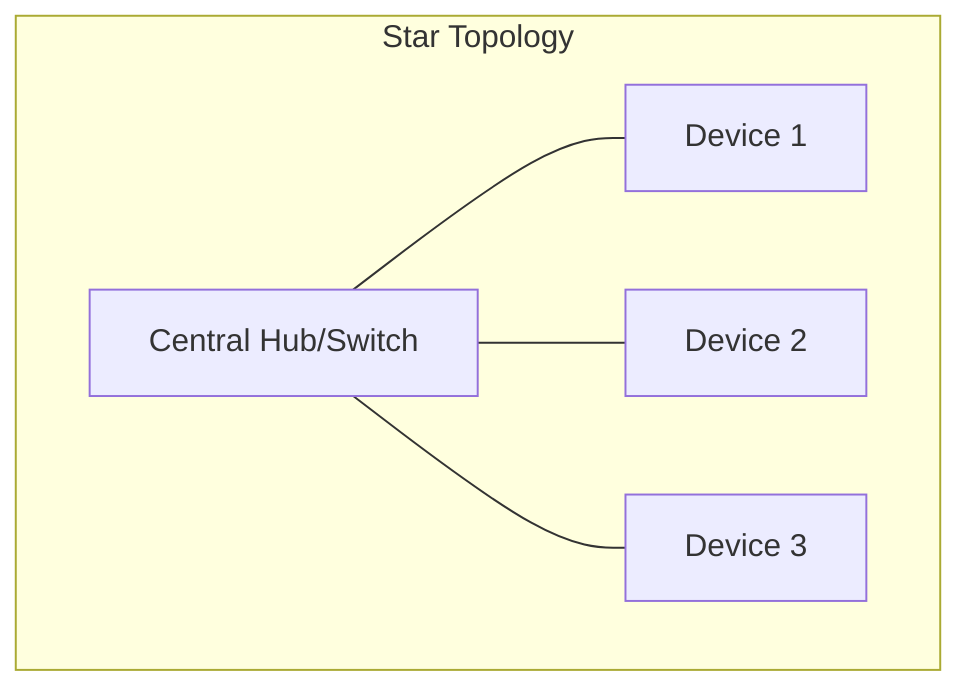
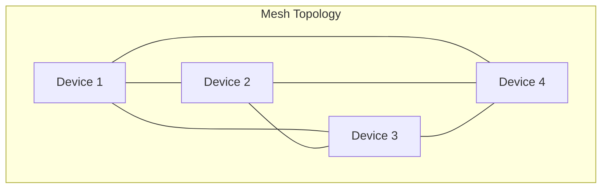
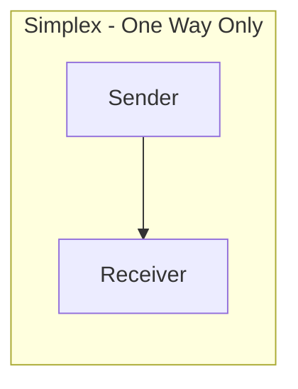
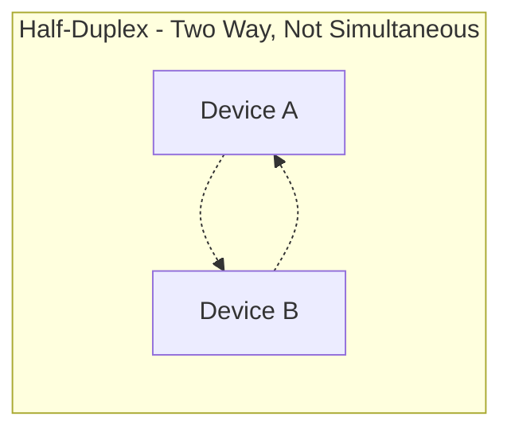
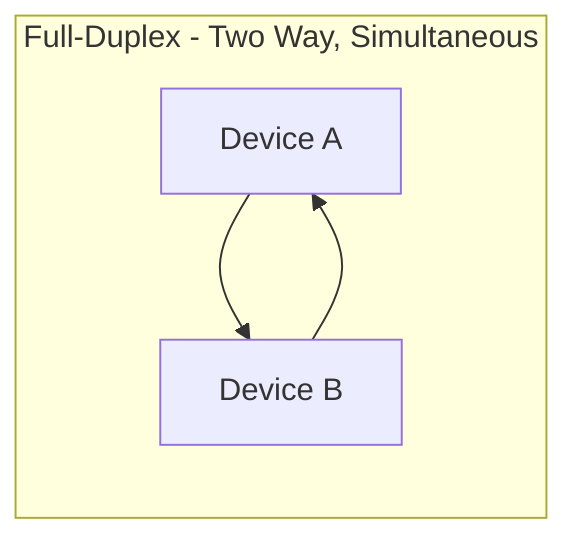

> **الهدف من الـ Section ده:**  
>  هتفهم إزاي أول طبقة في الـ OSI Model (Physical Layer) بتشتغل، إزاي البيانات بتتحول لإشارات فيزيائية وترجع تاني بيانات، وليه الأمان الفيزيائي (Physical Security) في الطبقة دي أساس مهم جدًا مهما كانت الشبكة محمية Software-wise.

## Table of Contents

- [Overview](#overview)
- [How the Physical Layer Works](#how-the-physical-layer-works)
- [Key Responsibilities](#key-responsibilities)
- [Physical Layer Devices](#physical-layer-devices)
- [Functions of the Physical Layer](#functions-of-the-physical-layer)
  - [Bit Synchronization](#bit-synchronization)
  - [Bit Rate Control](#bit-rate-control)
  - [Physical Topology](#physical-topology)
  - [Transmission Mode](#transmission-mode)
- [Characteristics](#characteristics)
- [SOC Analyst Perspective](#soc-analyst-perspective)
- [Summary](#summary)

---

## Overview

الـ **Physical Layer** هي أول وأقل طبقة في الـ OSI Model. هي المسؤولة عن إنشاء الاتصال الفيزيائي (Physical Connection) بين الأجهزة، ونقل البيانات على هيئة **Raw Bits** (0 و 1).

الطبقة دي بتركز بس على الـ Hardware والإشارات (Signals)، من غير أي فهم لمعنى البيانات نفسها، ولا MAC Addresses، ولا IP Addresses.

> [!NOTE]
> فكر في الطبقة دي زي "السلك" أو "الهوا" اللي بينقل الصوت في المكالمة - هي مش فاهمة إنت بتقول إيه، هي بس ناقلة الإشارة من مكان لمكان.

---

## How the Physical Layer Works

### Sending Data

- Converts binary data (0s and 1s) into physical signals
- Signals may be **electrical, optical, or wireless**
- Transmits signals through cables or wireless media

### Receiving Data

- Detects incoming signals
- Converts signals back into binary form
- Passes bits to the **Data Link Layer**

---

## Key Responsibilities

- Transmitting raw bits between devices
- Handling physical connections and media
- Defining signal types and hardware specifications
- Supporting higher OSI layers

---

## Physical Layer Devices

### Hub

- Broadcasts data to all connected ports
- Causes collisions and security risks
- Considered obsolete today

### Repeater

- Regenerates weak signals
- Extends network distance

### Modem

- Converts digital signals to analog and vice versa
- Connects local networks to ISPs

### Cables and Media

- Ethernet cables
- Fiber optic cables
- Wireless radio signals

> [!WARNING]
> الـ Hub اتناقشنا عليه قبل كده في درس الـ Network Devices، وبرضو هنا بنأكد إنه **Obsolete** لأنه بيسبب Collisions ومشاكل أمنية بسبب الـ Broadcasting لكل الأجهزة.

---

## Functions of the Physical Layer

### Bit Synchronization

بتوفر التوقيت (Clocking) عشان تخلي المرسل والمستقبل متزامنين على مستوى الـ Bit، يعني الاتنين فاهمين إمتى يبدأ الـ Bit وإمتى يخلص بالظبط.

### Bit Rate Control

بتحدد سرعة نقل البيانات (Bits per Second)، يعني كام Bit بيتنقل في الثانية الواحدة.

### Physical Topology

بتحدد إزاي الأجهزة متوزعة فيزيائيًا في الشبكة:

| Topology | Description | Fault Tolerance |
|---|---|---|
| Bus | كل الأجهزة متوصلة بكابل واحد مشترك | ضعيف - لو الكابل الرئيسي اتقطع، الشبكة كلها بتقع |
| Star | كل الأجهزة متوصلة بجهاز مركزي (Hub/Switch) | متوسط - عطل جهاز واحد ملوش تأثير، بس عطل المركز بيوقف الكل |
| Mesh | كل جهاز متوصل بكل الأجهزة التانية مباشرة | قوي جدًا - فيه مسارات بديلة كتير لو مسار وقع |

### Transmission Mode

بتحدد إزاي البيانات بتتدفق بين الأجهزة:

| Mode | Description | Real-World Example |
|---|---|---|
| Simplex | اتجاه واحد بس | Keyboard to Computer |
| Half-Duplex | اتجاهين لكن مش في نفس الوقت | Walkie-Talkie |
| Full-Duplex | اتجاهين في نفس الوقت | Phone Call |

---

## Characteristics

- No error detection or correction
- No addressing or data interpretation
- Works only with signals and hardware
- Relies on higher layers for intelligence

> [!IMPORTANT]
> بما إن الطبقة دي **مفهاش أي Error Detection أو Correction**، فأي مشكلة في الإشارة (زي Noise أو Attenuation) لازم تتصلح في طبقات أعلى (زي الـ Data Link Layer اللي بتستخدم آليات زي CRC للتأكد من سلامة البيانات).

---

## SOC Analyst Perspective

> [!IMPORTANT]
> الأمان في الـ Physical Layer غالبًا بيتم إهماله لأن التركيز الأكبر بيكون على الـ Software Security، لكن لو حد قدر يوصل فيزيائيًا لـ Cable أو Switch، ممكن يعمل ضرر كبير جدًا حتى لو كل الـ Software Defenses شغالة تمام.

من أهم مخاطر الـ Physical Layer اللي الـ SOC Analyst لازم يكون واعي بيها:

| Threat | Description |
|---|---|
| Cable Tapping / Wiretapping | توصيل جهاز غير مصرح بيه بالكابل لسرقة البيانات (خصوصًا في الكابلات النحاسية القديمة) |
| Rogue Device Connection | توصيل جهاز غريب (زي Laptop أو Switch) في Port فاضي من غير علم الـ IT Team |
| Signal Jamming | التشويش على الإشارات اللاسلكية لمنع الاتصال (Denial of Service على مستوى الإشارة) |
| Physical Theft / Tampering | سرقة أو العبث بالـ Hardware نفسه (Servers, Switches, Cables) |

> [!TIP]
> من أهم وسائل الحماية على مستوى الـ Physical Layer:
> - **Network Access Control (NAC)**: يمنع أي جهاز غير مصرح بيه من الاتصال حتى لو وصل فيزيائيًا للـ Port
> - **Port Security على الـ Switches**: يقفل أو ينبه لو جهاز بـ MAC Address غريب اتوصل
> - **Physical Security Controls**: زي غرف السيرفرات المقفولة، وكاميرات المراقبة، وسجلات الدخول

من ناحية الـ MITRE ATT&CK، محاولات الوصول الفيزيائي غالبًا بترتبط بـ:
- **T1200 - Hardware Additions**: إضافة جهاز Hardware غير مصرح بيه للشبكة (زي USB Rogue Device أو Network Implant) عشان يستخدم كنقطة دخول للهجوم

---

## Summary

- الـ **Physical Layer** هي أساس الـ OSI Model، وبتنقل البيانات على هيئة Raw Bits عبر إشارات كهربائية أو ضوئية أو لاسلكية
- بتشمل أجهزة زي **Hub, Repeater, Modem** ووسائط زي الكابلات النحاسية والفايبر والإشارات اللاسلكية
- بتحدد وظائف أساسية زي **Bit Synchronization, Bit Rate Control, Physical Topology (Bus/Star/Mesh), Transmission Mode (Simplex/Half-Duplex/Full-Duplex)**
- **مفيهاش Error Detection ولا Addressing** - كل ده بيتم في طبقات أعلى
- من ناحية الـ SOC: الأمان الفيزيائي (Physical Security) لازم ياخد اهتمام حقيقي، لأن أي وصول فيزيائي غير مصرح بيه (زي Rogue Devices أو Cable Tapping) ممكن يتخطى كل طبقات الحماية الـ Software (مرتبط بـ MITRE T1200 - Hardware Additions)
