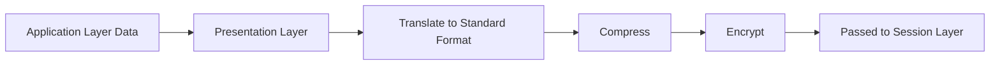
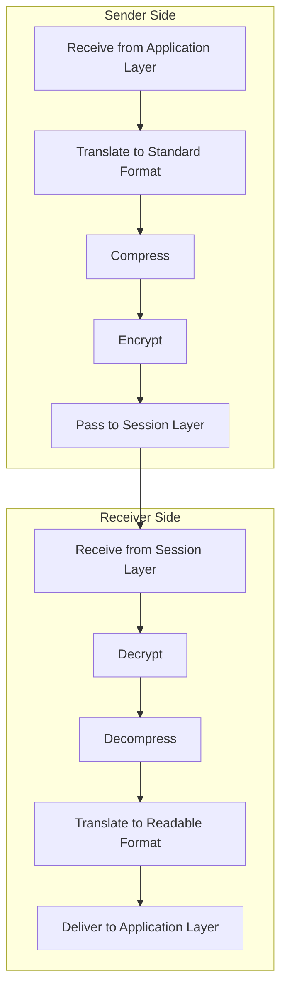
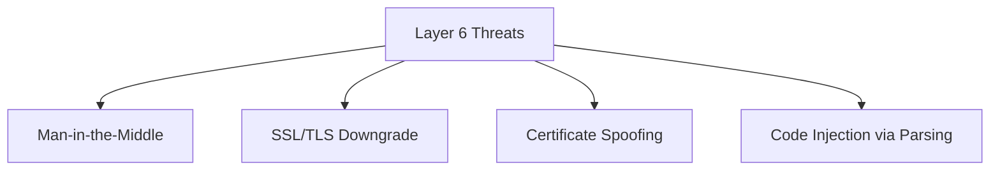

> **الهدف من الـ Section ده:**  
>  هتفهم إزاي الـ Presentation Layer بتترجم وتشفر وتضغط البيانات عشان الأنظمة المختلفة تفهم بعضها، وهتتعرف على أشهر هجمات الـ TLS/SSL اللي بتستهدف الطبقة دي تحديدًا زي Downgrade Attacks وCertificate Spoofing.

## Table of Contents

- [Overview](#overview)
- [Key Responsibilities](#key-responsibilities)
- [How the Presentation Layer Works](#how-the-presentation-layer-works)
- [Services Provided](#services-provided)
- [Common Protocols](#common-protocols)
- [Security Considerations and Attacks](#security-considerations-and-attacks)
- [SOC Analyst Perspective](#soc-analyst-perspective)
- [Summary](#summary)

---

## Overview

الـ **Presentation Layer** هي الطبقة السادسة في الـ OSI Model. مسؤوليتها ترجمة (Translating)، تشفير (Encrypting)، ضغط (Compressing)، وتنسيق (Formatting) البيانات عشان الأنظمة المتواصلة تقدر تفهم بعضها صح.

| Property | Value |
|---|---|
| OSI Layer | 6 |
| Also Known As | Translation Layer / Syntax Layer |
| Primary Role | Data representation, security, and efficiency |

الـ Presentation Layer بتضمن إن البيانات المبعوتة من الـ Application Layer بتتحول لصيغة موحدة (Standard Format) قبل النقل، وإن البيانات المستقبلة بترجع تتترجم لصيغة قابلة للاستخدام.

> [!NOTE]
> فكر في الطبقة دي زي "المترجم الفوري" في اجتماع دولي - بياخد الكلام من لغة (Format) ويترجمه للغة تانية يفهمها الطرف التاني، مع ضمان إن المعنى (Semantics) ما يتغيرش أثناء الترجمة.

---

## Key Responsibilities

### 1. Data Translation

بتحول البيانات بين الصيغ الخاصة بالـ Application والصيغ الموحدة للشبكة. ده بيسمح لأنظمة وبنى (Architectures) وترميزات (Encodings) مختلفة إنها تتواصل بفعالية.

**Example**: ASCII ↔ Unicode

### 2. Data Compression

بتقلل حجم البيانات قبل النقل عشان تحسّن استخدام الـ Bandwidth وتزود الأداء.

### 3. Data Encryption & Decryption

بتحمي البيانات أثناء النقل عن طريق تشفيرها عند المرسل وفك تشفيرها عند المستقبل.

### 4. Syntax and Semantics Management

بتضمن إن بنية البيانات (Syntax) ومعناها (Semantics) يفضلوا متسقين بين المرسل والمستقبل.

### 5. Transfer Syntax Negotiation

بيتم الاتفاق على قواعد تمثيل البيانات (الصيغة، الترميز، الضغط) قبل ما الاتصال يبدأ.

> [!IMPORTANT]
> عملية الـ **Transfer Syntax Negotiation** دي هي أساسيًا اللي بتحصل عمليًا في **TLS Handshake** لما الجهازين بيتفقوا على نوع التشفير (Cipher Suite) اللي هيستخدموه قبل تبادل أي بيانات فعلية.

---

## How the Presentation Layer Works

### Sender Side

1. Receives data from the Application Layer
2. Translates data into a standard format
3. Applies compression (if needed)
4. Encrypts data for security
5. Passes data to the Session Layer

### Receiver Side

1. Receives data from the Session Layer
2. Decrypts the data
3. Decompresses the data
4. Translates it into a readable format
5. Delivers data to the Application Layer

---

## Services Provided

- Format Translation
- Data Compression
- Data Encryption and Decryption
- Cross-platform Compatibility

---

## Common Protocols

| Protocol | Purpose |
|---|---|
| SSL (Secure Socket Layer) | Legacy encryption protocol |
| TLS (Transport Layer Security) | Secure successor to SSL |
| XDR (External Data Representation) | Standard data encoding |
| NDR (Network Data Representation) | Data representation for network communication |
| AFP (Apple Filing Protocol) | File services for macOS |
| NCP (NetWare Core Protocol) | File and print services in Novell NetWare |

> [!WARNING]
> بروتوكول **SSL** بكل إصداراته (بما فيها SSLv3) بقى **Deprecated** رسميًا بسبب ثغرات أمنية معروفة (زي POODLE Attack)، والاعتماد الكامل دلوقتي لازم يكون على **TLS** (الإصدارات 1.2 و1.3 تحديدًا).

---

## Security Considerations and Attacks

بما إن الـ Presentation Layer بتتعامل مع التشفير وتنسيق البيانات، فهي هدف متكرر للهجمات:

- **Man-in-the-Middle (MITM)** – Intercepting communications
- **SSL/TLS Downgrade Attacks** – Forcing weaker encryption
- **Certificate Spoofing** – Using fake digital certificates
- **Code Injection** – Exploiting data parsing vulnerabilities

---

## SOC Analyst Perspective

| Threat | Description | MITRE ATT&CK Reference |
|---|---|---|
| Man-in-the-Middle (MITM) | المهاجم بيحط نفسه بين طرفين اتصال عشان يعترض أو يعدل البيانات المشفرة | T1557 - Adversary-in-the-Middle |
| SSL/TLS Downgrade Attack | إجبار الجهازين على استخدام إصدار تشفير أضعف (زي SSLv3 بدل TLS 1.3) عشان يسهل فك التشفير أو استغلال ثغرات معروفة | T1600 - Weaken Encryption |
| Certificate Spoofing | استخدام شهادة رقمية مزيفة أو مسروقة عشان ينتحل هوية Server موثوق | T1553.002 - Subvert Trust Controls: Code Signing |
| Code Injection (Parsing Vulnerabilities) | استغلال ثغرات في طريقة تفسير (Parsing) صيغ البيانات (زي XML أو JSON) لتنفيذ كود ضار | T1190 - Exploit Public-Facing Application |

> [!IMPORTANT]
> **SSL/TLS Downgrade Attacks** خطيرة جدًا لأنها بتحصل غالبًا من غير ما المستخدم يلاحظ أي حاجة غريبة - المتصفح لسه بيوريه "قفل أمان" لكن التشفير الفعلي بقى أضعف بكتير وسهل الاختراق.

### Detection & Best Practices

- مراقبة الـ **Certificate Validity** ومطابقتها مع Certificate Authorities (CAs) موثوقة، ورصد أي **Self-Signed Certificates** غير متوقعة
- استخدام **Certificate Pinning** في التطبيقات الحساسة عشان تمنع قبول أي شهادة غير الشهادة المتوقعة، حتى لو موقعة من CA موثوق
- تحليل **JA3/JA3S Fingerprints** لتحديد أنماط TLS Handshake غير طبيعية، واللي ممكن تكشف أدوات هجوم أو Malware بيحاول يقلد Traffic شرعي
- مراقبة أي محاولة اتصال بتستخدم إصدارات TLS قديمة (زي TLS 1.0/1.1) أو SSL، لأن ده مؤشر على محاولة Downgrade أو نظام قديم محتاج تحديث

> [!TIP]
> لو شفت في الـ Logs اتصال بيبدأ بمحاولة TLS 1.3 وبعدين يرجع فجأة لـ TLS 1.0 أو SSLv3 من غير سبب واضح، ده مؤشر قوي على **Downgrade Attack** محتمل، ويستاهل تحقيق فوري.

---

## Summary

- الـ **Presentation Layer** (Layer 6) مسؤولة عن **الترجمة، الضغط، والتشفير** عشان الأنظمة المختلفة تفهم بعضها
- أهم وظائفها: **Data Translation, Data Compression, Encryption/Decryption, Syntax/Semantics Management, Transfer Syntax Negotiation**
- أهم البروتوكولات: **SSL (Legacy/Deprecated)** و **TLS (الحالي والآمن)**، بالإضافة لـ XDR, NDR, AFP, NCP
- أشهر الهجمات على الطبقة دي: **MITM, SSL/TLS Downgrade, Certificate Spoofing, Code Injection**
- من ناحية الـ SOC: مراقبة صحة الشهادات الرقمية، استخدام Certificate Pinning، وتحليل JA3 Fingerprints كلها أدوات أساسية لاكتشاف محاولات الاستغلال على مستوى التشفير، ومرتبطة بـ MITRE **T1557, T1600, T1553.002, T1190**
