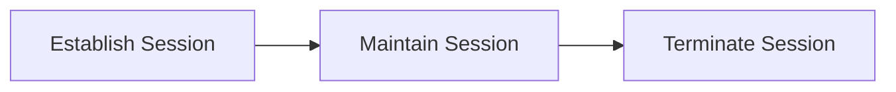
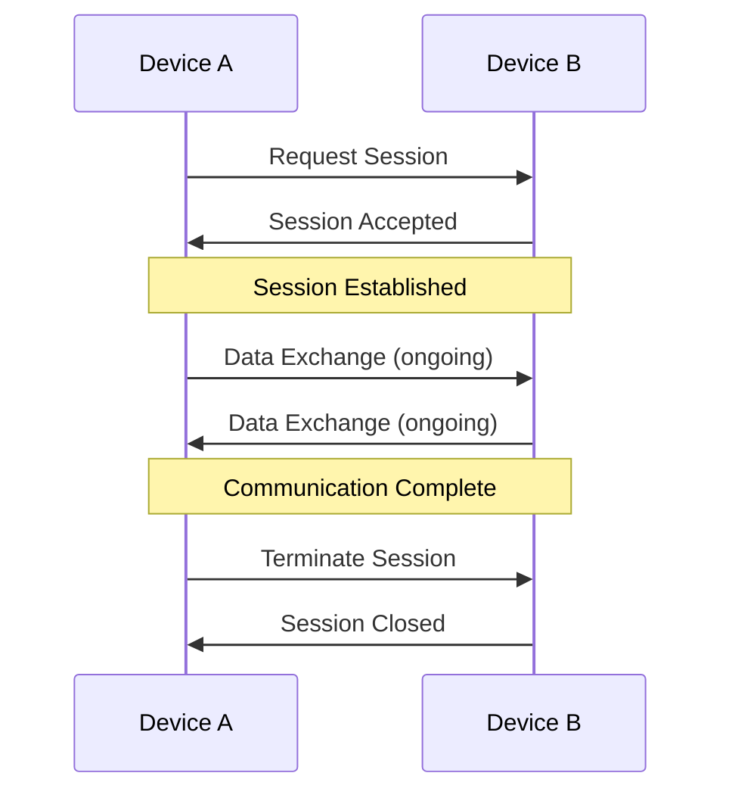
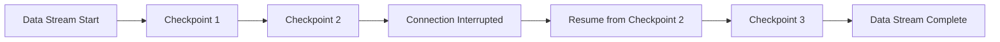
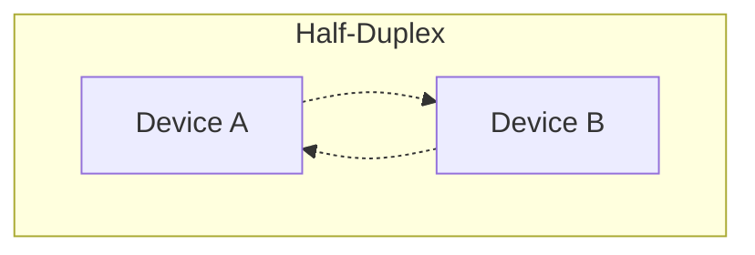
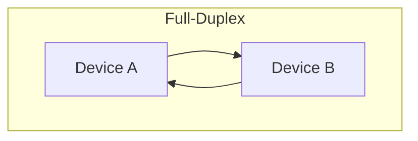
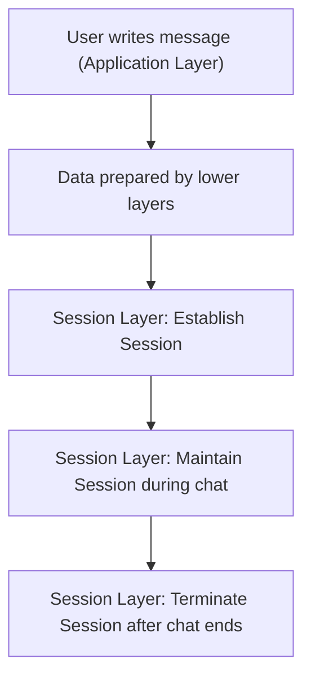

> [!TIP]
> الهدف من الـ Section ده: هتفهم إزاي الـ Session Layer بتدير "المحادثة" بين جهازين من أول ما تتفتح لحد ما تتقفل، إزاي بتستخدم Checkpoints عشان متضيعش البيانات لو الاتصال اتقطع، وهتقدر تربط ده بمخاطر حقيقية زي Session Hijacking وسرقة الـ Cookies.

## Table of Contents

- [Overview](#overview)
- [Key Responsibilities](#key-responsibilities)
  - [1. Session Establishment, Maintenance, and Termination](#1-session-establishment-maintenance-and-termination)
  - [2. Synchronization](#2-synchronization)
  - [3. Dialog Control](#3-dialog-control)
- [Protocols Used in the Session Layer](#protocols-used-in-the-session-layer)
- [Practical Example](#practical-example)
- [SOC Analyst Perspective](#soc-analyst-perspective)
- [Summary](#summary)

---

## Overview

الـ **Session Layer** هي الطبقة الخامسة في الـ OSI Model. مسؤوليتها إنشاء (Establishing)، إدارة (Managing)، وإنهاء (Terminating) جلسات الاتصال (Communication Sessions) بين جهازين. الطبقة دي بتضمن إن الاتصال بيحصل بشكل منظم، آمن، ومتزامن.

بمعنى بسيط، الـ Session Layer بتشتغل زي "مدير الاتصال" اللي بيتحكم في الحوار (Dialog) بين الـ Applications أثناء تبادل البيانات.

> [!NOTE]
> فكر في الـ Session زي مكالمة تليفون: فيها لحظة رد على المكالمة (Establishment)، فترة الكلام (Maintenance)، ولحظة إقفال الخط (Termination). الـ Session Layer هي المسؤولة عن تنظيم الحدث ده بالكامل.

---

## Key Responsibilities

### 1. Session Establishment, Maintenance, and Termination

- Initiates a communication session between two devices
- Maintains the session while data is being exchanged
- Gracefully terminates the session once communication is complete

ده بيضمن إن الجهازين متصلين صح قبل ما نقل البيانات يبدأ، وإنهم بيتفصلوا بأمان بعد كده.

### 2. Synchronization

- Inserts **checkpoints** (synchronization points) into the data stream
- If a connection is interrupted, communication can resume from the last checkpoint instead of restarting from the beginning
- Helps prevent data loss and incomplete message transmission

ده مهم جدًا خصوصًا وقت نقل كميات كبيرة من البيانات.

> [!TIP]
> فكرة الـ Checkpoints دي شبه لما بتنزل ملف كبير وينقطع النت، وبعدين لما ترجع تتصل الملف بيكمل من نفس النقطة بدل ما يبدأ التنزيل من الأول تاني.

### 3. Dialog Control

بتدير إزاي الأجهزة بتتواصل مع بعضها، وبتدعم:

- **Half-Duplex Communication**: Data flows in one direction at a time
- **Full-Duplex Communication**: Data flows in both directions simultaneously

ده بيسمح بتواصل مرن وفعال حسب احتياج الـ Application.

---

## Protocols Used in the Session Layer

- **NetBIOS** – Provides session-level services for applications over a network
- **PPTP (Point-to-Point Tunneling Protocol)** – Used to create secure VPN connections

> [!WARNING]
> الاتنين **NetBIOS** و **PPTP** بروتوكولات قديمة نسبيًا وليهم Vulnerabilities معروفة (زي Null Sessions في NetBIOS وضعف التشفير في PPTP)، وهنتكلم عن ده بالتفصيل في جزء الـ SOC Perspective تحت.

---

## Practical Example

اعتبر مستخدم بيبعت رسالة عن طريق تطبيق Messaging جوه متصفح الويب:

1. المستخدم بيكتب الرسالة باستخدام واجهة التطبيق (**Application Layer**)
2. البيانات بتتجهز للإرسال عن طريق الطبقات الأقل في الـ OSI Model
3. الـ **Session Layer**:
   - بتنشئ Session بين المرسل والمستقبل
   - بتحافظ على الـ Session نشطة طول فترة تبادل الرسائل
   - بتنهي الـ Session بعد ما المحادثة تخلص

> [!IMPORTANT]
> من غير الـ Session Layer، الاتصال هيفتقد التنظيم والمزامنة والموثوقية - يعني كل رسالة هتتبعت وكأنها اتصال منفصل تمامًا من غير أي سياق (Context) يربطها بالمحادثة الكاملة.

---

## SOC Analyst Perspective

> [!IMPORTANT]
> الـ Session Layer مرتبطة بشكل مباشر بمفهوم مهم جدًا في الأمن السيبراني وهو **Session Management**، وأي ضعف فيها بيفتح الباب لهجمات خطيرة زي Session Hijacking.

### Common Threats at the Session Layer

| Threat | Description | MITRE ATT&CK Reference |
|---|---|---|
| Session Hijacking | المهاجم بيسرق أو ينتحل Session ID/Token خاص بمستخدم شرعي عشان ياخد صلاحياته من غير ما يحتاج يعرف الباسورد | T1563 - Remote Service Session Hijacking |
| Session Cookie Theft | سرقة الـ Cookies اللي بتحتفظ بحالة الـ Session في تطبيقات الويب (غالبًا عن طريق XSS أو Malware) | T1539 - Steal Web Session Cookie |
| NetBIOS Null Session Enumeration | استغلال إعدادات NetBIOS القديمة عشان يتم عمل Enumeration لمعلومات عن المستخدمين والمشاركات (Shares) من غير Authentication | T1046 - Network Service Discovery |
| PPTP Cryptographic Weaknesses | استغلال ضعف التشفير المعروف في PPTP (خصوصًا آلية MS-CHAPv2) لفك أو اعتراض بيانات الـ VPN Session | T1557 - Adversary-in-the-Middle |

> [!WARNING]
> بروتوكول **PPTP** بقى غير موصى باستخدامه في البيئات الحديثة بسبب ضعف معروف في آلية الـ Authentication بتاعته (**MS-CHAPv2**)، واللي بيسهل على المهاجم فك التشفير واعتراض بيانات جلسة الـ VPN. البروتوكولات الأحدث زي **OpenVPN** أو **IKEv2/IPSec** أكتر أمانًا.

### Detection & Best Practices

- مراقبة أي **Session Token** بيتستخدم من أكتر من IP Address في وقت متقارب جدًا (مؤشر قوي على Session Hijacking)
- تفعيل **Session Timeout** المناسب عشان يقلل نافذة استغلال أي Token مسروق
- تعطيل **NetBIOS** لو مش ضروري للعمل، أو على الأقل تقييد الـ Null Sessions
- استخدام **HTTPS** دايمًا لحماية الـ Session Cookies من الاعتراض أثناء النقل

> [!TIP]
> لو شفت في الـ Logs إن نفس الـ Session ID استُخدم من جهازين بمواصفات مختلفة (زي User-Agent مختلف) أو من موقعين جغرافيين بعيدين عن بعض في وقت قريب جدًا، ده مؤشر قوي جدًا على **Session Hijacking** ويستاهل تحقيق فوري.

---

## Summary

- الـ **Session Layer** هي الطبقة الخامسة في الـ OSI Model، مسؤولة عن إنشاء وإدارة وإنهاء **Sessions** بين جهازين
- أهم وظائفها: **Session Establishment/Maintenance/Termination**، **Synchronization** (عن طريق Checkpoints)، و**Dialog Control** (Half-Duplex/Full-Duplex)
- من أهم بروتوكولاتها: **NetBIOS** و **PPTP**
- من ناحية الـ SOC: أخطر تهديد مرتبط بالطبقة دي هو **Session Hijacking (T1563)** وسرقة الـ **Session Cookies (T1539)**، بالإضافة لضعف معروف في PPTP وNetBIOS القديمة
- أهم إجراءات الحماية: مراقبة استخدام الـ Session Tokens من مصادر مختلفة، تفعيل Session Timeout، وتجنب البروتوكولات القديمة الضعيفة زي PPTP
