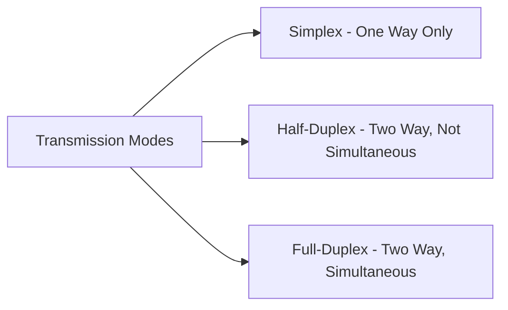
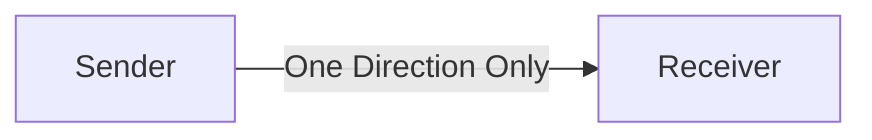
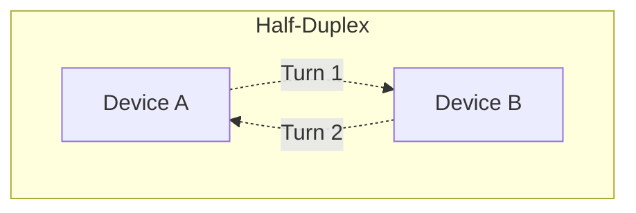
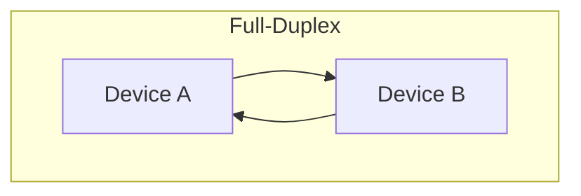
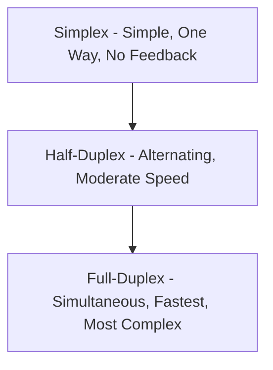

> **الهدف من الـ Section ده:**  
>  هتفهم بالتفصيل الفرق بين الـ Simplex والـ Half-Duplex والـ Full-Duplex Modes، أمثلة عملية على كل واحد فيهم، ومميزات وعيوب كل نوع، وهتقدر تربط ده بالسياق الأمني وقت تحليل أي وسيلة اتصال في الشبكة.

## Table of Contents

- [Overview](#overview)
- [Types of Transmission Modes](#types-of-transmission-modes)
- [1. Simplex Mode](#1-simplex-mode)
- [2. Half-Duplex Mode](#2-half-duplex-mode)
- [3. Full-Duplex Mode](#3-full-duplex-mode)
- [Comparison Summary](#comparison-summary)
- [SOC Analyst Perspective](#soc-analyst-perspective)
- [Summary](#summary)

---

## Overview

الـ **Transmission Modes** (وبتتسمى كمان **Communication Modes**) بتوصف إزاي البيانات بتتدفق بين الأجهزة في شبكة أو نظام اتصال. بتحدد اتجاه نقل البيانات، وهل الأجهزة تقدر تبعت وتستقبل بيانات في نفس الوقت ولا لأ.

المفاهيم دي أساسية جدًا في تصميم الشبكات والاتصالات.

---

## Types of Transmission Modes

فيه 3 أنواع رئيسية من الـ Transmission Modes:

- Simplex Mode
- Half-Duplex Mode
- Full-Duplex Mode

---

## 1. Simplex Mode

في الـ Simplex Mode، الاتصال بيكون في اتجاه واحد بس. جهاز واحد بيشتغل كـ **Sender** فقط، والتاني بيشتغل كـ **Receiver** فقط.

### Key Characteristics

- Data flows in a single direction
- Full channel capacity is used for transmission
- No feedback or acknowledgment

### Examples

- Keyboard → Computer
- Television broadcast
- Surveillance cameras

### Advantages

- Simple and cost-effective
- No coordination required between devices

### Disadvantages

- No error detection or confirmation
- Not suitable for interactive communication

> [!NOTE]
> غياب أي Feedback في الـ Simplex Mode معناه إن الجهاز المرسل مش عنده أي طريقة يتأكد بيها إن البيانات وصلت فعلاً للمستقبل بشكل صحيح.

---

## 2. Half-Duplex Mode

في الـ Half-Duplex Mode، الأجهزة تقدر تبعت وتستقبل بيانات، لكن مش في نفس الوقت. الاتصال بيحصل بالتبادل (Alternately) في كل اتجاه.

### Key Characteristics

- Bidirectional communication
- One direction active at a time
- Entire channel capacity is used per transmission

### Example

- Walkie-Talkie communication

### Advantages

- Better utilization than simplex
- Suitable where simultaneous communication is not required

### Disadvantages

- Delay due to turn-taking
- Slower than full-duplex systems

> [!TIP]
> فكر في الـ Walkie-Talkie: لازم تقول "Over" وتسيب الزرار عشان الطرف التاني يقدر يرد. لو الاتنين اتكلموا في نفس الوقت، الرسالة هتضيع أو تتشوش. ده بالظبط منطق الـ Half-Duplex.

---

## 3. Full-Duplex Mode

في الـ Full-Duplex Mode، الأجهزة تقدر تبعت وتستقبل بيانات في نفس الوقت بالظبط. النوع ده بيستخدم لما الاتصال المستمر ثنائي الاتجاه يكون مطلوب.

### Key Characteristics

- Simultaneous bidirectional communication
- Channel capacity is shared or duplicated

### Examples

- Telephone calls
- Video conferencing
- Modern network communications

### Advantages

- High efficiency and speed
- Ideal for real-time applications

### Disadvantages

- Higher cost
- More complex implementation
- Requires higher bandwidth

> [!IMPORTANT]
> معظم شبكات الـ Ethernet الحديثة (زي Modern Switches) بتشتغل بنظام **Full-Duplex**، وده اللي بيسمح بنقل واستقبال البيانات في نفس الوقت من غير أي Collisions، على عكس الشبكات القديمة اللي كانت تعتمد على Hubs وكانت غالبًا Half-Duplex.

---

## Comparison Summary

| Aspect | Simplex | Half-Duplex | Full-Duplex |
|---|---|---|---|
| Direction | One-way only | Two-way, one at a time | Two-way, simultaneous |
| Feedback/Acknowledgment | None | Possible (alternating) | Continuous |
| Speed | N/A (one direction) | Slower due to turn-taking | Fastest |
| Complexity | Simple | Moderate | Complex |
| Cost | Low | Moderate | Higher |
| Real-World Example | TV Broadcast | Walkie-Talkie | Phone Call |

---

## SOC Analyst Perspective

> [!NOTE]
> الـ Transmission Mode مش مفهوم بيتعرض للهجوم بشكل مباشر زي Protocol معين، لكن فهمه مهم جدًا وقت تحليل بنية الشبكة والـ Traffic Patterns، وله انعكاسات أمنية غير مباشرة.

### Security Implications

| Aspect | Security Relevance |
|---|---|
| Simplex Devices (Sensors, Cameras) | أجهزة الـ IoT وأنظمة المراقبة اللي بتشتغل Simplex غالبًا مفيهاش قناة للتأكد من سلامة البيانات، وده بيخليها هدف سهل للتلاعب (Data Injection/Spoofing) لو مؤمنتش صح على مستوى تاني |
| Legacy Half-Duplex Networks (Hub-based) | الشبكات القديمة اللي بتعتمد على Hubs (Half-Duplex بطبيعتها) بتسمح لأي جهاز متوصل إنه يشوف كل الـ Traffic، وده بيسهل عمليات الـ Sniffing مقارنة بالـ Switches الحديثة (Full-Duplex) |
| Full-Duplex Modern Networks | تقليل فرصة الـ Sniffing العشوائي، لكن محتاجة تقنيات زي Port Mirroring أو TAPs عشان الـ SOC يقدر يراقب الـ Traffic بشكل شرعي للتحليل |

> [!WARNING]
> لو لقيت جهاز أو Segment في الشبكة لسه شغال بنظام **Half-Duplex** أو معتمد على **Hub قديم**، ده يستاهل مراجعة، لأنه بيمثل نقطة ضعف حقيقية من ناحية إمكانية الـ Sniffing وسهولة اعتراض الـ Traffic مقارنة بالبنية التحتية الحديثة.

> [!TIP]
> لما تحط أداة مراقبة (زي IDS Sensor) على الشبكة، لازم تتأكد إنها متوصلة عن طريق **Port Mirroring (SPAN Port)** أو **Network TAP**، لأن في بيئة Full-Duplex الحديثة، الـ Switch مش هيبعت كل الـ Traffic لكل الـ Ports زي الـ Hub القديم، فمن غيرهم مش هتقدر تشوف كل الـ Traffic اللي محتاج تحلله.

---

## Summary

- الـ **Transmission Modes** بتحدد اتجاه تدفق البيانات بين الأجهزة، وفيه 3 أنواع: **Simplex, Half-Duplex, Full-Duplex**
- **Simplex**: اتجاه واحد بس، بسيط ورخيص، لكن من غير Feedback (زي Keyboard, TV Broadcast)
- **Half-Duplex**: اتجاهين لكن بالتبادل مش في نفس الوقت (زي Walkie-Talkie)
- **Full-Duplex**: اتجاهين في نفس الوقت، الأسرع والأكفأ لكن الأعقد والأغلى (زي المكالمات وVideo Conferencing وشبكات اليوم)
- من ناحية الـ SOC: الأجهزة والشبكات القديمة اللي بتشتغل بنظام Half-Duplex أو معتمدة على Hubs بتمثل خطر أمني أعلى بسبب سهولة الـ Sniffing، بينما مراقبة الشبكات الـ Full-Duplex الحديثة بتحتاج أدوات زي Port Mirroring أو Network TAPs

