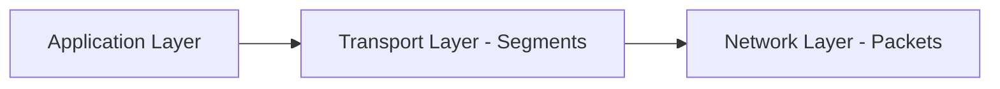
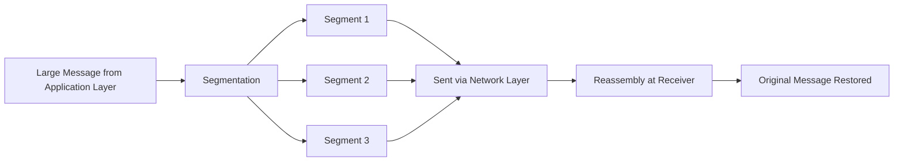
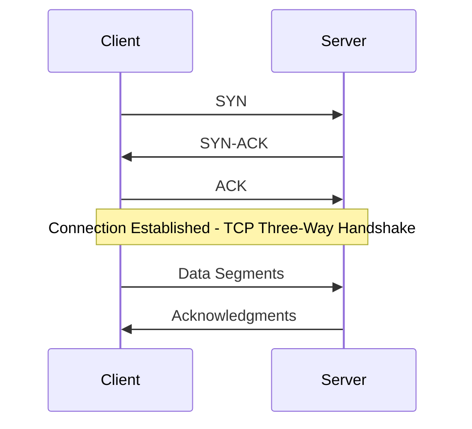
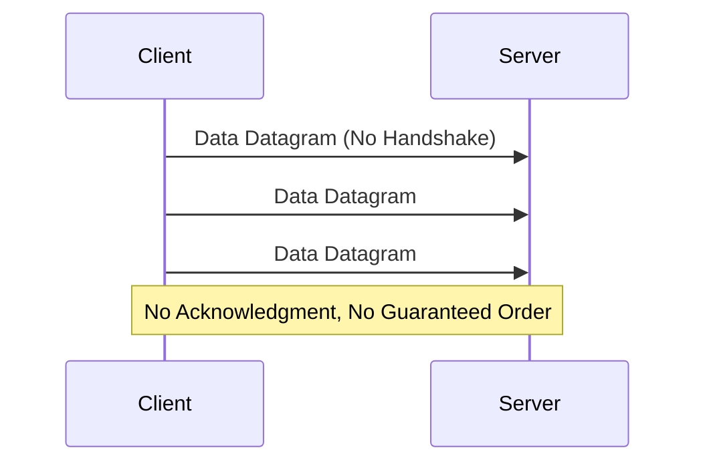
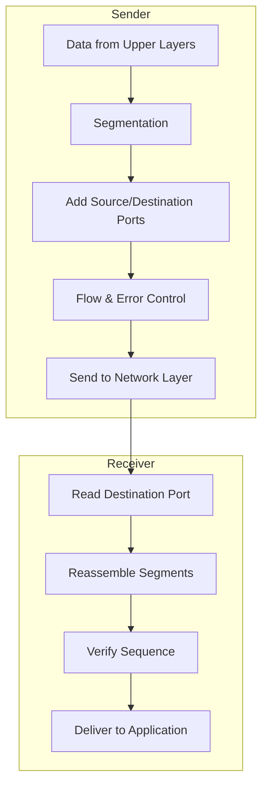

> **الهدف من الـ Section ده:**  
> هتفهم إزاي الـ Transport Layer بتضمن وصول البيانات كاملة وبالترتيب الصح بين جهازين، الفرق العملي بين TCP وUDP، ودور الـ Port Numbers في توجيه البيانات للـ Application الصح، وهتقدر تربط كل ده بأشهر هجمات الشبكة زي Port Scanning وSYN Flood.

## Table of Contents

- [Overview](#overview)
- [Key Functions of Transport Layer](#key-functions-of-transport-layer)
  - [1. End-to-End Delivery](#1-end-to-end-delivery)
  - [2. Segmentation and Reassembly](#2-segmentation-and-reassembly)
  - [3. Service Point Addressing (Port Numbers)](#3-service-point-addressing-port-numbers)
  - [4. Flow and Error Control](#4-flow-and-error-control)
- [Protocols Used in Transport Layer](#protocols-used-in-transport-layer)
- [Services Provided](#services-provided)
- [How It Works](#how-it-works)
- [SOC Analyst Perspective](#soc-analyst-perspective)
- [Summary](#summary)

---

## Overview

الـ **Transport Layer** هي الطبقة الرابعة في الـ OSI Model. بتوفر خدمات لـ **Application Layer** وبتاخد خدمات من **Network Layer**. مسؤوليتها الأساسية هي توصيل الرسائل كاملة من جهاز لجهاز عبر الشبكات (**End-to-End Delivery**). البيانات في الطبقة دي بتتسمى **Segments**.

> [!NOTE]
> الفرق بين "End-to-End" في الـ Transport Layer و"Hop-to-Hop" في الـ Data Link Layer: الـ Transport Layer بتتأكد من وصول البيانات للجهاز النهائي (Destination Device) بالكامل، مش بس النقلة الجاية بين Router وRouter.

---

## Key Functions of Transport Layer

### 1. End-to-End Delivery

- Ensures that data is delivered from the source device to the destination device reliably
- Provides acknowledgment of successful data transmission
- Retransmits segments if errors are detected

### 2. Segmentation and Reassembly

- **Segmentation**: Divides large messages from upper layers into smaller, manageable segments
- **Reassembly**: At the receiving end, segments are combined back into the original message in the correct order

### 3. Service Point Addressing (Port Numbers)

- Each segment includes a **Source Port** and **Destination Port** in its header
- This ensures that the data is delivered to the correct application or process on the receiving device
- Example: Web applications typically use **Port 80 (HTTP)** by default

> [!IMPORTANT]
> فكر في الـ IP Address زي عنوان المبنى، والـ Port Number زي رقم الشقة جوه المبنى ده. البيانات ممكن توصل للجهاز الصح (IP) لكن محتاجة كمان توصل للـ Application الصح جواه (Port).

### 4. Flow and Error Control

- Controls the rate of data transmission between sender and receiver to avoid congestion (**Flow Control**)
- Detects errors in segments and requests retransmission if needed (**Error Control**)

---

## Protocols Used in Transport Layer

- **TCP (Transmission Control Protocol)**: Connection-oriented, reliable, ensures ordered delivery
- **UDP (User Datagram Protocol)**: Connectionless, faster, but less reliable

| Aspect | TCP | UDP |
|---|---|---|
| Connection | Connection-Oriented (Handshake required) | Connectionless |
| Reliability | Reliable (Acknowledgment + Retransmission) | Unreliable (No Acknowledgment) |
| Order | Guarantees ordered delivery | No order guarantee |
| Speed | Slower (due to overhead) | Faster (less overhead) |
| Use Cases | Web browsing, Email, File Transfer | Streaming, VoIP, DNS, Gaming |

---

## Services Provided

### 1. Connection-Oriented Service (TCP)

- Establishes a reliable connection between sender and receiver
- Ensures all segments arrive in order and without loss
- Provides acknowledgment and retransmission mechanisms

> [!NOTE]
> الخطوات التلاتة دي (SYN, SYN-ACK, ACK) معروفة باسم **Three-Way Handshake**، وهي الطريقة اللي TCP بيتأكد بيها إن الطرفين جاهزين ومتفقين على بدء الاتصال قبل ما تتبعت أي بيانات فعلية.

### 2. Connectionless Service (UDP)

- Sends segments without establishing a dedicated connection
- Faster but no guarantee of delivery or order
- Ideal for streaming or real-time applications like video conferencing

---

## How It Works

### At the Sender

1. Receives data from upper layers (Application/Session)
2. Segments the data into smaller units
3. Adds Source and Destination Port Numbers
4. Implements Flow Control and Error Control
5. Forwards the segments to the Network Layer

### At the Receiver

1. Reads the Destination Port to determine which application receives the data
2. Reassembles the segments into the original message
3. Ensures correct sequence of segments before delivering to the application

الـ Transport Layer بتلعب دور حيوي (Critical Role) في الاتصال الموثوق عبر الشبكات، وبتربط بين خدمات الشبكة والـ Applications.

---

## SOC Analyst Perspective

> [!IMPORTANT]
> الـ Transport Layer من أكتر الطبقات اللي بتتفحص باستمرار في أي SOC، لأن الـ Port Numbers والـ Connection States (زي TCP Flags) بتدي مؤشرات قوية جدًا على وجود نشاط مشبوه.

### Common Ports Every Analyst Should Know

| Port | Protocol | Service |
|---|---|---|
| 20 / 21 | TCP | FTP |
| 22 | TCP | SSH |
| 23 | TCP | Telnet |
| 25 | TCP | SMTP |
| 53 | TCP/UDP | DNS |
| 80 | TCP | HTTP |
| 443 | TCP | HTTPS |
| 3389 | TCP | RDP |

### Common Layer 4 Threats

| Threat | Description | MITRE ATT&CK Reference |
|---|---|---|
| Port Scanning | المهاجم بيفحص الـ Ports المفتوحة على جهاز أو شبكة عشان يحدد الخدمات الشغالة والثغرات المحتملة | T1046 - Network Service Discovery |
| SYN Flood | إغراق الـ Server بعدد ضخم من الـ SYN Requests من غير إكمال الـ Handshake، بهدف استنزاف الموارد (DoS) | T1499 - Endpoint Denial of Service |
| Session Hijacking | سرقة أو التنبؤ بأرقام الـ Sequence بتاعة اتصال TCP قائم عشان ينتحل شخصية أحد الأطراف | T1557 - Adversary-in-the-Middle |
| UDP Flood | إغراق الجهاز بحزم UDP كتير عشان يستهلك الموارد (خصوصًا إن UDP مفهوش Handshake يتحقق منه) | T1498 - Network Denial of Service |

> [!WARNING]
> بروتوكول **UDP** بيستخدم كتير في هجمات الـ **Amplification/Reflection DoS** (زي DNS Amplification)، لأنه Connectionless ومفيهوش تحقق من هوية المرسل، فسهل يتزور فيه الـ Source IP.

> [!TIP]
> لو شفت جهاز واحد بيبعت عدد كبير جدًا من الـ SYN Packets لـ Ports مختلفة في وقت قصير من غير ما يكمل أي Handshake، ده مؤشر قوي جدًا على **Port Scanning** أو محاولة **SYN Flood**، وتستاهل تتحقق منه فورًا في أدوات زي Wireshark أو NetFlow Analysis.

من ناحية الأدوات:
- **IDS/IPS** بتراقب أنماط الـ Connections غير الطبيعية على مستوى الـ Ports
- **NetFlow/Firewall Logs** بتساعد في اكتشاف أي محاولة Scanning عن طريق تتبع عدد الـ Connections لعناوين IP وPorts مختلفة في وقت قصير

---

## Summary

- الـ **Transport Layer** هي الطبقة الرابعة، مسؤولة عن **End-to-End Delivery** للبيانات، والوحدة الأساسية فيها اسمها **Segment**
- أهم وظائفها: **Segmentation & Reassembly، Port Addressing، Flow & Error Control**
- بروتوكولين أساسيين: **TCP** (موثوق، Connection-Oriented، بيستخدم Three-Way Handshake) و **UDP** (أسرع، Connectionless، بدون ضمان توصيل)
- الـ **Port Numbers** بتحدد الـ Application الصحيح اللي المفروض يستقبل البيانات (زي Port 80 لـ HTTP)
- من ناحية الـ SOC: الطبقة دي مصدر أساسي لاكتشاف هجمات زي **Port Scanning (T1046)** و**SYN/UDP Flood (T1499/T1498)**، وأدوات زي IDS/IPS وNetFlow ضرورية لمراقبتها
