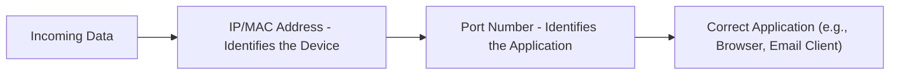
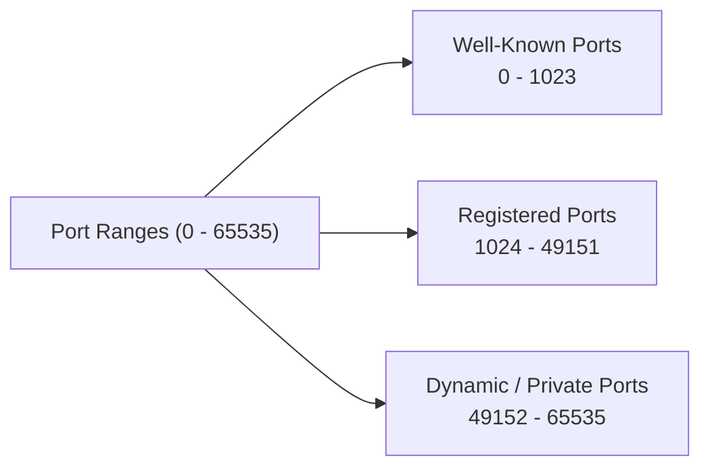

> **الهدف من الـ Section ده:**  
> هتفهم إيه هو الـ Port بالظبط وليه محتاج له مع الـ IP Address، هتتعرف على أنواع الـ Ports التلاتة (Well-Known, Registered, Dynamic)، وهتحفظ أهم الـ Common Ports اللي أي SOC Analyst لازم يعرفها عن ظهر قلب.

# Ports in Networking

## Table of Contents

- [Overview](#overview)
- [What is a Port?](#what-is-a-port)
- [Types of Ports](#types-of-ports)
- [Importance of Ports](#importance-of-ports)
- [Common Port Numbers](#common-port-numbers)
- [SOC Analyst Perspective](#soc-analyst-perspective)
- [Summary](#summary)

---

## Overview

الـ **Ports** هي عناوين منطقية (Logical Addresses) بتستخدم لتحديد تطبيق أو خدمة معينة على الكمبيوتر. لما البيانات بتتبعت عبر الشبكة، الـ **IP** والـ **MAC Address** بيوصلوها للجهاز الصحيح، لكن الـ **Port** هو اللي بيضمن إن البيانات توصل للـ Application الصحيح جوه الجهاز ده.

فكر في الموضوع كده:

- **IP/MAC Address** → زي الرقم القومي أو عنوان المبنى (بيحدد الجهاز نفسه)
- **Port Number** → زي رقم الشقة جوه المبنى (بيوصل البيانات للتطبيق الصحيح)

في الـ OSI Model، الـ Ports بتستخدم في **Transport Layer**، وبتتحدد جوه الـ Headers بتاعة بروتوكولات زي **TCP** و **UDP**.

---

## What is a Port?

- A port is a **16-bit unsigned integer** ranging from **0 to 65535**
- Every application that uses the internet has a unique port number
- Ports help computers differentiate between incoming and outgoing traffic

> [!NOTE]
> بما إن الـ Port هو رقم من 16 bit، فده معناه إن أقصى عدد ممكن من الـ Ports هو 2^16 = 65536 قيمة، من 0 لـ 65535.

---

## Types of Ports

الـ Ports بتتقسم لـ 3 نطاقات رئيسية حسب الـ **Internet Assigned Numbers Authority (IANA)**:

| Range | Name | Description |
|---|---|---|
| 0 – 1023 | Well-Known Ports | مخصصة لخدمات وبروتوكولات معروفة ومعتمدة رسميًا من IANA (زي HTTP, FTP, SSH) |
| 1024 – 49151 | Registered Ports | مسجلة لشركات أو تطبيقات معينة، لكن مش بنفس صرامة الـ Well-Known Ports |
| 49152 – 65535 | Dynamic / Private Ports | بتستخدم بشكل مؤقت (Ephemeral) من نظام التشغيل وقت ما جهازك بيبدأ اتصال جديد، وبترجع تتحرر بعد انتهاء الاتصال |

> [!TIP]
> لما جهازك يفتح اتصال بموقع إنترنت، هو غالبًا بيستخدم **Port من الـ Dynamic Range** كـ Source Port، بينما بيتواصل مع **Well-Known Port** على الـ Server (زي Port 443 لـ HTTPS).

---

## Importance of Ports

- **Service Identification**: Different applications on the same device use different ports
- **Efficient Data Routing**: Ensures data is delivered to the correct application
- **Traffic Control**: Firewalls can block traffic to specific ports
- **Scalability**: Multiple services can run simultaneously on the same device using different ports

---

## Common Port Numbers

| Port | Protocol | Service |
|---|---|---|
| 20 / 21 | TCP | FTP (Data / Control) |
| 22 | TCP | SSH |
| 23 | TCP | Telnet |
| 25 | TCP | SMTP |
| 53 | TCP/UDP | DNS |
| 67 / 68 | UDP | DHCP |
| 80 | TCP | HTTP |
| 110 | TCP | POP3 |
| 123 | UDP | NTP |
| 143 | TCP | IMAP |
| 443 | TCP | HTTPS |
| 445 | TCP | SMB |
| 3306 | TCP | MySQL |
| 3389 | TCP | RDP |
| 8080 | TCP | HTTP Alternate / Proxy |

> [!IMPORTANT]
> حفظ الـ Common Ports دي مش رفاهية بالنسبة لـ SOC Analyst - دي أداة أساسية عشان تقدر تقرأ أي Log أو Traffic Capture بسرعة وتعرف فورًا إيه نوع الخدمة اللي بيتم الوصول ليها من غير ما تحتاج ترجع تدور في مرجع كل مرة.

---

## SOC Analyst Perspective

> [!IMPORTANT]
> الـ Ports هي واحدة من أهم نقاط المراقبة في أي بيئة SOC، لأن أي محاولة اختراق غالبًا بتبدأ بمحاولة معرفة إيه الـ Ports المفتوحة على الهدف.

### Port States (as seen in scanning)

| State | Meaning |
|---|---|
| Open | فيه Service شغالة وبترد على الطلبات على الـ Port ده |
| Closed | الجهاز موجود ورد، لكن مفيش Service شغالة على الـ Port ده |
| Filtered | مفيش رد خالص، غالبًا بسبب Firewall بيمنع الوصول للـ Port ده |

> [!WARNING]
> **Port Scanning** هو غالبًا أول خطوة في أي عملية استطلاع (Reconnaissance) قبل أي هجوم فعلي. المهاجم بيحاول يعرف إيه الخدمات الشغالة على الهدف عشان يحدد إيه الثغرات المحتملة (زي خدمة قديمة أو غير محدثة شغالة على Port معروف).

من ناحية الـ MITRE ATT&CK:
- **T1046 - Network Service Discovery**: يغطي عمليات فحص الـ Ports والخدمات المتاحة على الشبكة
- **T1571 - Non-Standard Port**: بعض المهاجمين بيشغلوا خدمات (زي C2 Communication) على Ports غير معتادة عشان يتفادوا الكشف من أدوات المراقبة اللي بتركز بس على الـ Common Ports

### Best Practices for SOC Monitoring

- مراقبة أي **Port غير معروف أو غير متوقع** يبدأ يستقبل Traffic بشكل مفاجئ
- استخدام **Firewall Rules** لغلق أي Port مش ضروري للعمل (تطبيق مبدأ **Least Privilege** على مستوى الشبكة)
- ربط أي نشاط على Port حساس (زي 3389 RDP أو 22 SSH) بمصدر الـ IP والـ User عشان تكتشف أي محاولة وصول غير مصرح بيها بسرعة
- الانتباه لخدمات معروفة بتشتغل على Ports غير قياسية (زي HTTP Traffic ظاهر على Port غير 80/8080)، لأن ده ممكن يكون محاولة تمويه (Evasion)

> [!TIP]
> لو لاقيت في الـ Logs اتصال خارجي (Outbound) على Port غريب أو نادر الاستخدام (خصوصًا لو مش من ضمن الـ Well-Known Ports) وبيحصل بشكل دوري ومنتظم، ده يستاهل تحقيق - ممكن يكون **C2 Beaconing** بيستخدم Port غير قياسي لتفادي الكشف.

---

## Summary

- الـ **Ports** هي عناوين منطقية (16-bit، من 0 لـ 65535) بتحدد الـ Application أو الخدمة على الجهاز، وبتشتغل على مستوى **Transport Layer**
- 3 أنواع رئيسية: **Well-Known (0-1023)**، **Registered (1024-49151)**، **Dynamic/Private (49152-65535)**
- الـ Ports أساسية لـ: تحديد الخدمة، توجيه البيانات الصحيح، التحكم في الـ Traffic عبر Firewalls، والسماح بتشغيل خدمات متعددة في نفس الوقت
- حفظ **Common Ports** (زي 22 SSH، 80/443 HTTP/HTTPS، 3389 RDP) ضروري لأي SOC Analyst لقراءة الـ Logs بسرعة
- من ناحية الـ SOC: **Port Scanning (T1046)** غالبًا أول خطوة في أي هجوم، وبعض المهاجمين بيستخدموا **Non-Standard Ports (T1571)** لإخفاء نشاطهم، فمراقبة الأنماط غير الطبيعية في استخدام الـ Ports جزء أساسي من عمل أي SOC
