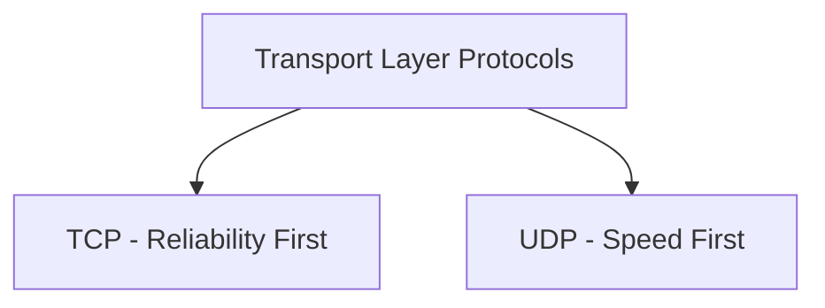
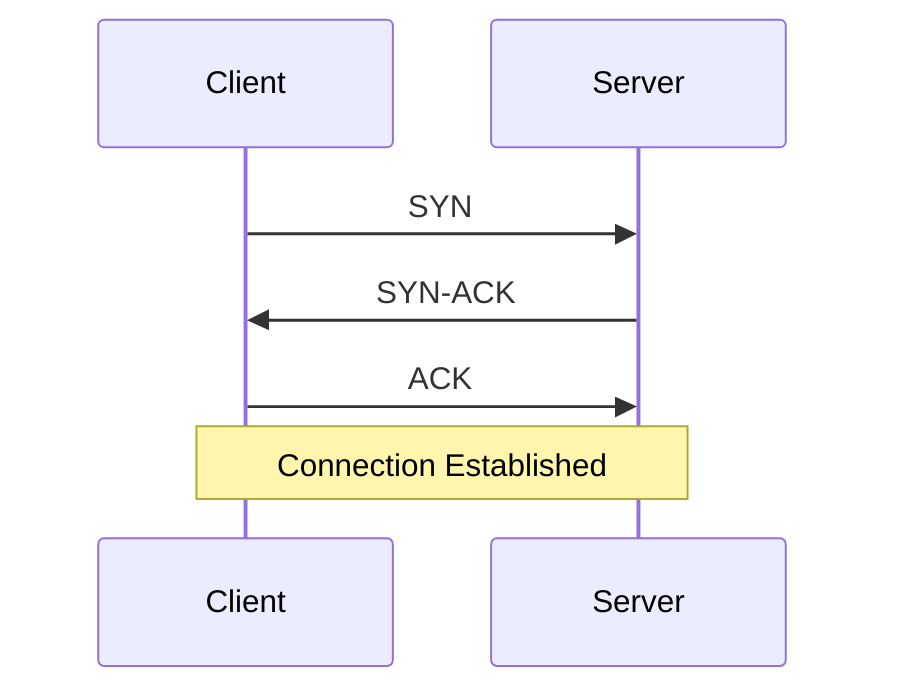
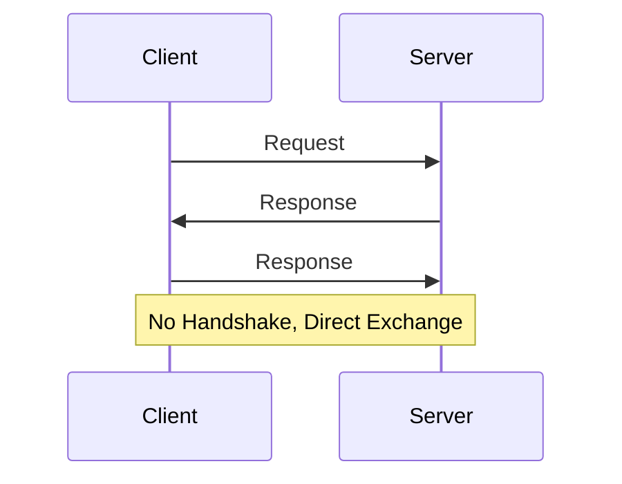
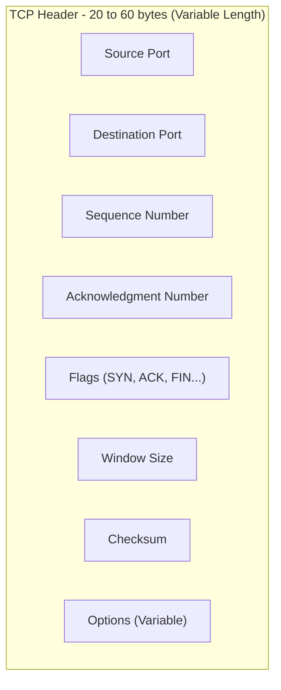
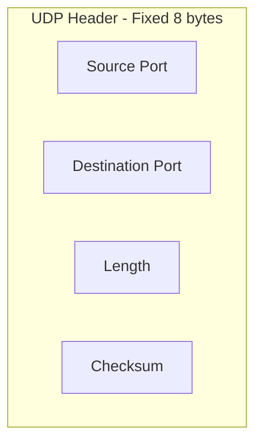

> **الهدف من الـ Section ده:**  
>  هتفهم الفرق التفصيلي بين TCP وUDP على مستوى الـ Transport Layer، إمتى تستخدم كل واحد فيهم، وإزاي الفروق دي (زي غياب الـ Handshake في UDP) بتفتح الباب لأنواع معينة من الهجمات لازم تكون واعي بيها كـ SOC Analyst.

## Table of Contents

- [Overview](#overview)
- [How Each Protocol Establishes Communication](#how-each-protocol-establishes-communication)
- [Detailed Comparison Table](#detailed-comparison-table)
- [Header Structure Comparison](#header-structure-comparison)
- [When to Use TCP vs UDP](#when-to-use-tcp-vs-udp)
- [SOC Analyst Perspective](#soc-analyst-perspective)
- [Summary](#summary)

---

## Overview

اختيار البروتوكول المناسب بين **TCP** و**UDP** بيعتمد بشكل أساسي على احتياج الـ Application: هل هو محتاج **Reliability** (موثوقية) ولا محتاج **Speed and Efficiency** (سرعة وكفاءة)؟

الاتنين شغالين على الـ **Transport Layer (Layer 4)**، لكن الفلسفة اللي كل واحد فيهم مبني عليها مختلفة تمامًا.

---

## How Each Protocol Establishes Communication

### TCP - Connection-Oriented

### UDP - Connectionless

> [!NOTE]
> في TCP، الجهازين بيتفقوا الأول على فتح قناة اتصال موثوقة (زي مكالمة تليفون بتتأكد إن الطرف التاني رد قبل ما تتكلم). في UDP، البيانات بتتبعت على طول من غير أي اتفاق مسبق (زي بعت رسالة SMS من غير ما تتأكد إن الشخص فاتح تليفونه أصلاً).

---

## Detailed Comparison Table

| TCP | UDP |
|---|---|
| TCP is a connection-oriented protocol | UDP is the connection-less protocol |
| TCP supports error-checking mechanisms | UDP has only the basic error-checking mechanism using checksums |
| An acknowledgment segment is present | No acknowledgment segment |
| TCP is slower than UDP | UDP is faster, simpler, and more efficient than TCP |
| Retransmission of lost packets is possible in TCP, but not in UDP | There is no retransmission of lost packets in the User Datagram Protocol (UDP) |
| TCP has a 20-60 bytes variable length header | The header length is fixed at 8 bytes |

> [!IMPORTANT]
> النقطة الأهم في الجدول ده هي **"No retransmission in UDP"**. ده معناه إن لو حصل فقد في أي Packet أثناء استخدام UDP، مفيش أي آلية جوه البروتوكول نفسه تعيد إرساله. لو الـ Application محتاج الموثوقية دي، لازم يبنيها بنفسه فوق UDP (زي ما بيحصل في بعض تطبيقات الـ Streaming أو الـ Gaming).

---

## Header Structure Comparison

> [!NOTE]
> الفرق الكبير في حجم الـ Header (20-60 بايت في TCP مقابل 8 بايت ثابتة في UDP) هو أحد أسباب إن UDP أسرع وأخف بكتير - مفيش Overhead إضافي زي أرقام الـ Sequence أو حقول الـ Flags المعقدة.

---

## When to Use TCP vs UDP

| Scenario | Recommended Protocol | Why |
|---|---|---|
| تصفح المواقع (Web Browsing) | TCP | محتاج كل البيانات توصل كاملة وبالترتيب الصحيح |
| نقل الملفات (File Transfer - FTP) | TCP | فقد جزء من الملف غير مقبول |
| البريد الإلكتروني (Email - SMTP) | TCP | لازم الرسالة توصل كاملة |
| البث المباشر (Video Streaming) | UDP | فقد إطار أو اتنين مقبول مقابل السرعة والاستمرارية |
| مكالمات الصوت (VoIP) | UDP | التأخير (Latency) أهم من إعادة إرسال البيانات المفقودة |
| الألعاب الأونلاين (Online Gaming) | UDP | السرعة والاستجابة الفورية أهم من ضمان وصول كل حزمة |
| DNS Queries | UDP (عادة) | طلب واستجابة بسيطة وسريعة، مع إمكانية التحول لـ TCP لو الرد كبير |

---

## SOC Analyst Perspective

> [!IMPORTANT]
> غياب الـ Handshake والـ Acknowledgment في UDP مش بس فرق تقني، ده بيفتح ثغرات أمنية حقيقية لازم تكون واعي بيها.

### Security Implications

| Aspect | Security Impact |
|---|---|
| No Handshake in UDP | سهل جدًا تزوير الـ Source IP (**IP Spoofing**) لأنه مفيش تحقق من هوية المرسل قبل تبادل البيانات |
| No Acknowledgment in UDP | صعب تتبع نجاح أو فشل الاتصال، وده بيصعب كشف بعض أنواع الـ Data Exfiltration اللي بتستخدم UDP |
| TCP Handshake Exploitation | هجوم **SYN Flood** بيستغل إن الـ Server بيحجز موارد بمجرد استقبال SYN، حتى قبل ما الـ Handshake يكتمل |
| Fixed Small UDP Header | بيسهل على المهاجمين استخدام UDP في هجمات **Amplification/Reflection** (زي DNS/NTP Amplification) لأن الـ Overhead قليل والاستجابة ممكن تكون أكبر بكتير من الطلب |

> [!WARNING]
> بروتوكولات زي **DNS** و**NTP** اللي بتشتغل على UDP هي من أكتر البروتوكولات استغلالًا في هجمات **Amplification DDoS**، لأن المهاجم بيقدر يبعت طلب صغير بـ Source IP مزور (بتاع الضحية)، ويخلي الـ Server يرد برد كبير على الضحية بدل ما يرد على المهاجم نفسه.

من ناحية الـ MITRE ATT&CK:
- **T1498 - Network Denial of Service**: يغطي هجمات زي UDP Flood وAmplification Attacks
- **T1499 - Endpoint Denial of Service**: يغطي هجمات زي SYN Flood اللي بتستهدف استنزاف موارد جهاز معين

> [!TIP]
> لما تحلل Traffic غريب، لو لقيت حجم كبير من البيانات بيتبعت عبر UDP على Ports غير معتادة (خصوصًا لو مفيش Response واضح)، ده يستاهل تحقيق - ممكن يكون محاولة **Data Exfiltration** بتستغل إن UDP أصعب في المراقبة والتتبع مقارنة بـ TCP.

---

## Summary

- الاختيار بين **TCP** و**UDP** بيعتمد على احتياج الـ Application: **Reliability** (TCP) مقابل **Speed and Efficiency** (UDP)
- **TCP**: Connection-Oriented، بيدعم Error-Checking قوي، فيه Acknowledgment، بيعيد إرسال الحزم المفقودة، لكنه أبطأ وHeader بتاعه متغير (20-60 بايت)
- **UDP**: Connectionless، Error-Checking بسيط بالـ Checksum بس، مفيش Acknowledgment ولا Retransmission، لكنه أسرع وأبسط، وHeader بتاعه ثابت (8 بايت)
- الاختيار العملي: TCP للبيانات اللي لازم توصل كاملة (Web, Email, File Transfer)، وUDP للتطبيقات الحساسة للتأخير (Streaming, VoIP, Gaming, DNS)
- من ناحية الـ SOC: غياب الـ Handshake في UDP بيسهل **IP Spoofing** وهجمات **Amplification DDoS** (مرتبطة بـ MITRE T1498)، بينما آلية الـ Handshake في TCP نفسها بتتعرض للاستغلال في **SYN Flood** (T1499)
