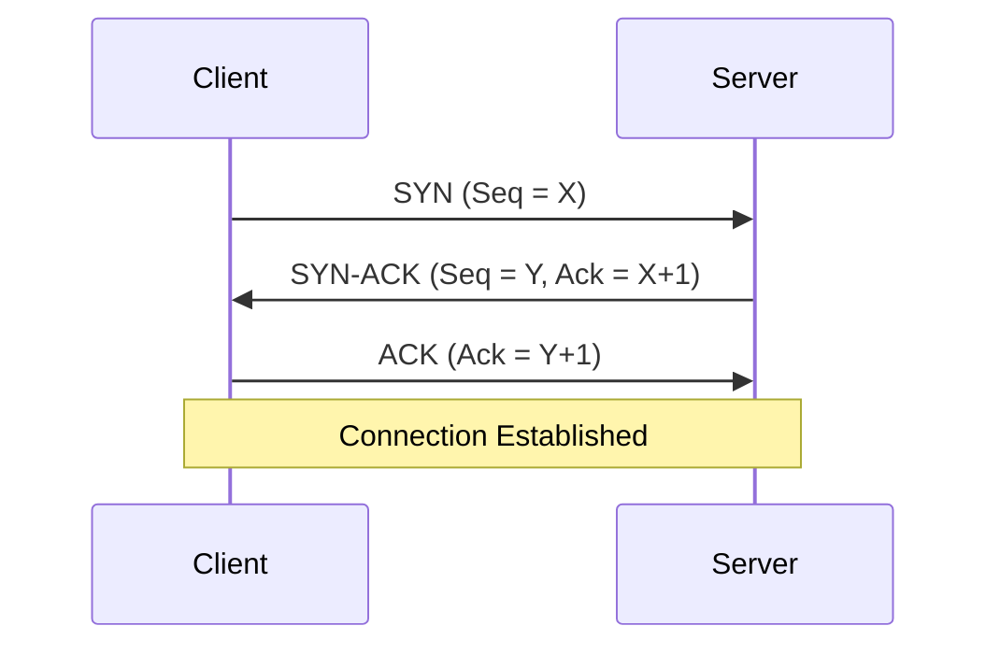
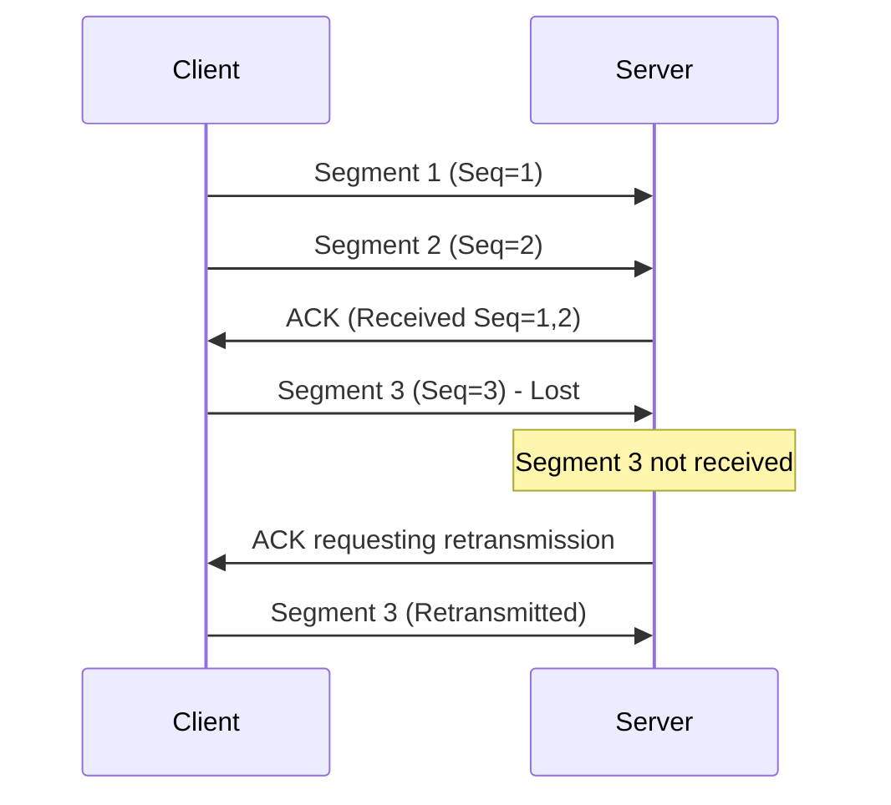
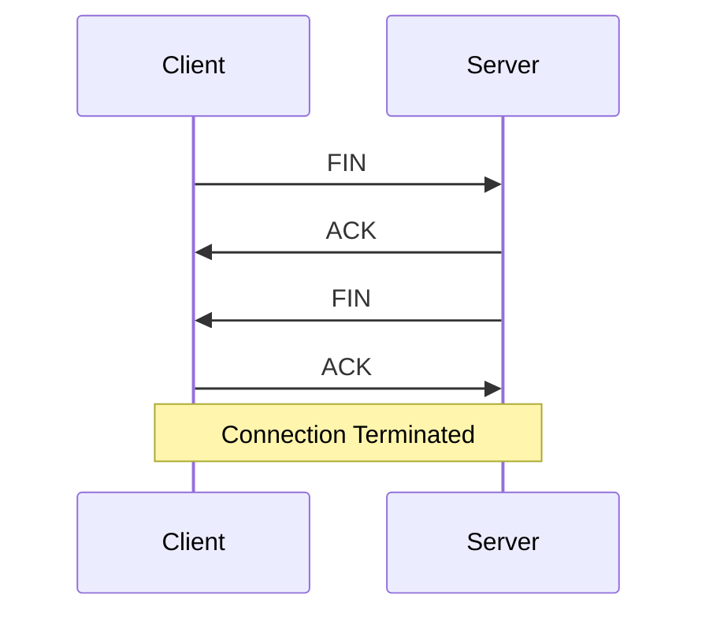
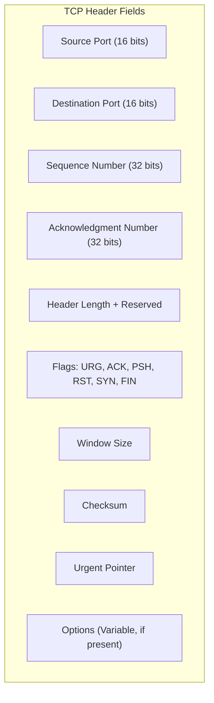

> **الهدف من الـ Section ده:**  
>  هتفهم TCP بالتفصيل - إزاي بيفتح الاتصال، إزاي بيقفله بأمان، وإيه اللي جوه الـ Header بتاعه، وهتقدر تربط كل خطوة بأنواع الهجمات والـ Scanning Techniques اللي بتستغل الـ TCP Flags نفسها.

# Transmission Control Protocol (TCP)

## Table of Contents

- [Overview](#overview)
- [Key Characteristics of TCP](#key-characteristics-of-tcp)
- [How TCP Works](#how-tcp-works)
  - [1. Connection Establishment (Three-Way Handshake)](#1-connection-establishment-three-way-handshake)
  - [2. Data Transmission](#2-data-transmission)
  - [3. Connection Termination (Four-Way Handshake)](#3-connection-termination-four-way-handshake)
- [TCP Header](#tcp-header)
- [Common Uses of TCP](#common-uses-of-tcp)
- [SOC Analyst Perspective](#soc-analyst-perspective)
- [Summary](#summary)

---

## Overview

**Transmission Control Protocol (TCP)** هو بروتوكول شبكات أساسي بيشتغل على **Layer 4 (Transport Layer)** في الـ OSI Model. اتصمم عشان يوفر توصيل موثوق (Reliable)، مرتب (Ordered)، ومتحقق من الأخطاء (Error-Checked) للبيانات بين الـ Applications الشغالة على أجهزة مختلفة عبر الشبكة.

TCP جزء أساسي من **TCP/IP Protocol Suite**، ومستخدم بشكل واسع في خدمات الإنترنت زي تصفح المواقع، والإيميل، ونقل الملفات.

---

## Key Characteristics of TCP

- **Connection-Oriented**: A connection must be established before data transmission begins
- **Reliable Data Transfer**: Ensures that all data reaches the destination without loss or corruption
- **Ordered Delivery**: Data is received in the same sequence in which it was sent
- **Error Detection and Recovery**: Lost or damaged segments are detected and retransmitted
- **Flow Control**: Prevents the sender from overwhelming the receiver
- **Congestion Control**: Adjusts transmission speed based on network conditions

> [!NOTE]
> الفرق بين **Flow Control** و **Congestion Control**: الأول بيحمي الـ **Receiver** من إنه يتغرق ببيانات أسرع من قدرته على معالجتها، والتاني بيحمي **الشبكة نفسها** من الازدحام عن طريق تعديل سرعة الإرسال حسب حالة الشبكة.

---

## How TCP Works

### 1. Connection Establishment (Three-Way Handshake)

قبل ما تتبعث أي بيانات، TCP بيفتح اتصال باستخدام عملية من 3 خطوات:

- **SYN (Synchronize)**: The sender requests a connection
- **SYN-ACK (Synchronize-Acknowledge)**: The receiver agrees and acknowledges the request
- **ACK (Acknowledge)**: The sender confirms, and the connection is established

العملية دي بتضمن إن الجهازين جاهزين للتواصل ومتزامنين (Synchronized) مع بعض.

> [!IMPORTANT]
> الـ **Sequence Numbers** في الـ Handshake مش بس شكليات - هي اللي بتضمن إن الطرفين متفقين على "نقطة البداية" لترقيم البيانات، وده أساسي عشان الـ Reassembly الصحيح للبيانات لاحقًا.

### 2. Data Transmission

- Data is divided into smaller units called **segments**
- Each segment includes **sequence numbers** and **port information**
- The receiver sends **acknowledgements (ACKs)** for received segments
- If a segment is lost, TCP automatically **retransmits** it

### 3. Connection Termination (Four-Way Handshake)

TCP بيقفل الاتصال بأمان باستخدام عملية من 4 خطوات:

1. **FIN**: One side requests to close the connection
2. **ACK**: The other side acknowledges the request
3. **FIN**: The second side signals it is ready to close
4. **ACK**: Final acknowledgement, and the connection is terminated

ده بيضمن إن كل البيانات المتبقية اتوصلت قبل قطع الاتصال.

> [!NOTE]
> ليه القفل محتاج 4 خطوات بدل 3 زي الفتح؟ لأن كل طرف لازم يقفل الاتجاه بتاعه بشكل منفصل (TCP هو Full-Duplex)، فمينفعش الطرفين يقفلوا في خطوة واحدة مشتركة زي الفتح.

---

## TCP Header

| Field | Purpose |
|---|---|
| Source / Destination Port | تحديد الـ Application على كل طرف من الاتصال |
| Sequence Number | ترقيم البيانات لضمان إعادة تجميعها بالترتيب الصحيح |
| Acknowledgment Number | تأكيد استلام البيانات لغاية رقم معين |
| Flags | التحكم في حالة الاتصال (SYN لفتح الاتصال، FIN لقفله، RST لإنهائه فجأة، ACK للتأكيد، PSH لدفع البيانات فورًا، URG للبيانات العاجلة) |
| Window Size | كمية البيانات اللي ممكن تتبعت قبل انتظار Acknowledgment (جزء من Flow Control) |
| Checksum | التحقق من سلامة البيانات وعدم تلفها أثناء النقل |

> [!IMPORTANT]
> حقل الـ **Flags** هو أهم جزء بالنسبة للـ SOC Analyst، لأنه بيوضح حالة كل Segment - وده بالظبط اللي بيتستخدم في تحليل أي Traffic مشبوه.

---

## Common Uses of TCP

- Web applications (HTTP / HTTPS)
- Email services (SMTP, POP3, IMAP)
- File transfers (FTP)
- Remote access (SSH)

---

## SOC Analyst Perspective

> [!IMPORTANT]
> كل مرحلة من مراحل TCP (Handshake، نقل البيانات، الإغلاق) عندها طريقة استغلال خاصة بيها، فمهم تفهم كل مرحلة عشان تقدر تكتشف الشذوذ (Anomalies) فيها.

### Attacks Exploiting TCP Mechanics

| Attack | Exploits | MITRE ATT&CK Reference |
|---|---|---|
| SYN Flood | إغراق الـ Server بـ SYN Packets كتير من غير إكمال الـ Handshake، فيحجز موارد للاتصالات "نصف المفتوحة" (Half-Open) لحد ما تنفد الموارد | T1499 - Endpoint Denial of Service |
| TCP Reset (RST) Attack | بعت حزمة RST مزيفة عشان تقفل اتصال قائم بين طرفين بالقوة (Connection Hijacking/Disruption) | T1498 / T1557 |
| TCP Session Hijacking | التنبؤ أو سرقة الـ Sequence Numbers بتاعة اتصال قائم عشان ينتحل شخصية أحد الأطراف | T1557 - Adversary-in-the-Middle |
| Port Scanning (SYN/FIN/NULL/XMAS Scan) | إرسال Segments بـ Flags مختلفة (زي SYN بس، أو FIN بس، أو من غير Flags خالص) لفحص حالة الـ Ports من غير ما يكمل اتصال كامل | T1046 - Network Service Discovery |

> [!WARNING]
> تقنيات الـ Scanning زي **FIN Scan** و **NULL Scan** و **XMAS Scan** بتستغل إن بعض الأنظمة بترد بشكل مختلف على Segments غريبة الـ Flags (زي Segment فيها FIN بس من غير SYN سابق)، وده بيدي المهاجم معلومات عن حالة الـ Port من غير ما يعمل اتصال كامل يظهر بسهولة في logs التقليدية.

> [!TIP]
> لما تحلل Traffic في Wireshark أو أي IDS، راقب أنماط زي:
> - عدد كبير من SYN Packets من غير ACK يكمل بعدها (مؤشر SYN Flood أو Scanning)
> - RST Packets كتيرة وغير متوقعة في اتصال كان شغال طبيعي
> - Segments بـ Flags غير منطقية (زي SYN+FIN مع بعض في نفس الوقت) وده غالبًا مؤشر على Scanning Tool أو Traffic معدَّل يدويًا (Crafted Packets)

---

## Summary

- **TCP** هو بروتوكول Connection-Oriented موثوق، بيضمن التوصيل الكامل والمرتب للبيانات، ويشتغل على **Layer 4**
- بيفتح الاتصال بـ **Three-Way Handshake** (SYN, SYN-ACK, ACK) وبيقفله بـ **Four-Way Handshake** (FIN, ACK, FIN, ACK)
- بيستخدم **Sequence Numbers** و**Acknowledgments** لضمان وصول البيانات كاملة وبالترتيب الصح، ويعيد إرسال أي Segment مفقود
- الـ **TCP Header** بيحتوي على حقول أساسية زي Ports، Sequence/Acknowledgment Numbers، وأهمهم للـ SOC هو حقل الـ **Flags**
- مستخدم في تطبيقات تحتاج دقة أكتر من سرعة: **HTTP/HTTPS, SMTP/POP3/IMAP, FTP, SSH**
- من ناحية الـ SOC: آلية الـ Handshake نفسها بتتعرض لاستغلال في **SYN Flood (T1499)**، والـ Flags بتتستخدم في تقنيات **Port Scanning (T1046)** زي FIN/NULL/XMAS Scans، وده يخلي تحليل الـ TCP Flags جزء أساسي من أي Traffic Analysis
