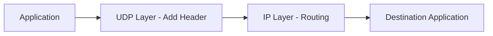
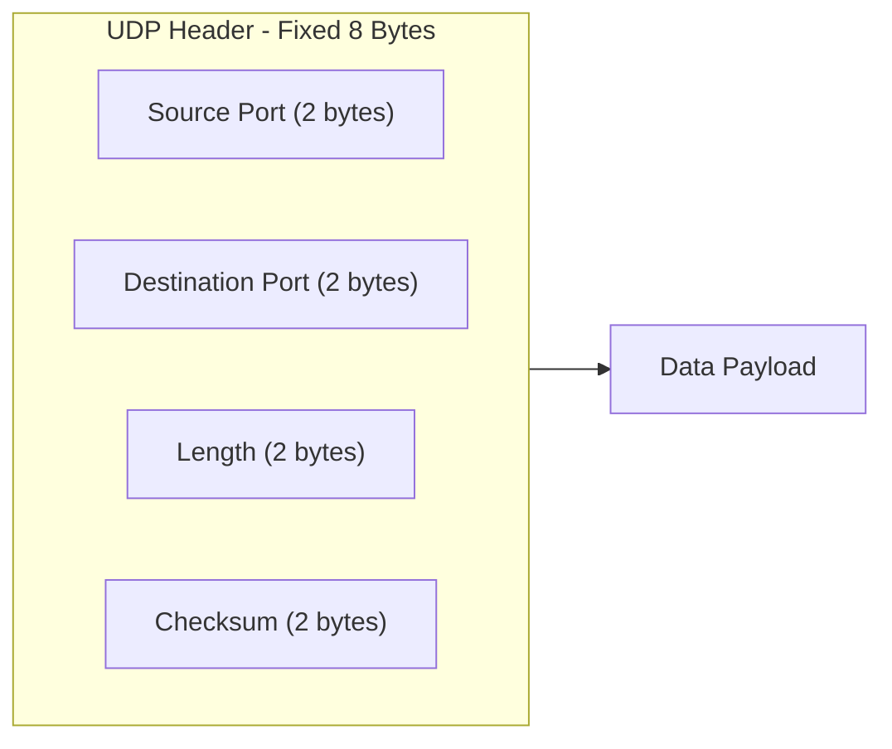
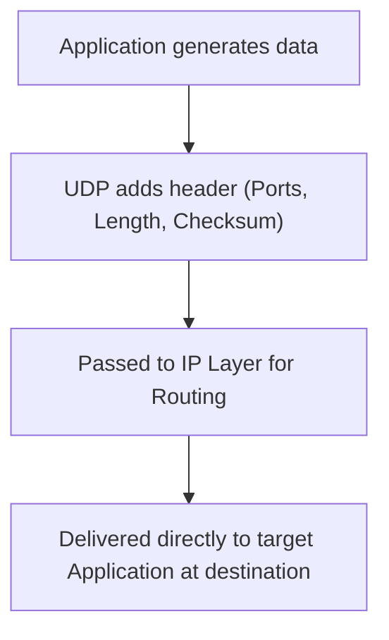

> **الهدف من الـ Section ده:**  
> هتفهم UDP بالتفصيل - إزاي بيشتغل من غير Handshake ولا Acknowledgment، وإيه هي التطبيقات اللي بتعتمد عليه، وهتقدر تربط بساطته دي بإزاي بيتستغل في هجمات الـ Amplification وDDoS اللي منتشرة جدًا.

# User Datagram Protocol (UDP)

## Table of Contents

- [Overview](#overview)
- [Key Characteristics of UDP](#key-characteristics-of-udp)
- [UDP Header Structure](#udp-header-structure)
- [How UDP Works](#how-udp-works)
- [Applications of UDP](#applications-of-udp)
- [Advantages and Disadvantages](#advantages-and-disadvantages)
- [SOC Analyst Perspective](#soc-analyst-perspective)
- [Summary](#summary)

---

## Overview

**User Datagram Protocol (UDP)** هو بروتوكول Transport Layer (**Layer 4** في الـ OSI Model) مصمم للتواصل السريع والخفيف (Fast and Lightweight). على عكس TCP، الـ UDP بروتوكول **Connectionless** ومبيضمنش التوصيل، ولا الترتيب، ولا الموثوقية، وده اللي بيخليه مثالي للتطبيقات اللحظية (Real-Time) اللي السرعة فيها أهم من الدقة.

> [!NOTE]
> فكر في UDP زي "طرد بريدي سريع" بيتبعت من غير Tracking Number ومن غير ما تتأكد إنه وصل - سريع وبسيط، لكن لو ضاع، مفيش حد هيبلغك أو يعيد إرساله تلقائيًا.

---

## Key Characteristics of UDP

- **Connectionless protocol** (no session establishment)
- **Fast data transmission** with low latency
- **No acknowledgments or retransmissions**
- **Minimal protocol overhead**
- **Suitable for time-sensitive communication**

---

## UDP Header Structure

الـ UDP Header طوله **8 bytes** ثابتة، وبيتبعه الـ Data Payload مباشرة.

| Field | Size | Purpose |
|---|---|---|
| Source Port | 2 bytes | تحديد الـ Application المرسل (اختياري، ممكن يكون صفر لو مفيش رد متوقع) |
| Destination Port | 2 bytes | تحديد الـ Application المستقبل على الجهاز التاني |
| Length | 2 bytes | طول الـ Header + الـ Data مع بعض |
| Checksum | 2 bytes | تحقق أساسي بسيط من سلامة البيانات |

> [!WARNING]
> UDP بيوفر **Basic Error Checking بس** عن طريق الـ Checksum، **ومفيهوش أي Flow Control أو Congestion Control**. يعني لو الشبكة مزدحمة أو الـ Receiver مش قادر يستوعب، UDP مش هيبطئ أو يتحكم في نفسه زي TCP.

---

## How UDP Works

1. The application sends data to the UDP layer
2. UDP adds its header (ports, length, checksum)
3. The packet is passed to the IP layer for routing
4. At the destination, UDP delivers the data directly to the target application

> [!NOTE]
> لاحظ إن الخطوات دي أبسط بكتير من TCP - مفيش Handshake، مفيش انتظار Acknowledgment، مفيش إعادة إرسال. البيانات بتتبعت وخلاص.

---

## Applications of UDP

UDP بيستخدم بكثرة في السيناريوهات اللي السرعة فيها أهم حاجة:

- **DNS** – Fast domain name resolution
- **VoIP** – Real-time voice communication
- **Video Streaming** – Live broadcasts and streaming
- **DHCP** – Automatic IP address assignment
- **NTP** – Network time synchronization
- **RIP** – Routing information exchange

| Application | Why UDP Fits |
|---|---|
| DNS | استعلام وسؤال سريع، لو الرد اتأخر ممكن يتكرر السؤال بسهولة |
| VoIP | التأخير (Latency) بيدمر جودة المكالمة أكتر من فقد جزء بسيط من الصوت |
| Video Streaming | فقد فريم أو اتنين مش هيبين، لكن التقطيع بسبب انتظار إعادة إرسال هيبين |
| DHCP | عملية بسيطة وسريعة لتوزيع إعدادات الشبكة وقت الاتصال |
| NTP | مزامنة الوقت محتاجة تكون سريعة ومتكررة، مش لازم Reliability عالية |
| RIP | تبادل معلومات التوجيه بشكل دوري وسريع بين الـ Routers |

---

## Advantages and Disadvantages

### Advantages

- Very fast and efficient
- Low overhead
- Ideal for real-time applications

### Disadvantages

- No guaranteed delivery
- No packet ordering
- No congestion control

---

## SOC Analyst Perspective

> [!IMPORTANT]
> بساطة UDP هي نفسها نقطة ضعفه الأمنية الأساسية. غياب الـ Handshake والـ Acknowledgment بيخليه أداة مفضلة في هجمات معينة، ومهم إنك كـ SOC Analyst تعرف تفرق بين UDP Traffic طبيعي وUDP Traffic مشبوه.

### Common Threats Involving UDP

| Threat | Description | MITRE ATT&CK Reference |
|---|---|---|
| UDP Flood | إغراق الجهاز أو الـ Server بعدد ضخم من الـ UDP Packets عشوائية الـ Port، بهدف استنزاف الموارد | T1498 - Network Denial of Service |
| DNS Amplification | استغلال إن رد DNS ممكن يكون أكبر بكتير من الطلب، مع تزوير الـ Source IP (Spoofing) عشان الرد يوصل للضحية مش للمهاجم | T1498 - Network Denial of Service |
| NTP Amplification | نفس فكرة DNS Amplification لكن باستخدام بروتوكول NTP، واللي بيدي نسبة تضخيم (Amplification Ratio) عالية جدًا | T1498 - Network Denial of Service |
| UDP-based Port Scanning | فحص الـ Ports المفتوحة عن طريق إرسال UDP Packets ومراقبة الردود (أو غياب الردود) | T1046 - Network Service Discovery |
| Data Exfiltration over UDP (e.g., DNS Tunneling) | تهريب بيانات مسروقة عن طريق تغليفها جوه طلبات DNS أو بروتوكولات UDP تانية لتفادي الكشف | T1071.004 - Application Layer Protocol: DNS |

> [!WARNING]
> **DNS Amplification** و**NTP Amplification** من أخطر أنواع هجمات الـ DDoS لأن نسبة التضخيم (Amplification Factor) ممكن توصل لعشرات الأضعاف - يعني طلب صغير جدًا من المهاجم يقدر ينتج رد ضخم يتوجه بالكامل للضحية، وكل ده بسبب غياب أي تحقق من هوية المرسل الحقيقي في UDP.

> [!TIP]
> لو لاحظت حجم غير طبيعي من الـ UDP Responses (خصوصًا من DNS أو NTP Servers) متجهة لجهاز واحد معين من غير ما يكون فيه طلبات مقابلة بنفس الحجم، ده مؤشر قوي على **Amplification Attack**، والجهاز المستهدف هنا هو **الضحية مش المصدر**.

من ناحية أدوات الـ Detection:
- **NetFlow Analysis** مفيد جدًا لرصد أي زيادة مفاجئة وغير طبيعية في حجم UDP Traffic
- **DNS Query Logs** بتساعد في اكتشاف محاولات الـ **DNS Tunneling** عن طريق تحليل طول وتكرار الـ Queries غير الطبيعية

---

## Summary

- **UDP** بروتوكول **Connectionless** خفيف وسريع، بيشتغل على **Layer 4**، بيقدم سرعة عالية مقابل التضحية بالـ Reliability
- الـ **Header** بتاعه ثابت **8 bytes** بس (Source Port, Destination Port, Length, Checksum)
- مفيهوش **Acknowledgment ولا Retransmission ولا Flow/Congestion Control**
- مستخدم في تطبيقات حساسة للتأخير: **DNS, VoIP, Video Streaming, DHCP, NTP, RIP**
- المميزات: سرعة وكفاءة وOverhead قليل / العيوب: مفيش ضمان توصيل ولا ترتيب ولا Congestion Control
- من ناحية الـ SOC: بساطة UDP بتفتح الباب لهجمات خطيرة زي **UDP Flood وDNS/NTP Amplification (T1498)**، وكمان بتستخدم في **Data Exfiltration عبر DNS Tunneling (T1071.004)**، فمراقبة حجم وأنماط UDP Traffic جزء أساسي من عمل أي SOC
