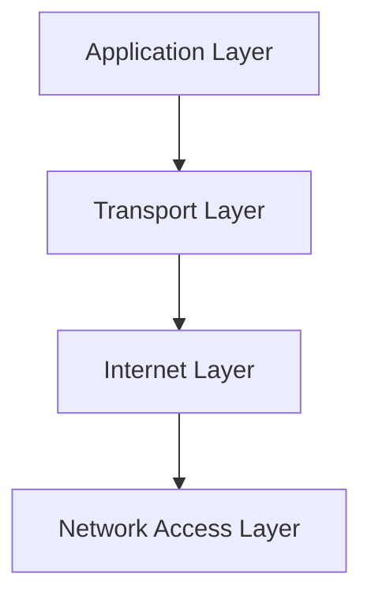
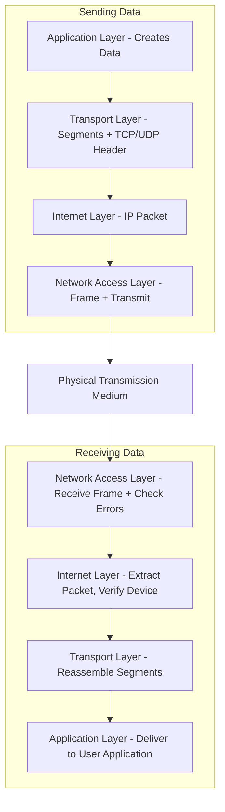
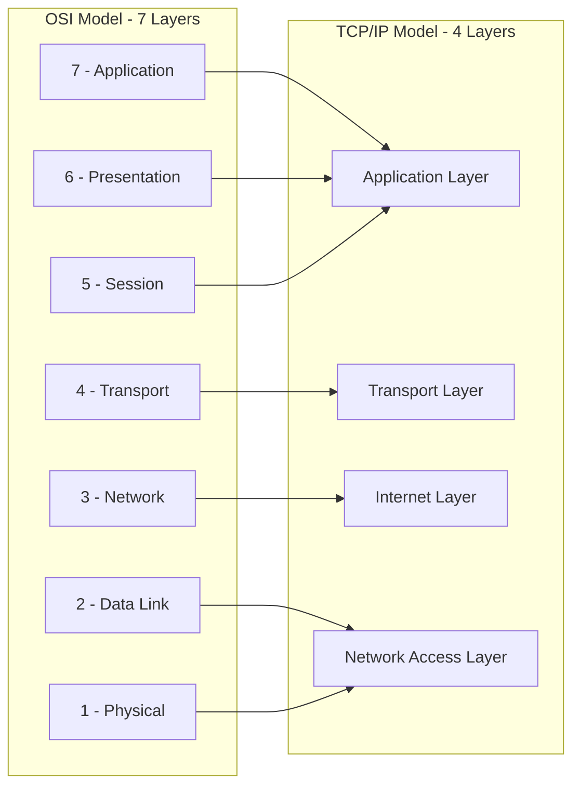
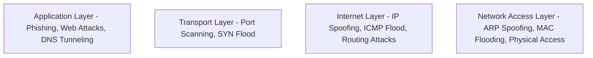

> **الهدف من الـ Section ده:**  
>  هتفهم الـ TCP/IP Model وإزاي هو الإطار العملي الفعلي اللي الإنترنت شغال عليه، الفرق بينه وبين الـ OSI Model، وإزاي كل طبقة فيه بترتبط بطبقات الـ OSI اللي درستها قبل كده عشان الصورة تكتمل عندك.

## Table of Contents

- [Overview](#overview)
- [Layers of TCP/IP Model](#layers-of-tcpip-model)
  - [1. Application Layer](#1-application-layer)
  - [2. Transport Layer](#2-transport-layer)
  - [3. Internet Layer](#3-internet-layer)
  - [4. Network Access Layer (Link Layer)](#4-network-access-layer-link-layer)
- [How TCP/IP Works](#how-tcpip-works)
- [TCP/IP vs OSI Model](#tcpip-vs-osi-model)
- [Advantages of TCP/IP](#advantages-of-tcpip)
- [Limitations](#limitations)
- [Why TCP/IP is Preferred over OSI](#why-tcpip-is-preferred-over-osi)
- [SOC Analyst Perspective](#soc-analyst-perspective)
- [Summary](#summary)

---

## Overview

الـ **TCP/IP Model** هو إطار عمل شبكي مقسم لطبقات (Layered Networking Framework) بيشرح إزاي البيانات بتتنقل بين الأجهزة عبر الشبكة باستخدام بروتوكولات موحدة (Standardized Protocols) عشان يضمن نقل موثوق وفعال. هو أبسط وأعملي (Practical) من الـ OSI Model، وبيعتبر الإطار الأساسي اللي الإنترنت الحديث شغال عليه فعليًا.

> [!NOTE]
> الفرق الجوهري بين الـ OSI والـ TCP/IP: الـ OSI **إطار نظري (Theoretical)** بيشرح المفاهيم بتفصيل أكتر (7 طبقات)، بينما TCP/IP **إطار عملي (Practical)** مبني فعليًا على البروتوكولات المستخدمة في الواقع (4 طبقات).

---

## Layers of TCP/IP Model

### 1. Application Layer

- **Position**: Top layer, closest to the user
- **Function**: Interfaces applications (web browsers, email, file transfer) with the network

**Key Features**:
- Provides network services to user applications
- Supports protocols like HTTP, FTP, SMTP, DNS
- Handles data formatting, encryption, and session management

> [!NOTE]
> لاحظ إن الطبقة دي في TCP/IP بتغطي وظائف تلات طبقات من الـ OSI مع بعض: **Application + Presentation + Session**.

### 2. Transport Layer

- **Function**: Ensures reliable and efficient data delivery between devices

**Key Functions**:
- **Segmentation & Reassembly**: Breaks data into segments and reassembles it
- **Reliable Delivery & Error Handling**: TCP ensures correct delivery, resends lost data
- **Flow Control**: Regulates data transmission speed
- **Multiplexing**: Uses port numbers for multiple applications

**Protocols**:
- **TCP (Transmission Control Protocol)**: Connection-oriented, reliable, ordered
- **UDP (User Datagram Protocol)**: Connectionless, faster, suitable for live streaming or gaming

### 3. Internet Layer

- **Function**: Handles addressing, routing, and packaging of data for network-to-network transfer

**Key Features**:
- **Logical Addressing**: Uses IP addresses for source & destination
- **Packet Routing**: Determines the best path for packets
- **Fragmentation & Reassembly**: Splits large packets, reassembles at the destination

**Protocols**: IP, ICMP, ARP

> [!NOTE]
> الطبقة دي بتقابل الـ **Network Layer (Layer 3)** في الـ OSI Model.

### 4. Network Access Layer (Link Layer)

- **Function**: Physical transmission of data over hardware like cables or Wi-Fi

**Key Features**:
- Sends & receives raw bits
- Frames data for transmission
- Checks for errors using CRC/Checksum
- Uses MAC addresses to identify devices
- Manages medium access to avoid collisions

> [!NOTE]
> الطبقة دي بتغطي وظائف طبقتين من الـ OSI مع بعض: **Data Link Layer + Physical Layer**.

---

## How TCP/IP Works

### Sending Data

1. **Application Layer**: Creates data and passes it to the Transport Layer
2. **Transport Layer**: Segments data, adds TCP/UDP info
3. **Internet Layer**: Encapsulates segments into IP packets
4. **Network Access Layer**: Converts packets to frames and transmits over physical media

### Receiving Data

1. **Network Access Layer**: Receives frames and checks for errors
2. **Internet Layer**: Extracts packets, verifies correct device
3. **Transport Layer**: Reassembles segments, corrects errors (TCP)
4. **Application Layer**: Delivers data to user application

---

## TCP/IP vs OSI Model

| TCP/IP Layer | Corresponding OSI Layer(s) |
|---|---|
| Application Layer | Application (7) + Presentation (6) + Session (5) |
| Transport Layer | Transport (4) |
| Internet Layer | Network (3) |
| Network Access Layer | Data Link (2) + Physical (1) |

---

## Advantages of TCP/IP

- Widely used in Internet & modern networks
- Platform-independent
- Reliable communication via TCP
- Scalable from small networks to the global Internet
- Open standard, free to use

---

## Limitations

- Complex for beginners
- Layer boundaries not strictly enforced
- TCP overhead for error-checking
- Basic security requires additional protocols like TLS/SSL
- Original design not optimized for real-time audio/video

> [!WARNING]
> نقطة "Basic security requires additional protocols like TLS/SSL" مهمة جدًا - الـ TCP/IP Model في تصميمه الأساسي **مفهوش أمان مدمج (Built-in Security)**، فأي حماية للبيانات (زي التشفير) لازم تتضاف كطبقة إضافية فوقه، وده سبب رئيسي ليه الـ Application Layer Protocols بتحتاج نسخ آمنة زيHTTPS بدل HTTP، وSFTP بدل FTP.

---

## Why TCP/IP is Preferred over OSI

- Simpler structure with 4 practical layers
- Protocol-driven, based on real-world protocols
- Flexible, robust, and widely adopted
- Open standard with universal acceptance
- OSI is theoretical; TCP/IP is used in actual networks

---

## SOC Analyst Perspective

> [!IMPORTANT]
> رغم إن الـ OSI Model أفضل لفهم المفاهيم النظرية بالتفصيل، إلا إن **TCP/IP هو اللي شغال فعليًا** على أي شبكة بتحللها، فكل الـ Logs والـ Packet Captures اللي هتشوفها في شغلك اليومي مبنية على الطبقات الأربعة دي.

| TCP/IP Layer | Common Detection Tools |
|---|---|
| Application Layer | WAF, Email Security Gateway, DNS Logs, Proxy Logs |
| Transport Layer | IDS/IPS, NetFlow, Firewall (Port/Protocol Rules) |
| Internet Layer | Firewall, Router ACLs, IP Reputation Feeds |
| Network Access Layer | Switch Port Security, Arpwatch, NAC |

> [!TIP]
> غياب الأمان المدمج في تصميم TCP/IP الأساسي هو السبب اللي خلى معظم الهجمات الحديثة تعتمد على استغلال البروتوكولات القديمة (زي ARP وDNS) اللي اتصممت أصلاً من غير أي اعتبار أمني، فلما تحلل Traffic غريب، دايمًا اسأل نفسك: "البروتوكول ده اتصمم أصلاً وهو واخد بالُه من الأمان، ولا لأ؟"

من ناحية الـ MITRE ATT&CK، معظم التقنيات اللي اتغطت في دروس الـ OSI Layers السابقة (زي **T1046, T1498, T1499, T1557, T1566, T1190**) بتتوزع فعليًا على نفس الطبقات الأربعة دي في TCP/IP، وده بيأكد إن فهم الطبقتين مع بعض (OSI للتفصيل، TCP/IP للتطبيق العملي) هو أساس أي تحليل Threat Hunting قوي.

---

## Summary

- الـ **TCP/IP Model** هو الإطار العملي الفعلي اللي الإنترنت شغال عليه، وبيتكون من **4 طبقات**: Application, Transport, Internet, Network Access
- كل طبقة بتقابل واحدة أو أكتر من طبقات الـ **OSI Model** (Application Layer بتغطي Layers 5-7، وNetwork Access بتغطي Layers 1-2)
- عملية إرسال واستقبال البيانات بتمر بنفس فكرة **Encapsulation/Decapsulation** اللي درستها في الـ OSI Model
- المميزات: بساطة، انتشار عالمي، موثوقية، وقابلية للتوسع / العيوب: مفيش أمان مدمج، وتعقيد نسبي للمبتدئين
- TCP/IP بيتفضل على OSI عمليًا لأنه **Protocol-Driven** ومبني على الواقع الفعلي للشبكات، بينما OSI أداة تعليمية نظرية أكتر
- من ناحية الـ SOC: فهم التطابق بين الطبقتين ضروري عشان تربط أي Tool أو Log بمكانه الصحيح، وغياب الأمان الأصلي في TCP/IP هو السبب الجذري لمعظم الثغرات في البروتوكولات القديمة (ARP, DNS, إلخ)
