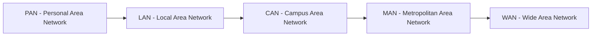
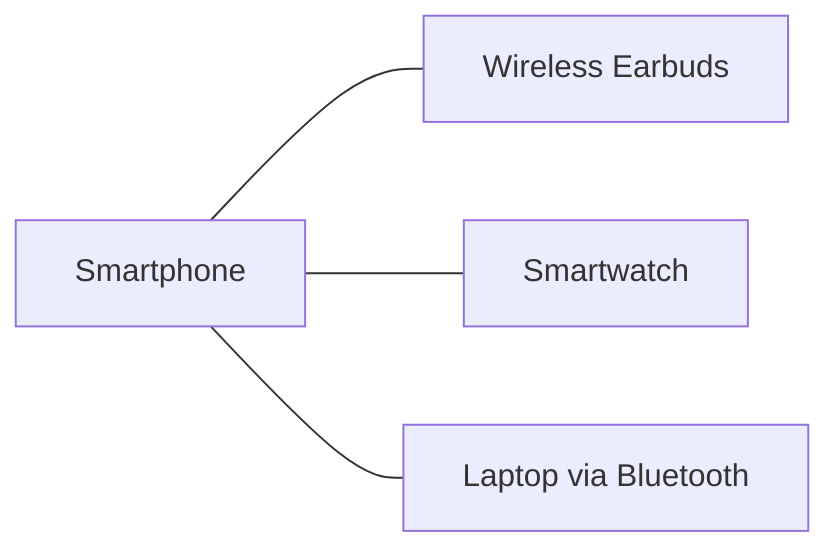
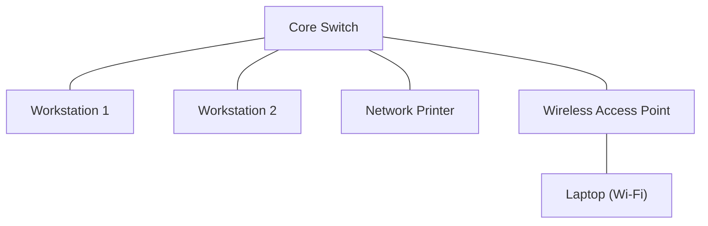
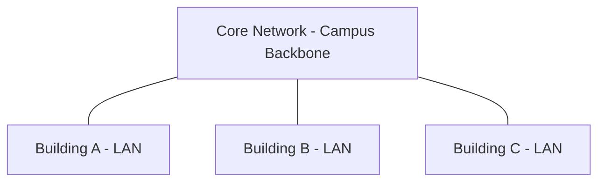
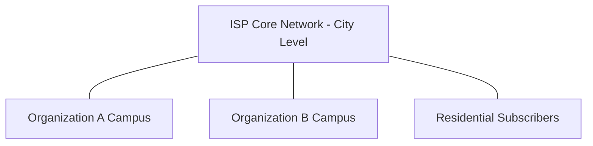
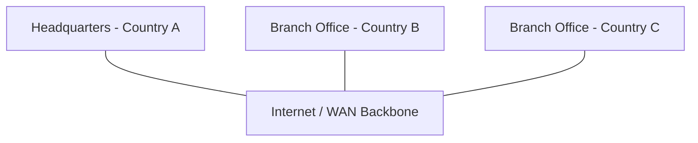
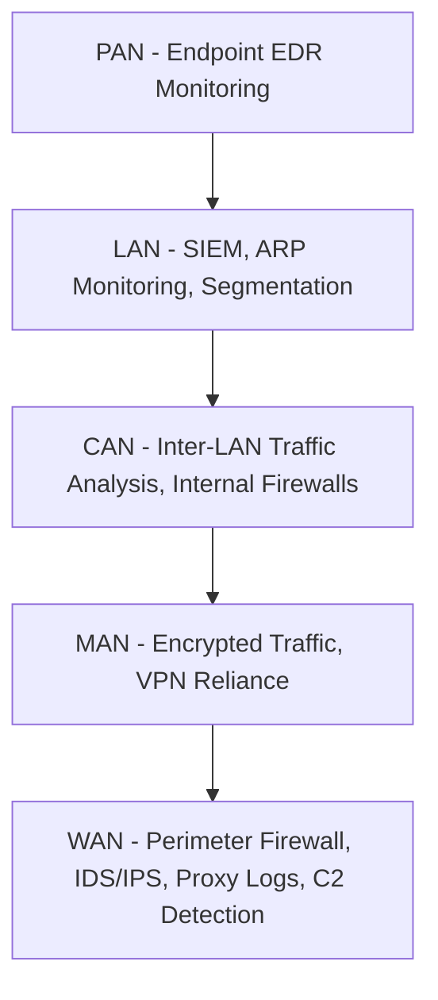

> **الهدف من الـ Section ده:**  
> هتفهم إزاي الـ Networks بتتصنف حسب الـ Geographical Area اللي بتغطيها، من الشبكة الصغيرة اللي بتوصل سماعتك بموبايلك (PAN) لحد شبكة الإنترنت اللي بتوصل العالم كله (WAN)، وليه الفرق ده مهم لك كـ SOC Analyst وقت ما تحلل الـ Traffic وتحدد مصدر أي Anomaly.

## Table of Contents

- [Introduction](#introduction)
- [Personal Area Network (PAN)](#personal-area-network-pan)
- [Local Area Network (LAN)](#local-area-network-lan)
- [Campus Area Network (CAN)](#campus-area-network-can)
- [Metropolitan Area Network (MAN)](#metropolitan-area-network-man)
- [Wide Area Network (WAN)](#wide-area-network-wan)
- [Comparison Table](#comparison-table)
- [SOC Analyst Perspective](#soc-analyst-perspective)
- [Summary](#summary)

---

## Introduction

الـ Computer Networks بتتصنف حسب حجم المنطقة الجغرافية (Geographical Area) اللي بتغطيها. الفكرة إن كل ما الشبكة تكبر، الـ Complexity والـ Attack Surface بتزيد معاها، وده حاجة مهمة جدًا للـ SOC Analyst لأن كل نوع شبكة بيحتاج طريقة مراقبة (Monitoring) مختلفة.

الترتيب من الأصغر للأكبر:

> [!NOTE]
> كل نوع من الأنواع دي مش بس بيختلف في المساحة، لكن كمان بيختلف في الـ Technologies المستخدمة، والـ Ownership (مين المالك أو المسؤول عن الشبكة)، وده بيأثر على مين المسؤول عن الـ Security بتاعها.

---

## Personal Area Network (PAN)

الـ PAN هي أصغر نوع شبكة، بتوصل بين الأجهزة الشخصية اللي حوالين المستخدم في مدى قصير جدًا، وغالبًا بتكون Wireless.

| Property | Details |
|---|---|
| Coverage | 1–10 meters |
| Technologies | Bluetooth, NFC, Infrared |
| Example | Smartphone connected to wireless earbuds |
| Usage | Short-range communication between personal devices |

> [!WARNING]
> غلطة شائعة إن الناس تفتكر PAN دايمًا آمنة لأنها short-range، بس فعليًا بروتوكولات زي Bluetooth ليها Vulnerabilities معروفة (زي BlueBorne) ممكن تتستغل لو الـ Device مش Updated.

من ناحية الـ SOC، PAN مش بتظهر غالبًا في الـ Network Monitoring التقليدي (زي SIEM أو IDS على مستوى الشبكة)، لكنها ممكن تكون نقطة دخول (Entry Point) في هجمات الـ Endpoint، فمهم إن الـ EDR (Endpoint Detection and Response) يراقب الـ Bluetooth/NFC Connections على الأجهزة.

---

## Local Area Network (LAN)

الـ LAN بتوصل الأجهزة في منطقة محدودة زي بيت أو مكتب أو مبنى واحد، وبتوفر سرعة عالية ونقل بيانات آمن نسبيًا لأنها Isolated جوه حدود جغرافية صغيرة.

| Property | Details |
|---|---|
| Coverage | Room, building, or small campus |
| Technologies | Ethernet, Wi-Fi |
| Example | Home or office network |
| Usage | Fast and secure local communication |

> [!IMPORTANT]
> الـ LAN هي أكتر بيئة الـ SOC Analyst بيشتغل فيها بشكل يومي، لأنها المكان اللي فيه الـ Workstations والـ Servers والـ Domain Controllers، وأي Lateral Movement بين الأجهزة غالبًا بيحصل هنا.

من ناحية الـ Detection، مراقبة الـ LAN بتشمل:
- **Windows Event ID 4624 / 4625**: Logon Success / Failure على أجهزة الـ LAN
- **ARP Spoofing Detection**: لأن الـ LAN غالبًا بتعتمد على ARP للـ Local Communication، وده نقطة ضعف مشهورة (MITM Attacks)
- **Network Segmentation**: تقسيم الـ LAN لـ VLANs بيقلل الـ Blast Radius لو جهاز اتخترق

> [!TIP]
> استخدام VLANs جوه الـ LAN بيدي طبقة إضافية من الـ Segmentation، وده بيسهل عليك كـ Analyst إنك تعزل جهاز مصاب (Infected Host) من غير ما توقف الشبكة كلها.

---

## Campus Area Network (CAN)

الـ CAN بتربط أكتر من LAN مع بعض جوه Campus واحد أو مجموعة مباني قريبة من بعض، وغالبًا بتكون مملوكة وبتتدار من جهة واحدة (زي جامعة أو شركة).

| Property | Details |
|---|---|
| Coverage | University or corporate campus |
| Technologies | Ethernet, Fiber Optics |
| Example | University campus network |
| Usage | Interconnecting LANs across a campus |

> [!NOTE]
> الفرق الرئيسي بين CAN و LAN إن الـ CAN بتربط شبكات (Networks of Networks) مش أجهزة مفردة، فبتحتاج Routing بين الـ LANs المختلفة مش بس Switching.

من ناحية الـ SOC، الـ CAN بتحتاج مراقبة على مستوى الـ Inter-LAN Traffic، لأن أي Attacker خش على LAN معينة ممكن يحاول يعمل Pivoting للـ LANs التانية جوه نفس الـ Campus. هنا بيبقى مهم استخدام:
- **Internal Firewalls / Routers with ACLs** بين الـ Buildings
- **NetFlow / Traffic Analysis** لمراقبة الـ East-West Traffic بين الـ Segments

---

## Metropolitan Area Network (MAN)

الـ MAN بتغطي منطقة أكبر زي مدينة كاملة أو منطقة حضرية (Metropolitan Area)، وغالبًا بتكون مملوكة لـ Service Providers أو مؤسسات كبيرة.

| Property | Details |
|---|---|
| Coverage | City or metropolitan area |
| Technologies | Fiber Optics, Microwave, Metro Ethernet |
| Example | City-wide ISP network |
| Usage | High-speed connectivity across a city |

> [!WARNING]
> الـ MAN بتكون عادةً خارج نطاق سيطرة الـ Organization بالكامل لأنها مملوكة للـ ISP أو مزود الخدمة، فالـ Security بتاعها مش دايمًا تحت تحكم الـ SOC Team بتاعتك، وده بيفرض إنك تعتمد على تشفير الـ Traffic (زي VPN) وأنت بتنقل بيانات عليها.

---

## Wide Area Network (WAN)

الـ WAN هي أكبر نوع شبكة، بتوصل شبكات على مستوى دول أو قارات كاملة، وأشهر مثال عليها هو الـ Internet نفسه.

| Property | Details |
|---|---|
| Coverage | Country, continent, or worldwide |
| Technologies | Leased lines, Satellite, Internet |
| Example | The Internet |
| Usage | Long-distance and global communication |

> [!IMPORTANT]
> الـ WAN هي المدخل الرئيسي للتهديدات الخارجية (External Threats)، لأنها البوابة اللي بتوصل شبكتك الداخلية بالـ Internet. أغلب الـ Attack Vectors زي Phishing وC2 Communication وExternal Recon بتعدي من هنا.

من ناحية الـ MITRE ATT&CK، الاتصال عبر الـ WAN بيرتبط بتقنيات زي:
- **T1071 - Application Layer Protocol**: استخدام بروتوكولات زي HTTP/HTTPS/DNS للتواصل مع Command and Control (C2) عبر الـ Internet
- **T1090 - Proxy**: استخدام Proxies لإخفاء مصدر الـ Traffic عبر الـ WAN

> [!TIP]
> مراقبة الـ Perimeter (الحدود بين الـ Internal Network والـ WAN) عن طريق Firewalls وIDS/IPS وProxy Logs هي أول خط دفاع، لأن أي Traffic غريب بيدخل أو يخرج من هنا لازم يتراجع بعناية.

---

## Comparison Table

| Network Type | Coverage | Ownership | Typical Technologies | Example |
|---|---|---|---|---|
| PAN | 1–10 meters | Individual User | Bluetooth, NFC, Infrared | Phone + Earbuds |
| LAN | Room / Building | Single Organization or Home | Ethernet, Wi-Fi | Office Network |
| CAN | Campus | Single Organization | Ethernet, Fiber Optics | University Campus |
| MAN | City | ISP / Large Organization | Fiber, Metro Ethernet, Microwave | City ISP Network |
| WAN | Country / Global | Multiple Entities / ISPs | Leased Lines, Satellite, Internet | The Internet |

---

## SOC Analyst Perspective

> [!NOTE]
> كل ما اتحركنا من PAN لـ WAN، بيزيد اعتمادنا على أدوات الـ Network-Level Monitoring (زي SIEM, IDS/IPS, Firewalls) بدل الاعتماد على الـ Endpoint فقط. الـ SOC الناضج بيغطي كل الطبقات دي مع بعض مش طبقة واحدة بس.

---

## Summary

- الشبكات بتتصنف حسب المساحة الجغرافية اللي بتغطيها: **PAN → LAN → CAN → MAN → WAN**
- **PAN**: مدى قصير جدًا (1–10 متر)، بتستخدم Bluetooth/NFC، مهمة من ناحية الـ Endpoint Security
- **LAN**: تغطي مبنى أو مكان واحد، أهم بيئة للـ SOC Analyst في المراقبة اليومية (Logon Events, ARP, Segmentation)
- **CAN**: بتربط أكتر من LAN جوه Campus واحد، بتحتاج مراقبة الـ Inter-LAN Traffic
- **MAN**: بتغطي مدينة كاملة، غالبًا مملوكة لـ ISP، الأمان بيعتمد على التشفير أكتر من التحكم المباشر
- **WAN**: أكبر نوع، بتشمل الإنترنت نفسه، وهي البوابة الرئيسية للتهديدات الخارجية (مرتبطة بـ MITRE ATT&CK T1071, T1090)
- كل ما زاد حجم الشبكة، زادت الـ Attack Surface والحاجة لأدوات مراقبة أقوى (SIEM, IDS/IPS, Firewalls, EDR)

