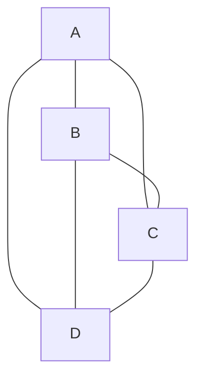
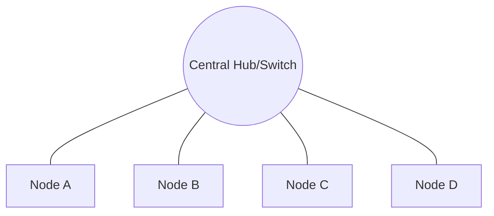
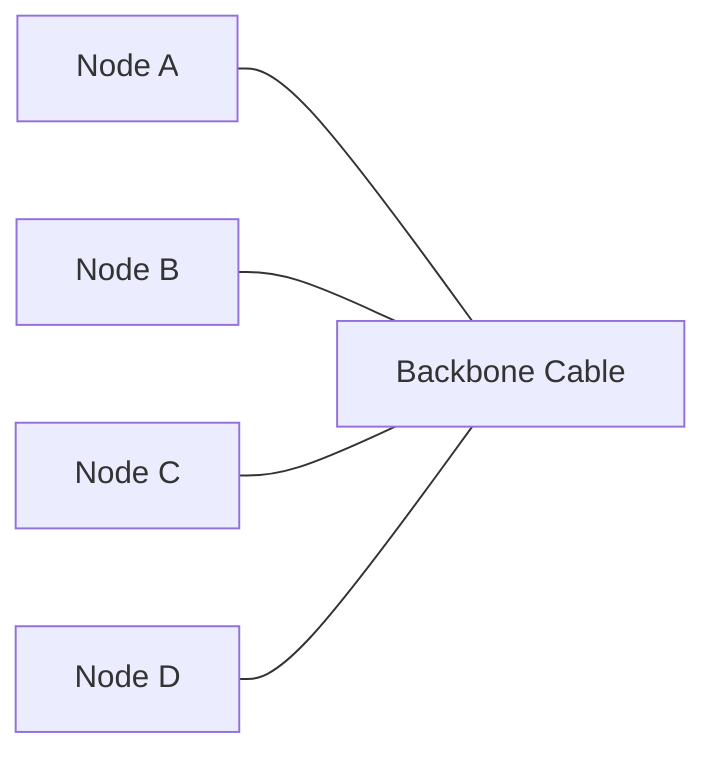
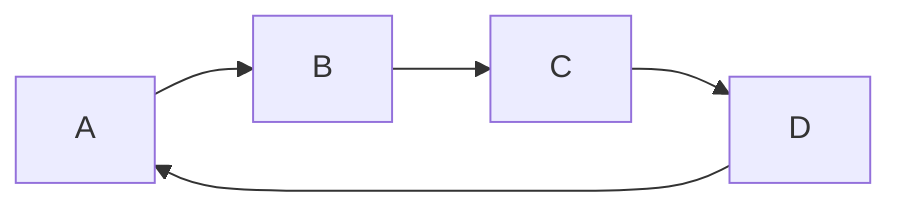
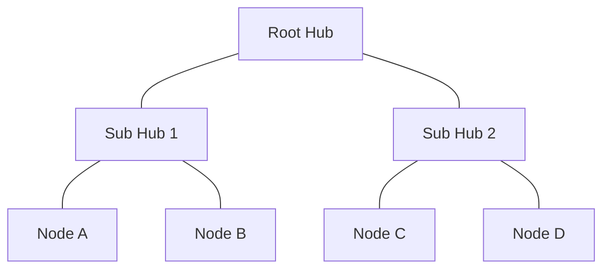
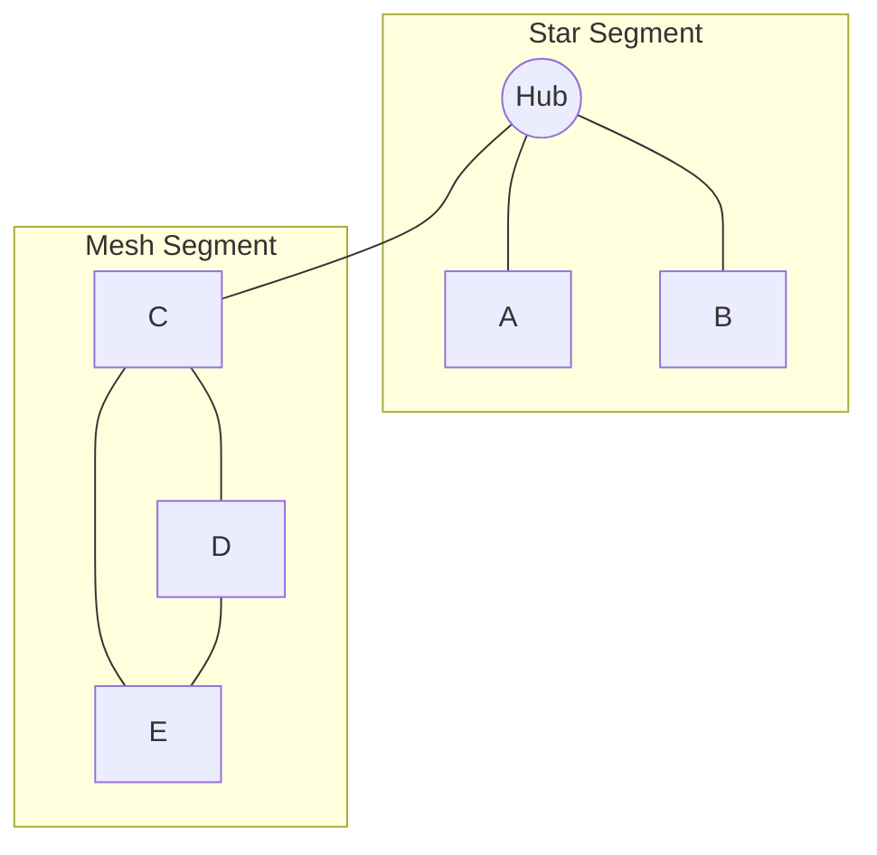

> **الهدف من الـ Section ده:**  
> هتفهم إزاي الـ Devices بتتوصل ببعض جوا أي Network، إيه الـ Topologies المختلفة اللي ممكن تشوفها في أي بيئة، ومميزات وعيوب كل واحدة فيهم — وده مهم جدًا لـ SOC Analyst عشان لما تشوف Network Diagram تقدر تفهم إزاي الـ Traffic ماشي وفين ممكن تحصل نقطة ضعف أو Single Point of Failure ممكن الـ Attacker يستغلها.

## Table of Contents

- [Introduction](#introduction)
- [Physical vs Logical Topology](#physical-vs-logical-topology)
- [Key Terms](#key-terms)
- [Common Network Topologies](#common-network-topologies)
  - [Mesh Topology](#1-mesh-topology)
  - [Star Topology](#2-star-topology)
  - [Bus Topology](#3-bus-topology)
  - [Ring Topology](#4-ring-topology)
  - [Tree Topology](#5-tree-topology)
  - [Hybrid Topology](#6-hybrid-topology)
- [Comparison Table](#comparison-table)
- [Memory Tip](#memory-tip)
- [SOC Analyst Perspective](#soc-analyst-perspective)
- [Summary](#summary)

---

## Introduction

الـ **Network Topology** هي ببساطة الطريقة اللي بيتم بيها ترتيب الـ Devices (Nodes) جوا أي شبكة، وإزاي الـ Data بتتنقل بينهم. تخيل الموضوع زي خريطة مدينة: ممكن الشوارع تبقى مرتبة بشكل معين (شبكة، دايرة، خط مستقيم...) وده اللي بيحدد إزاي العربيات (Data) هتتحرك من مكان للتاني.

فهم الـ Topology مش بس موضوع نظري — لو انت SOC Analyst وشايف Network Diagram، لازم تعرف تحدد:
- فين ممكن يحصل **Bottleneck**؟
- لو جهاز واحد وقع، هل الشبكة كلها هتقف ولا لأ؟
- فين أنسب مكان أحط فيه **IDS/IPS** أو **Network Sensor** عشان أراقب الـ Traffic؟

> [!NOTE]
> فهم الـ Topology بيساعدك تحدد الـ **Attack Surface** وتعرف تحط الـ Monitoring Tools في الأماكن الصح.

---

## Physical vs Logical Topology

الـ Network Topology بتنقسم لنوعين رئيسيين:

| النوع | التعريف |
|---|---|
| **Physical Topology** | الشكل الفعلي/الحقيقي لترتيب الأجهزة والكابلات على أرض الواقع |
| **Logical Topology** | الطريقة اللي بتتحرك بيها الـ Data فعليًا، بغض النظر عن الشكل الفيزيائي |

> [!IMPORTANT]
> ممكن الـ Physical Topology تبقى **Star** (كل الأجهزة متوصلة بـ Switch واحد)، لكن الـ Logical Topology تكون **Bus** أو **Ring** حسب إزاي الـ Data بتتحرك فعليًا جوا الشبكة. الفرق ده مهم جدًا تفهمه عشان متتلخبطش وانت بتحلل أي بيئة.

---

## Key Terms

| Term | Definition |
|---|---|
| **Node** | أي جهاز جوا الشبكة (Computer, Server, Router, Switch...) |
| **Link** | الاتصال بين Node و Node تاني، سواء سلكي (Wired) أو لاسلكي (Wireless) |
| **Topology** | ترتيب الـ Nodes والـ Links مع بعض جوا الشبكة |

---

## Common Network Topologies

### 1. Mesh Topology

في الـ **Mesh Topology**، كل Node بيتوصل بشكل مباشر مع كل Node تاني في الشبكة.

فيه نوعين:
- **Full Mesh**: كل الأجهزة متوصلة ببعضها البعض مباشرة.
- **Partial Mesh**: بس بعض الأجهزة اللي متوصلة ببعض.

**Advantages:**
- Fault Isolation ممتاز — لو Link واحد وقع، الباقي مش هيتأثر
- High Security لأن الـ Data بتتبعت مباشرة بين الأطراف
- Reliable Data Transmission

**Disadvantages:**
- مكلفة جدًا (Expensive) لأنك محتاج عدد كابلات وPorts كبير
- الـ Maintenance معقدة مع زيادة عدد الأجهزة

> [!TIP]
> الـ Mesh Topology بتتستخدم غالبًا في الـ **Backbone Networks** أو الـ **Critical Infrastructure** اللي محتاجة أعلى درجة من الـ Redundancy.

---

### 2. Star Topology

كل الأجهزة بتتوصل بجهاز مركزي واحد وهو الـ **Hub** أو الـ **Switch**.

**Advantages:**
- سهلة الإعداد (Easy Setup)
- لو جهاز واحد وقع، الباقي بيفضل شغال عادي
- سهلة في الـ Troubleshooting

**Disadvantages:**
- الاعتماد الكلي على الـ Central Hub — لو وقع، الشبكة كلها بتقف
- محتاجة كابلات كتير (More Cabling Required)

> [!WARNING]
> الـ Central Hub/Switch هنا هو الـ **Single Point of Failure**. من منظور SOC، ده أهم جهاز محتاج تراقبه وتأمّنه لأنه لو اتضرب، الشبكة كلها بتتأثر.

---

### 3. Bus Topology

كل الأجهزة بتشارك **Cable واحد** بيسمى الـ Backbone.

**Advantages:**
- تكلفة قليلة (Low Cost)
- تركيب بسيط (Simple Cabling)

**Disadvantages:**
- لو الـ Cable الرئيسي اتقطع، الشبكة كلها بتقف
- Limited Security — أي جهاز على نفس الـ Bus ممكن يشوف الـ Traffic

> [!WARNING]
> بسبب طبيعة الـ Shared Medium، الـ Bus Topology معرضة جدًا لهجمات الـ **Sniffing**، لأن أي جهاز على نفس الخط ممكن يلتقط الـ Packets اللي مش موجهلوه.

---

### 4. Ring Topology

الأجهزة بتتوصل في شكل **Closed Loop**، والـ Data بتتنقل بالتسلسل من جهاز للتاني، غالبًا باستخدام تقنية اسمها **Token Passing**.

**Advantages:**
- سرعة نقل عالية (High-Speed Transmission)
- تصادمات قليلة جدًا في الـ Data (Minimal Collisions)

**Disadvantages:**
- لو جهاز واحد وقع، ممكن الشبكة كلها تتأثر (حسب نوع الـ Ring)
- الـ Troubleshooting صعب لأنك لازم تتبع الحلقة كلها

---

### 5. Tree Topology

هيكل هرمي (Hierarchical) بيجمع بين مميزات الـ **Star** والـ **Bus**.

**Advantages:**
- أمان عالي (High Security)
- قابلة للتوسع بسهولة (Scalable)
- سهولة اكتشاف الأخطاء (Easy Error Detection)

**Disadvantages:**
- لو الـ Central/Root Hub وقع، كل الفروع تحته بتتأثر
- تكلفة كابلات عالية

---

### 6. Hybrid Topology

مزيج من نوعين أو أكتر من الـ Topologies السابقة عشان توصل لأفضل أداء ممكن حسب احتياج الشبكة.

**Advantages:**
- مرنة جدًا (Flexible)
- قوية وموثوقة (Robust)
- أداء محسّن حسب احتياج كل جزء من الشبكة

**Disadvantages:**
- تصميم معقد (Complex Design)
- تكلفة بنية تحتية عالية

> [!NOTE]
> أغلب الشبكات الكبيرة والـ Enterprise Networks في الواقع بتكون **Hybrid**، لأنها بتجمع بين أكتر من نوع حسب احتياج كل قسم (مثلاً Data Center يكون Mesh، والمكاتب تكون Star).

---

## Comparison Table

| Topology | Cost | Fault Tolerance | Security | Scalability | Common Use |
|---|---|---|---|---|---|
| **Mesh** | High | Very High | High | Low | Critical/Backbone Networks |
| **Star** | Medium | Medium (depends on Hub) | Medium | High | Most LANs today |
| **Bus** | Low | Low | Low | Low | Legacy/Small Networks |
| **Ring** | Medium | Low-Medium | Medium | Medium | Legacy Token Ring Networks |
| **Tree** | High | Medium | High | High | Large Enterprise Networks |
| **Hybrid** | Very High | High | High | High | Enterprise/Complex Environments |

---

## Memory Tip

- **Mesh** → Full connections (كل حاجة متوصلة بكل حاجة)
- **Star** → Central hub (كله بيمر على نقطة مركزية)
- **Bus** → Single backbone cable (خط واحد للكل)
- **Ring** → Circular loop (حلقة مقفولة)
- **Tree** → Hierarchy (هرمية)
- **Hybrid** → Combination of types (خليط من الأنواع)

---

## SOC Analyst Perspective

من وجهة نظر SOC Analyst، فهم الـ Topology مش بس نظري — هو أساسي عشان:

| النشاط | ليه مهم |
|---|---|
| **Placement of Sensors** | تحديد أفضل مكان لـ IDS/IPS أو Network TAP عشان تراقب كل الـ Traffic |
| **Identifying Single Points of Failure** | معرفة أي جهاز لو وقع ممكن يأثر على الشبكة كلها أو يبقى هدف جذاب للـ Attacker |
| **Traffic Flow Analysis** | فهم إزاي الـ Data المفروض تتحرك، عشان تقدر تكتشف أي **Anomaly** أو حركة غير طبيعية |
| **Incident Containment** | لما يحصل Incident، تعرف تعزل الجزء المتأثر من الشبكة بسرعة وبدون ما توقف كل حاجة |

> [!IMPORTANT]
> أي SOC Analyst كويس لازم يقدر يقرا الـ Network Diagram بتاع بيئة العمل بتاعته ويحدد فورًا: فين نقط الضعف، وفين لازم يكون فيه Monitoring، وإزاي الـ Traffic المفروض يتحرك في الحالة الطبيعية.

---

## Summary

- الـ **Network Topology** بتوضح إزاي الأجهزة (Nodes) متوصلة ببعض وإزاي الـ Data (Traffic) بتتحرك جواها.
- بتنقسم لـ **Physical Topology** (الشكل الفعلي) و **Logical Topology** (طريقة انتقال الـ Data).
- أهم الأنواع: **Mesh, Star, Bus, Ring, Tree, Hybrid** — كل واحدة ليها Advantages و Disadvantages مختلفة.
- الـ **Star Topology** هي الأكتر انتشارًا في الشبكات الحديثة، بينما الـ **Mesh** بتتستخدم للـ Critical/Backbone Networks.
- الـ **Hybrid Topology** هي الأقرب للواقع في أغلب الـ Enterprise Environments.
- من منظور SOC: فهم الـ Topology بيساعدك تحدد أماكن الـ Monitoring، تكتشف الـ Single Points of Failure، وتفهم الـ Traffic الطبيعي عشان تقدر تكتشف أي Anomaly بسرعة.
