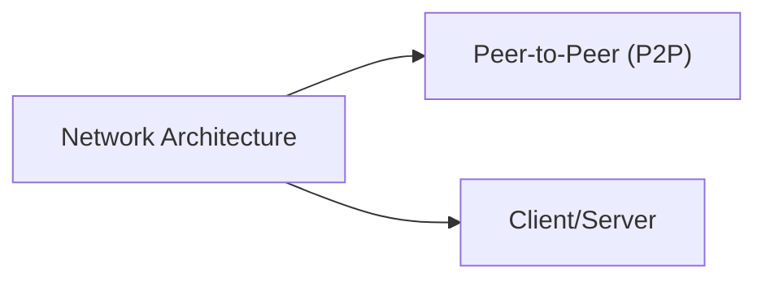
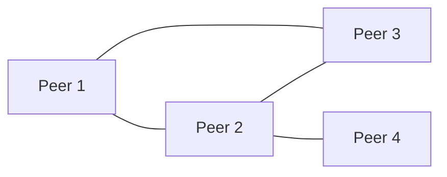
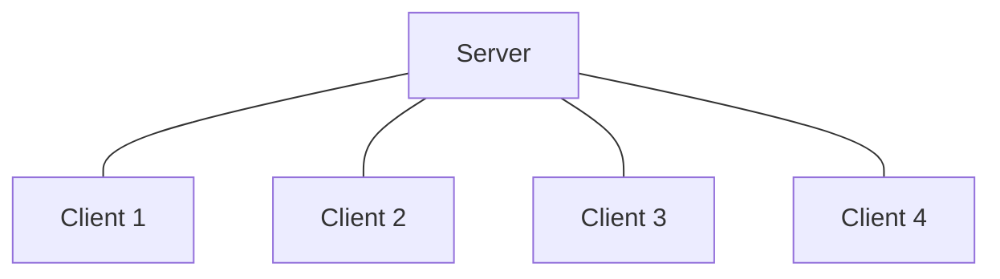
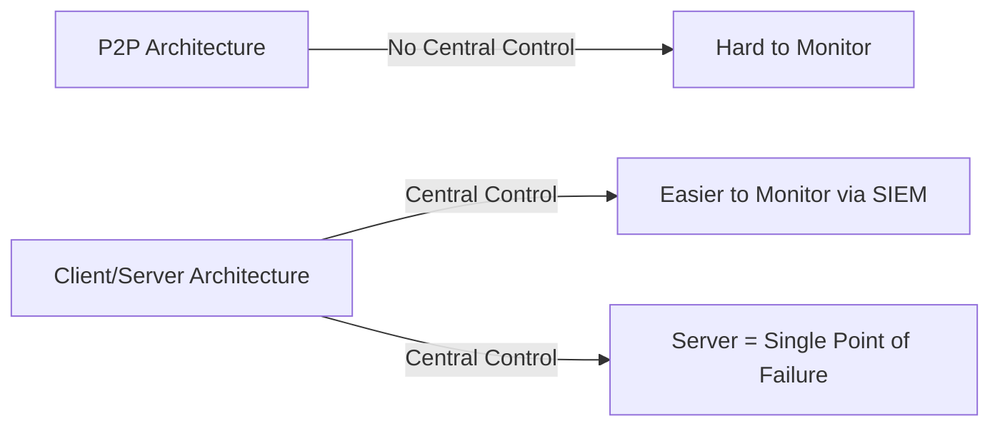

> **الهدف من الـ Section ده:**  
> هتفهم إزاي الشبكات بتتصمم من ناحية الـ Architecture، الفرق بين الـ Peer-to-Peer والـ Client/Server، وليه الاختيار ده بيأثر بشكل مباشر على مستوى الـ Security والـ Control اللي هتقدر تفرضه كـ SOC Analyst على الشبكة.

# Network Architecture Types (Peer-to-Peer vs Client/Server)

## Table of Contents

- [Introduction](#introduction)
- [Peer-to-Peer (P2P) Architecture](#peer-to-peer-p2p-architecture)
- [Client/Server Architecture](#clientserver-architecture)
- [Architecture Comparison](#architecture-comparison)
- [SOC Analyst Perspective](#soc-analyst-perspective)
- [Summary](#summary)

---

## Introduction

الشبكات مش بس بتتصنف حسب المساحة الجغرافية اللي بتغطيها، لكن كمان بتتصنف حسب طريقة الـ Architecture اللي بتتبني بيها، يعني إزاي الأجهزة بتتواصل مع بعضها ومين المسؤول عن توفير الـ Resources والخدمات.

فيه نوعين أساسيين من الـ Architecture:

> [!NOTE]
> الفرق الأساسي بين النوعين هو وجود أو غياب **Centralized Control**. الـ P2P مفيهوش جهة مركزية بتتحكم في الشبكة، بينما الـ Client/Server فيه Server مركزي بيتحكم في كل حاجة.

---

## Peer-to-Peer (P2P) Architecture

في الـ P2P Architecture، كل الأجهزة (Peers) متوصلة ببعض مباشرة من غير أي Server مركزي. كل جهاز ممكن يشتغل كـ Client وكـ Server في نفس الوقت، يعني يطلب خدمة ويقدم خدمة كمان.

المهام والمسؤوليات موزعة على كل الـ Peers، وده بيخلي النوع ده مناسب للشبكات الصغيرة (غالبًا لحد 10 أجهزة). الاتصال بيحصل بشكل مباشر بين الأجهزة، سواء عن طريق الإنترنت أو شبكة محلية.

### Common Use Cases

- File sharing
- Small business networks
- Educational or temporary setups

### Advantages and Disadvantages

| ✅ Advantages | ❌ Disadvantages |
|---|---|
| Low cost, as no dedicated server is required | Difficult to enforce centralized security policies |
| Simple design and easy implementation | Each peer must be managed individually |
| Easy setup and management due to built-in OS support | Performance and efficiency decrease as the network grows |

> [!WARNING]
> غياب الـ Centralized Control في الـ P2P معناه إن مفيش جهة واحدة تقدر تفرض Security Policies موحدة على كل الأجهزة. لو جهاز واحد جوه الشبكة اتخترق (Compromised)، صعب جدًا تتابع أو تتحكم في باقي الأجهزة لأن كل واحد فيهم مستقل بذاته.

من ناحية الـ SOC، مراقبة شبكات الـ P2P بتكون تحدي حقيقي لأن:
- مفيش **Centralized Logging** يجمع كل الأحداث في مكان واحد
- كل جهاز محتاج يتراقب لوحده (Local Firewall, Local AV/EDR)
- بروتوكولات الـ P2P (زي BitTorrent) ممكن تتستغل لنقل بيانات أو Malware من غير ما تعدي على أي Central Point تقدر تراقبه

---

## Client/Server Architecture

في الـ Client/Server Architecture، فيه جهاز مركزي وقوي اسمه **Server** بيوفر الخدمات والموارد والبيانات لأجهزة تانية اسمها **Clients**. الـ Clients بتطلب الخدمة، والـ Server بيعالج الطلب ويرد عليه.

الـ Server هنا هو قلب الشبكة (Core of the Network)، وبيوفر Centralized Control وأمان أعلى وقابلية أكبر للتوسع (Scalability). النوع ده مستخدم بكثرة في الشبكات المتوسطة والكبيرة.

### Common Use Cases

- Corporate networks
- Web applications
- Databases and enterprise systems

### Advantages and Disadvantages

| ✅ Advantages | ❌ Disadvantages |
|---|---|
| Centralized data management and updates | Server failure can disrupt client access |
| Enhanced security and access control | Higher cost for hardware and software |
| Better scalability and stability | Requires skilled administrators for management |
| Dedicated Network Operating System (NOS) support | |

> [!IMPORTANT]
> وجود Server مركزي معناه إن الـ Server نفسه بيبقى **Single Point of Failure** وكمان **High-Value Target** للمهاجمين، لأن لو الـ Attacker قدر يخترق الـ Server، هيقدر يوصل لكل الـ Clients اللي بتعتمد عليه.

من ناحية الـ SOC، الـ Client/Server Architecture أسهل بكتير في المراقبة لأن:
- الـ Logs كلها بتتجمع مركزيًا (Centralized Logging عن طريق SIEM)
- سهل تطبيق **Access Control Policies** موحدة على مستوى الـ Server
- الـ Authentication والـ Authorization بيتحكم فيهم من مكان واحد (زي Active Directory Domain Controller)

> [!TIP]
> راقب دايمًا الـ Windows Event ID **4624 / 4625** (Logon Success/Failure) على الـ Servers، لأنها أول مكان يظهر فيه أي محاولة Brute Force أو Unauthorized Access على الـ Server المركزي.

---

## Architecture Comparison

| Aspect | Peer-to-Peer (P2P) | Client/Server |
|---|---|---|
| Central Control | None | Centralized on the Server |
| Scalability | Poor (best for small networks) | High (suitable for large networks) |
| Security Management | Decentralized, hard to enforce | Centralized, easier to enforce |
| Cost | Low | Higher (dedicated hardware/software) |
| Single Point of Failure | No single point, but harder to secure | Yes, the Server |
| Logging & Monitoring | Distributed, difficult to aggregate | Centralized, easier for SIEM integration |
| Typical Scale | Up to ~10 devices | Medium to large organizations |

---

## SOC Analyst Perspective

> [!IMPORTANT]
> كـ SOC Analyst، أول حاجة تحتاج تعرفها عن أي شبكة بتحللها هي نوع الـ Architecture بتاعها، لأن ده بيحدد إزاي هتجمع الـ Logs وإزاي هتراقب الـ Traffic.

- في **P2P**: التركيز بيكون على الـ Endpoint Security (Local EDR/AV) لكل جهاز لوحده، لأن مفيش نقطة مركزية تجمع منها الـ Logs
- في **Client/Server**: التركيز بيكون على تأمين الـ Server نفسه (Hardening, Patch Management, Access Control) بالإضافة لمراقبة الـ Client Requests جواه، ودمج الـ Logs في SIEM واحد للتحليل المركزي

> [!NOTE]
> أغلب بيئات العمل الحقيقية (Enterprise Environments) بتعتمد على Client/Server Architecture، لأنها بتوفر مستوى Control وVisibility أعلى بكتير، وده اللي بيسهل مهمة الـ SOC Team في الـ Detection والـ Response.

---

## Summary

- الشبكات بتتصنف من ناحية الـ Architecture لنوعين رئيسيين: **Peer-to-Peer (P2P)** و **Client/Server**
- **P2P**: كل الأجهزة متساوية، مفيش Server مركزي، مناسب للشبكات الصغيرة (حتى 10 أجهزة)، لكن صعب تأمينه بشكل مركزي
- **Client/Server**: فيه Server مركزي بيوفر الخدمات، بيدي Centralized Control وSecurity أفضل، لكن الـ Server نفسه بيبقى Single Point of Failure وهدف رئيسي للمهاجمين
- من ناحية الـ SOC: P2P محتاج تركيز على الـ Endpoint Security لكل جهاز، بينما Client/Server محتاج تركيز على تأمين ومراقبة الـ Server المركزي عن طريق SIEM
- الأغلبية في بيئات الـ Enterprise بتستخدم Client/Server لأنها بتوفر Visibility وControl أعلى بكتير
